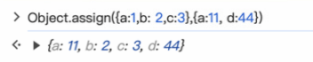

# 对象的常用方法

## Object.assign()

> **Object.assign()** 静态方法将一个或者多个*源对象*中所有可枚举的自有属性复制到*目标对象*，并返回修改后的目标对象。
>
> 可以实现浅拷贝

## Object.is()

> Object.is() 是一种判断两个值是否相同的方法。

## Object.entries()

> 返回一个数组，包含给定对象自有的可枚举字符串键属性[key, value]的键值对 。

## Object.keys()

> 返回一个由给定对象自身的可枚举的字符串键属性名组成的数组。

## Object.values()

> 返回一个给定对象的自有可枚举字符串键属性值组成的数组

## Object.prototype.hasOwnProperty()

> 指示对象是否具有指定的属性作为它自己的属性。
>
> 如果指定的属性是对象的直接属性，则该方法返回 true — 即使值为 null 或未定义。如果该属性是继承的或根本没有声明，则返回 false。

## Object.prototype.toString()

> 返回一个表示该对象的字符串

## Object.freeze()

> 冻结一个对象，这意味着它不能再被更改。冻结对象可防止向其添加新属性，防止删除现有属性，防止更改现有属性的可枚举性、可配置性或可写性，并防止更改现有属性的值。它还可以防止其原型被更改。