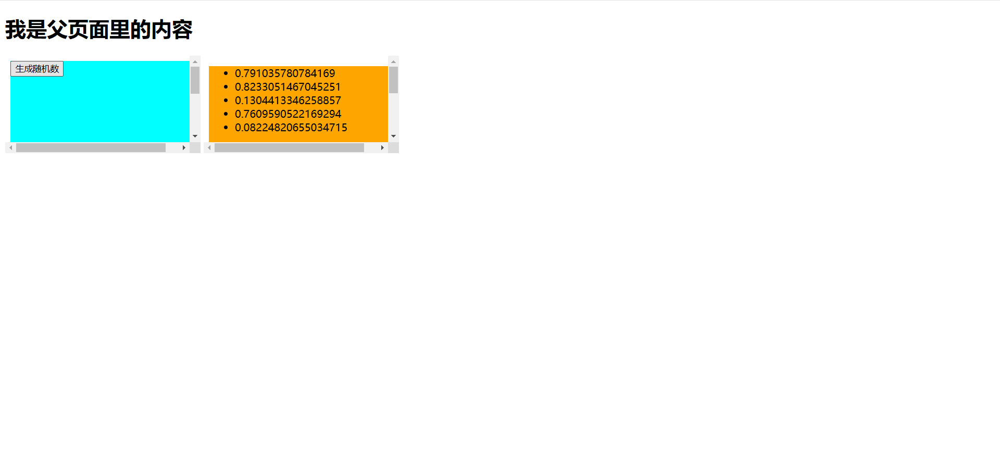
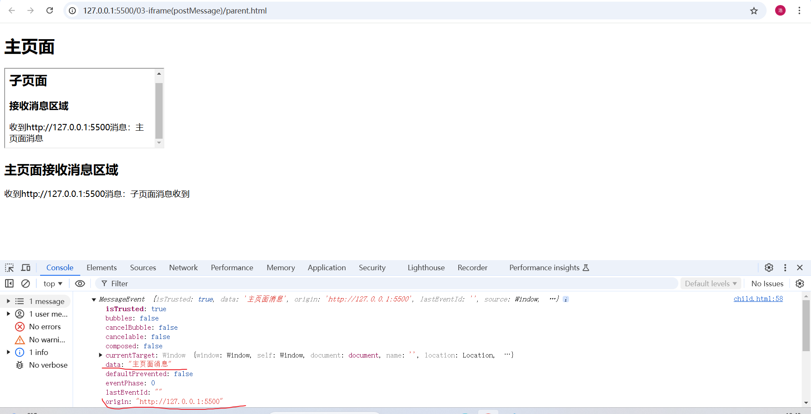
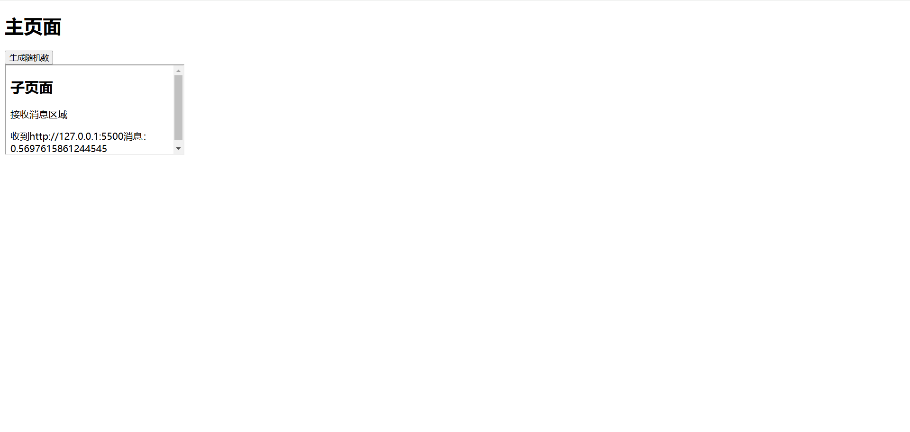

# 跨iframe的消息通信

## 需求

> **在实际项目开发中可能会碰到在 a.com 页面中嵌套 b.com 页面，这时第一反应是使用 iframe，但是产品又提出在 a.com 中操作，b.com 中进行显示，或者相反。**

## 解决方式1

> MessageChannel：创建一个新的消息通道，并通过它的两个 [`MessagePort`](https://developer.mozilla.org/zh-CN/docs/Web/API/MessagePort) 属性发送数据。


**parent**
```html
  <!-- parent.html -->
  <h1>我是父页面里的内容</h1>
  <iframe src="./child1.html" frameborder="0"></iframe>
  <iframe src="./child2.html" frameborder="0"></iframe>
  <!-- 面试题：跨iframe的消息通信 -->
```
```js
  // parent.js
  let channel = new MessageChannel()
  // let port1 = channel.port1  ！！！let定义的变量不在window上面         或者直接使用window.port1 = channel.port1
  // let port2 = channel.port2  ！！！let定义的变量不在window上面
  var port1 = channel.port1
  var port2 = channel.port2
```

**child1**
```html
  <!-- child1.html -->
  <div class="child-container">
    <button>生成随机数</button>
  </div>
```

```js
  // child1.js
  let port1 = window.parent.port1
  let button = document.querySelector('.child-container button')
  button.addEventListener('click', function () {
    let random = Math.random()
    port1.postMessage(random)
  })
```
**child2**
```html
  <!-- child2.html -->
  <div class="child-container">
    <ul></ul>
  </div>
```

```css
    /* child2.css */
    .child-container {
      width: 300px;
      height: 300px;
      background-color: orange;
    }
```

```js
  // child2.js
  let port2 = window.parent.port2
  let ul = document.querySelector('ul')
  port2.onmessage = function (e) {
    console.log(e.data);
    let li = document.createElement('li')
    li.innerText = e.data
    ul.appendChild(li)
  }
```

**效果**



## 解决方式2

> postMessage：该允许来自不同源的脚本采用异步方式进行有限的通信，可以实现跨文本档、多窗口、跨域消息传递。

> **注意**：该方法可以安全地实现跨源通信。通常，对于两个不同页面的脚本，只有当执行它们的页面位于具有相同的协议（通常为https），端口号（443为https的默认值），以及主机  (两个页面的模数 Document.domain设置为相同的值) 时，这两个脚本才能相互通信。window.postMessage() 方法提供了一种受控机制来规避此限制，只要正确的使用，这种方法就很安全。

**语法**

> otherWindow.postMessage(message, targetOrigin, [transfer]);

`otherWindow：其他窗口的引用，如 iframe的contentWindow、执行window.open返回的窗口对象、或者是命名过或数值索引的window.frames。`

`message：将要发送到其他window的数据。`

`targetOrigin：指定那些窗口能接收到消息事件，其值可以是字符串 “*” 表示无限制，或者是一个URI。`

`transfer：是一串和message同时传递的Transferable对象，这些对象的所有权将被转移给消息的接收方，而发送方将不再保留所有权。`

`postMessage方法被调用时，会在所有页面脚本执行完毕之后像目标窗口派发一个 MessageEvent 消息，该MessageEvent消息有四个属性需要注意：`

> `type：表示该message的类型`
>
> `data：为 postMessage 的第一个参数`
>
> `origin：表示调用postMessage方法窗口的源`
>
> `source：记录调用postMessage方法的窗口对象`

**代码：**

**parent**

```html
  <h1>主页面</h1>
  <iframe id="child" src="./child.html"></iframe>
  <div>
    <h2>主页面接收消息区域</h2>
    <span id="message"></span>
  </div>
```

```js
  let child = document.querySelector('#child')
  let messageSpan = document.querySelector('#message')
  window.onload = function () {
    child.contentWindow.postMessage("主页面消息", "http://127.0.0.1:5500/03-iframe(postMessage)/child.html")
  }
  window.addEventListener('message', function (event) {
    messageSpan.innerHTML = "收到" + event.origin + "消息：" + event.data;
  });
```

**child**

```html
  <h2>子页面</h2>
  <div>
    <h3>接收消息区域</h3>
    <span id="message"></span>
  </div>
```

```js
  window.addEventListener('message', function (event) {
    if (window.parent !== event.source) return
    console.log(event);
    document.getElementById('message').innerHTML = "收到" + event.origin + "消息：" + event.data;
    // 在iframe本页面，要操作这个iframe的父页面的DOM元素（即嵌套这个iframe的页面）可以用：
    // window.parent、window.top(这里的TOP是获取的顶层，即有多层嵌套iframe的时候使用)
    top.postMessage("子页面消息收到", 'http://127.0.0.1:5500/03-iframe(postMessage)/parent.html')
  });
```

**效果**



## 解决方式2(生成随机数)

**代码：**

**parent**

```html
  <div>
    <h1>主页面</h1>
    <button>生成随机数</button>
  </div>
  <iframe id="child" src="./child.html"></iframe>
```

```js
  let child = document.querySelector('#child')
  let button = document.querySelector('button')
  button.addEventListener('click', () => {
    child.contentWindow.postMessage(Math.random(), "http://127.0.0.1:5500/03-iframe(postMessage)%20copy/child.html")
  })
```

**child**

```html
  <h2>子页面</h2>
  <div>
    <p>接收消息区域</p>
    <span id="message"></span>
  </div>
```

```js
  window.addEventListener('message', function (event) {
    if (window.parent !== event.source) return
    console.log(event);
    document.getElementById('message').innerHTML = "收到" + event.origin + "消息：" + event.data;
    // 在iframe本页面，要操作这个iframe的父页面的DOM元素（即嵌套这个iframe的页面）可以用：
    // window.parent、window.top(这里的TOP是获取的顶层，即有多层嵌套iframe的时候使用)
    top.postMessage("子页面消息收到", 'http://127.0.0.1:5500/03-iframe(postMessage)%20copy/child.html')
  });
```

**效果**

