# 安装宝塔_服务器运维面板

## 安装宝塔——服务器运维面板

首先，需要有一台服务器

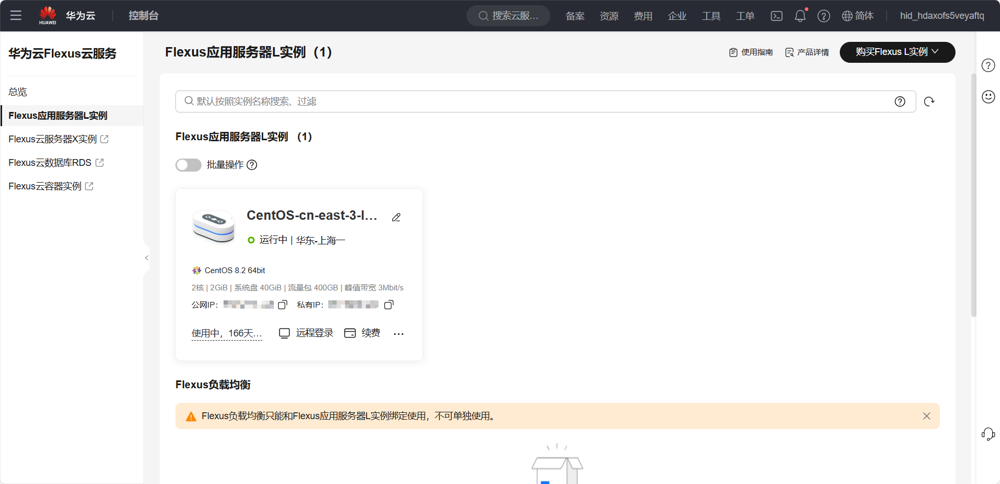

然后打开命令行工具，输入

```
ssh root@服务器上的公网IP
```


然后输入密码，这时候输入密码不会显示密码，显示Welcome to Huawei cloud service就代表成功了

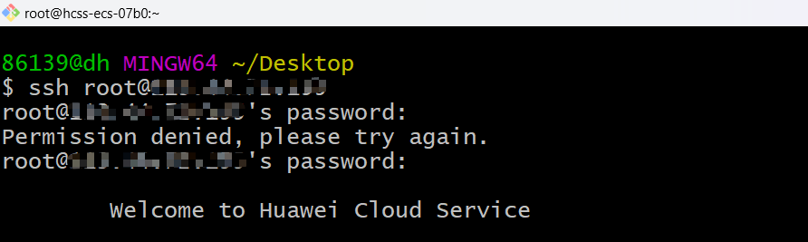

这个时候打开浏览器输入bt.cn进入宝塔的官网，点击立即免费安装

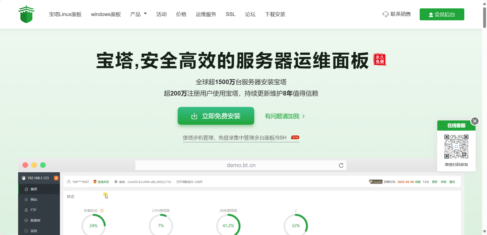

选择你服务器的版本，在右边复制命令

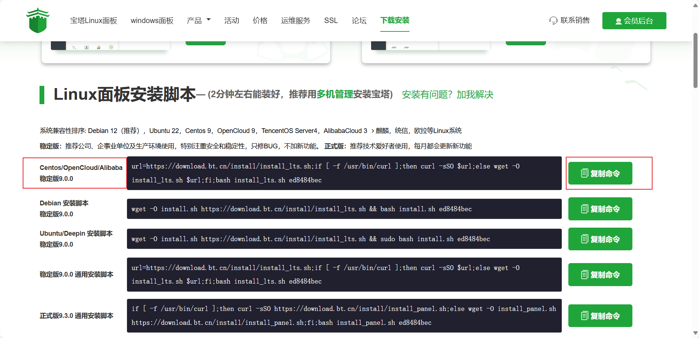

回到命令行工具，粘贴，回车，进入安装宝塔面板，下方的问题输入y

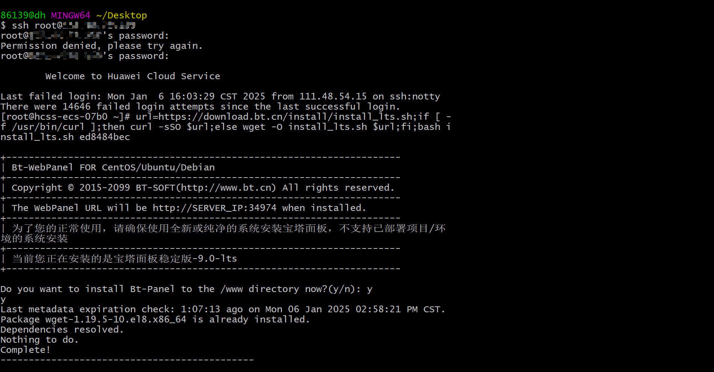

开始一段很久的自动安装，到了这个界面代表安装好了，复制`外网面板地址:端口号`，如：120.36.458.12:23519

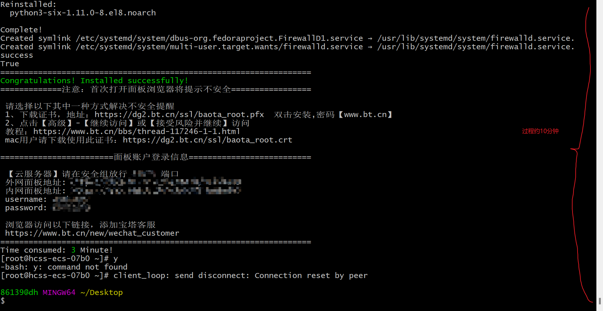

到浏览器打开，此时发现打不开，先不着急关闭页面，来到华为云，点击配置安全组规则——添加规则

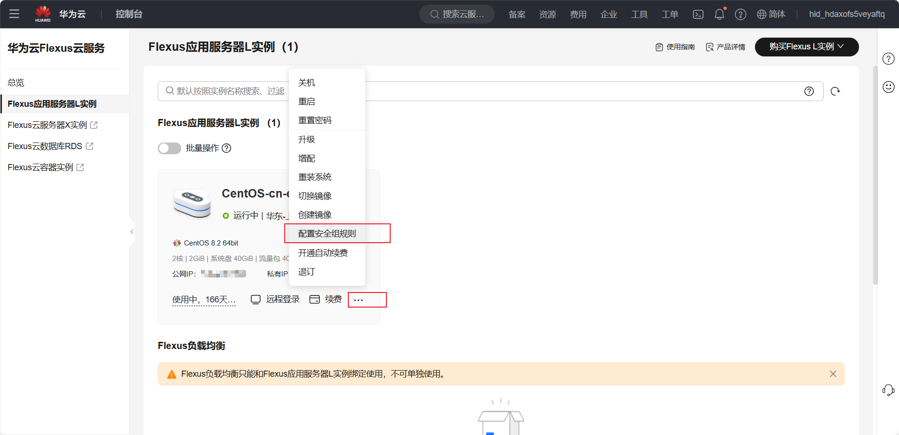

优先级看需要填，端口填刚刚在命令行看到的端口，点击确定

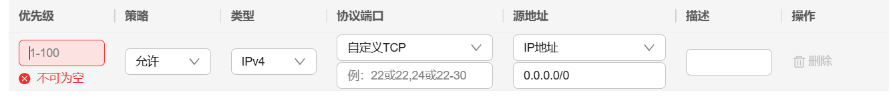

然后再刷新一下刚刚打不开的网址，发现打开了，需要登录，将命令行中显示的username和password填入其中，登录进入后，要绑定宝塔账号，绑定好之后，显示以下界面

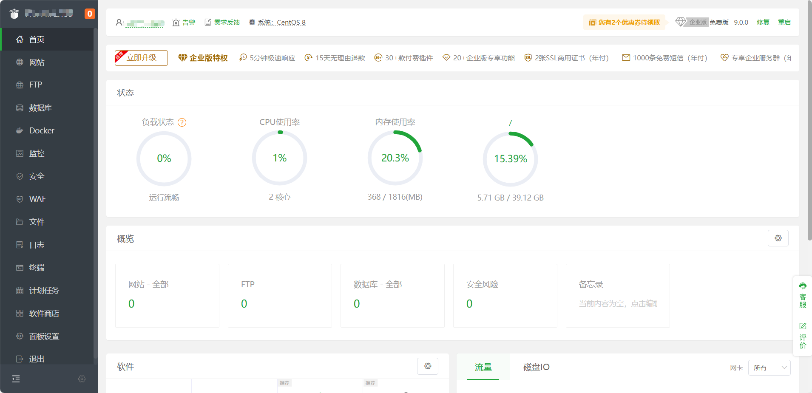

完成。

-------------------

## 下载并配置Nginx

在上面的界面中点击软件商店，搜索Nginx，安装

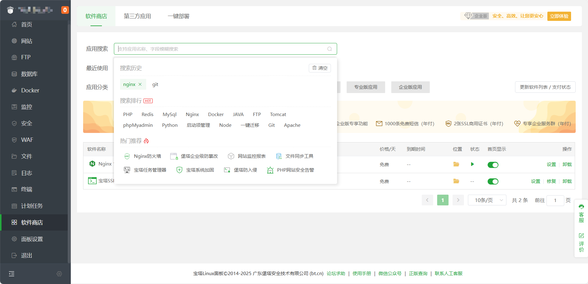

安装过程大约10分钟，安装好后打开首页显示，然后去首页

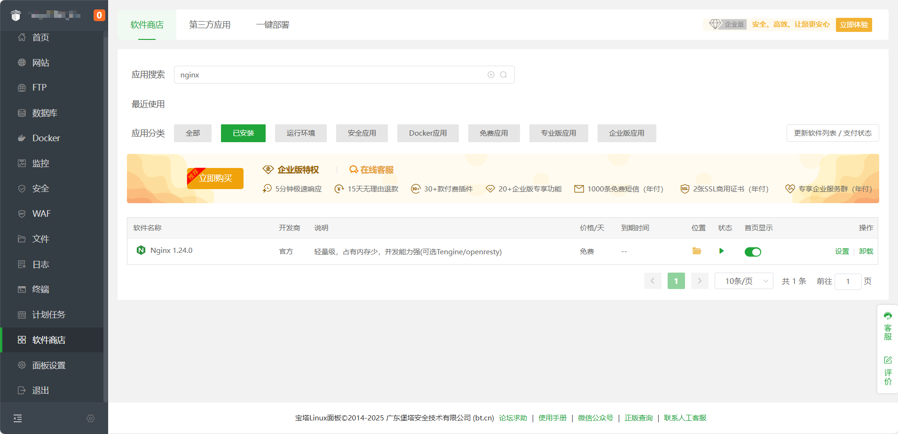

点开Nginx

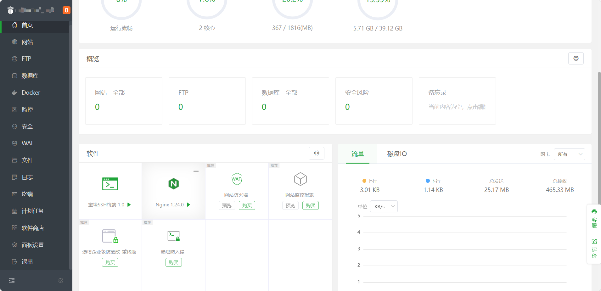

在配置修改中找到server，将端口改为80(http默认端口)，root改成/www/wwwroot，点击保存

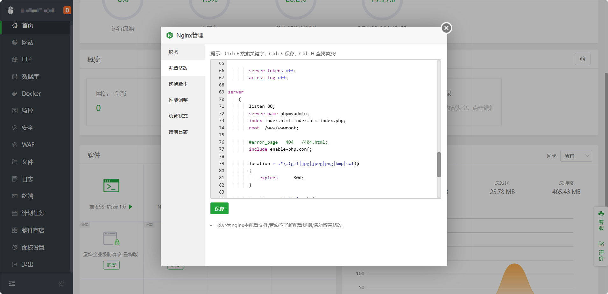

在服务中，点击重载配置

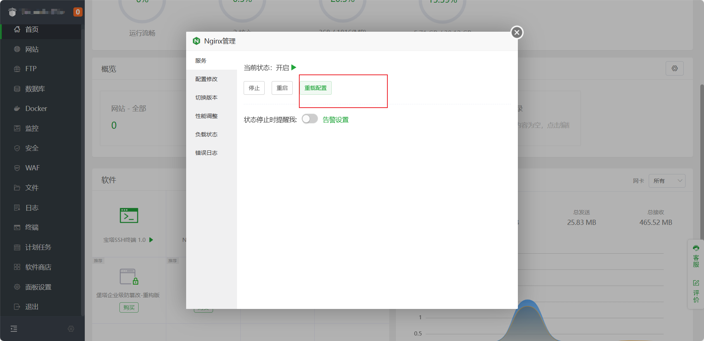

但此时80端口没有配置在我们服务器的安全组规则中，点击一键放通常用端口，确定

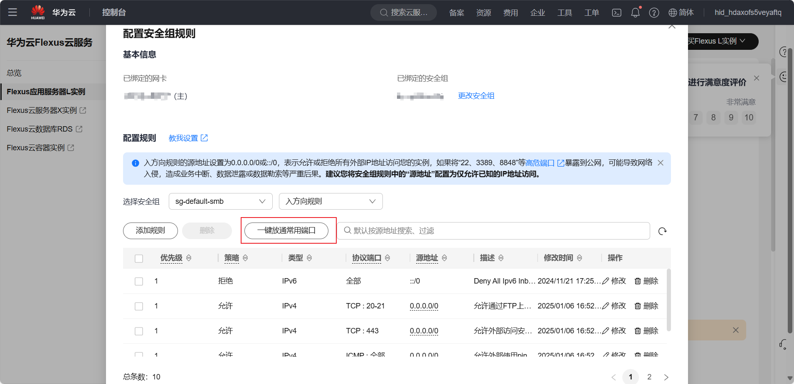

来到宝塔Linux面板，点击文件，进入到/www/wwwroot/default文件夹中，将你想上传的文件或网页放到这个文件夹中

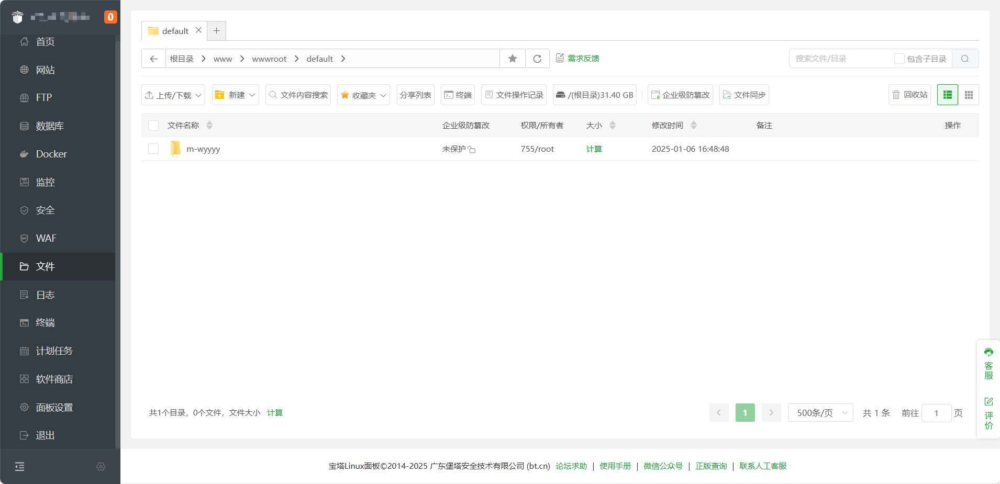

完成，此时想访问网页的话，只需访问`http://服务器公网IP/default/m-wyyyy/...(路径)`