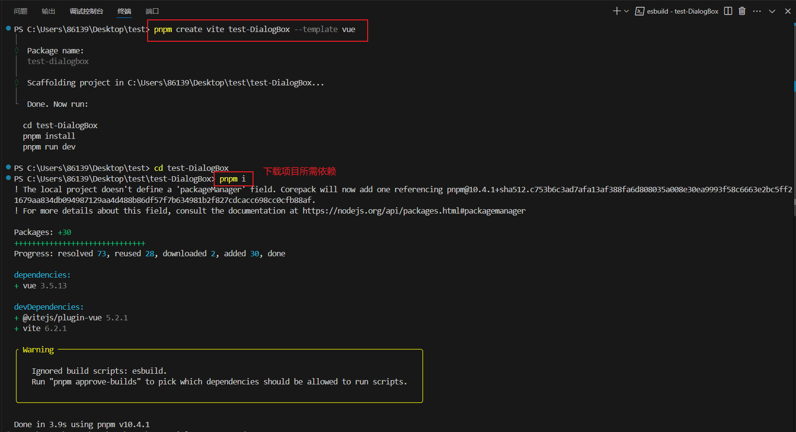
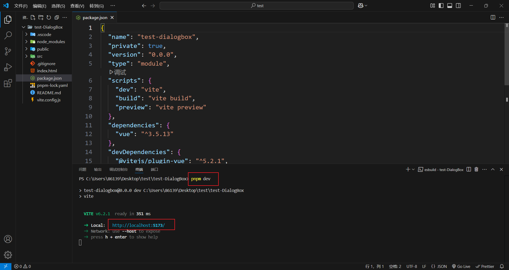

# vue入门

## 快速构建一个 Vite + Vue 项目

```powershell
# npm 6.x
npm create vite@latest my-vue-app --template vue

# npm 7+, extra double-dash is needed:
npm create vite@latest my-vue-app -- --template vue

# yarn
yarn create vite my-vue-app --template vue

# pnpm
pnpm create vite my-vue-app --template vue
```






