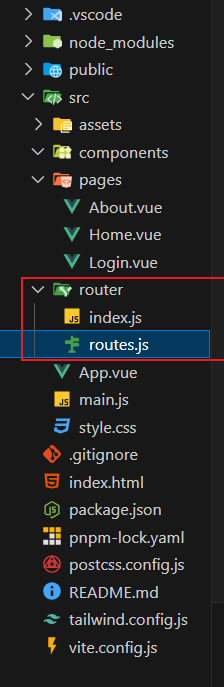
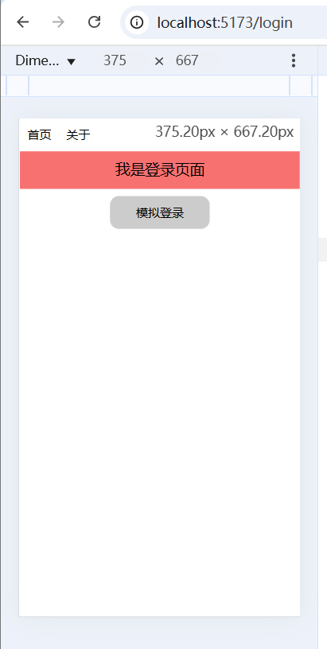

# Vue Router

### 安装 Vue Router

```bash
pnpm add vue-router@4
```

### 创建路由器实例

使用createRouter()

在src中新键router文件夹，新建routes.js和index.js两个文件



`router/routes.js`

```js
// 用来专门存放路由
import Home from '../pages/Home.vue'
import About from '../pages/About.vue'
import Login from '../pages/Login.vue'

export const STATIC_ROURES = [
  { path: '/', redirect: '/home' },//路由重定向，访问根路径时 重定向到home页面
  { path: '/home', component: Home },
  { path: '/about', component: About },
  { path: '/login', component: Login },
]
```

`router/index.js`

```js
import { createRouter, createWebHashHistory, createWebHistory } from "vue-router";
import { STATIC_ROURES } from "./routes";

// 创建路由实例 （本质上是一个plugin，可以通过use()来注册）
export const router = createRouter({
  // history: createWebHashHistory(), //通过哈希值改变，不美观
  history: createWebHistory(),
  // url <-----> component
  routes: STATIC_ROURES,
})
```

### 注册路由器插件

一旦创建了我们的路由器实例，我们就需要将其注册为插件，这一步骤可以通过调用 `use()` 来完成。

`main.js`

```js
import { createApp } from 'vue'
import './style.css'
import App from './App.vue'

import { router } from './router'
// 注册两个全局组件 RouterView 和 RouterLink
// RouterView是渲染组件的 本质上是component的封装
// RouterLink是切换组件的 本质上是
createApp(App).use(router).mount('#app')
```

如果你好奇这个插件做了什么，它的职责包括：

1. 全局注册 `RouterView` 和 `RouterLink` 组件。
2. 添加全局 `$router` 和 `$route` 属性。
3. 启用 `useRouter()` 和 `useRoute()` 组合式函数。
4. 触发路由器解析初始路由。

### 使用

`App.vue`

```vue
<template>
  <RouterLink to="/home">首页</RouterLink>
  <RouterLink to="/about">关于</RouterLink>
  <RouterView />
</template>
```

在这个 `template` 中使用了两个由 Vue Router 提供的组件: `RouterLink` 和 `RouterView`。

不同于常规的 `<a>` 标签，我们使用组件 `RouterLink` 来创建链接。这使得 Vue Router 能够在不重新加载页面的情况下改变 URL，处理 URL 的生成、编码和其他功能。

`RouterView` 组件可以使 Vue Router 知道你想要在哪里渲染当前 URL 路径对应的`路由组件`。

如何想自定义控制页面渲染的方式，可以使用`router.push()`来改变路由

`App.vue`

```vue
<template>
  <RouterView />
  <button class="p-[10px] hover:bg-[#ccc] rounded-md" @click="onToHome">首页</button>
  <button class="p-[10px] hover:bg-[#ccc] rounded-md" @click="onToAbout">关于</button>
</template>
<script setup>
import { useRouter } from 'vue-router'
const router = useRouter()
const onToHome = () => router.push('/home')
const onToAbout = () => router.push('/about')
</script>
```

### 导航守卫

主要用来通过跳转或取消的方式守卫导航。每一个导航触发都要经过这个导航守卫。

接收三个参数`to`、`from`、`next`(非必选)

- **to**: 即将要进入的目标。到哪里去
- **from**: 当前导航正要离开的路由。从哪里来
- **next()**: 用于控制路由导航的行为。它的作用如下：

> 1. **继续导航**：调用 `next()` 时，导航会继续，进入目标路由。
> 2. **中断导航**：调用 `next(false)` 时，导航会被取消，用户停留在当前路由。
> 3. **重定向**：调用 `next('/path')` 或 `next({ path: '/path' })` 时，导航会中断并重定向到指定路径。
> 4. **错误处理**：调用 `next(error)` 时，导航会中止，错误会被传递给 `router.onError()` 注册的回调。

需求：用户未登录时，无论访问哪个路径，都会被重定向到`login`页面

`router/index.js`

```js
import { createRouter, createWebHashHistory, createWebHistory } from "vue-router";
import { STATIC_ROURES } from "./routes";
// 创建路由实例 （本质上是一个plugin）
export const router = createRouter({
  history: createWebHistory(),
  // url <-----> component
  routes: STATIC_ROURES,
})
// 添加全局的路由守卫 拦截器
router.beforeEach((to, from, next) => {
  // 假设localStorage中的isLogin存在就是登录状态
  const isLogin = Boolean(window.localStorage.getItem('isLogin'))
  if (isLogin || to.fullPath === '/login') {
    next()
  } else {
    next('/login')
  }
})
```

`login.vue`

```vue
<template>
  <div class="text-center">
    <h1 class="text-[20px] bg-red-400 py-[10px]">我是登录页面</h1>
    <button @click="onLogin" class="px-[35px] py-[10px] mt-[10px] bg-[#ccc] rounded-xl">
      模拟登录
    </button>
  </div>
</template>
<script setup>
import { useRouter } from 'vue-router'
const router = useRouter()
const onLogin = () => {
  // 登录后默认进入首页
  router.push('/home')
  // 假设localStorage中的isLogin存在就是登录状态
  window.localStorage.setItem('isLogin', 'true')
}
</script>
```

此时无论访问根路径还是/home或者是/about都会被重定向到login页面，点击模拟登录后就可以访问其他页面了




以下笔记以ts为基础

------------------------

## 带参数的静态路由匹配(vueRouter的两种传参方式)

### 初始化

初始化一个vue+vite+ts的项目

```powershell
```


### 1、路径参数

```typescript
import type { RouteRecordRaw } from 'vue-router'
import Index from '../views/Index.vue'
import About from '../views/About.vue'
import Mine from '../views/Mine.vue'

const router: RouteRecordRaw[] = [
  // 路由重定向
  {
    path: '/',
    redirect: '/index',
  },
  {
    path: '/index',
    component: Index,
  },
  // 在routes.ts上通过:key配置
  {
    path: '/about/:id/:uid',
    component: About,
  },
  {
    path: '/mine',
    component: Mine,
  },
]

export default router

```

```vue
<template>
  <div>index</div>
  <!-- 两种写法，在路径上都是：/about/123/345 -->
  <RouterLink to="/about/123/345">to About</RouterLink>
  <RouterLink :to="{ path: '/about/123/345' }">to About</RouterLink>
</template>
<script setup lang="ts"></script>
```

### 2、query参数

```vue
<template>
  <div>about</div>
  <!-- 三种写法，在路径上都是：/mine?bar=1&baz=2 -->
  <RouterLink :to="{ path: '/mine', query: { bar: 1, baz: 2 } }"
    >to Mine</RouterLink
  >
  <RouterLink :to="'/mine?bar&baz=2'">to Mine</RouterLink>
  <RouterLink :to="{ path: '/mine?bar&baz=2' }">to Mine</RouterLink>
</template>
<script setup lang="ts">
import { useRouter } from 'vue-router'
const router = useRouter()
console.log(router.currentRoute.value.params)
const f1 = () => router.push('/mine?bar&baz=2')
const f2 = () => router.push({ path: '/mine', query: { bar: 1, baz: 2 } })
const f3 = () => router.push({ path: '/mine?bar&baz=2' })
</script>
```


