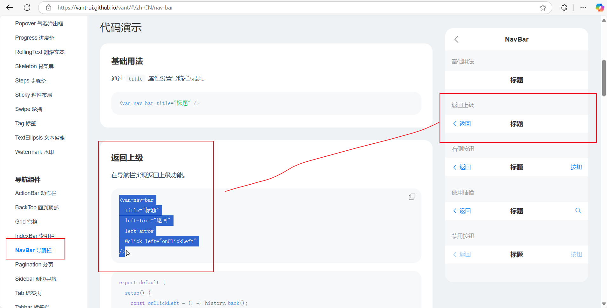
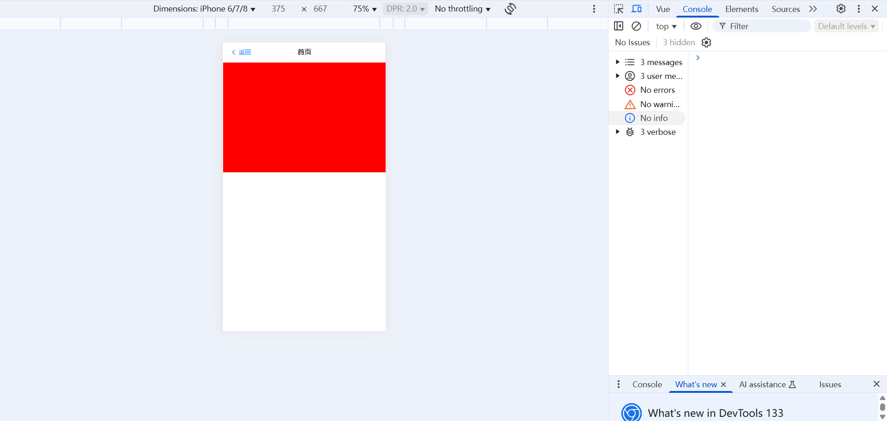
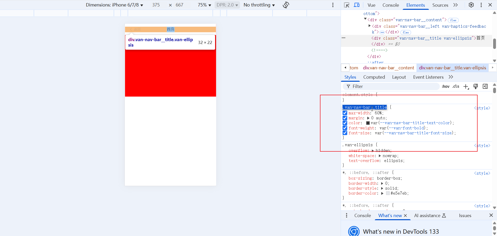
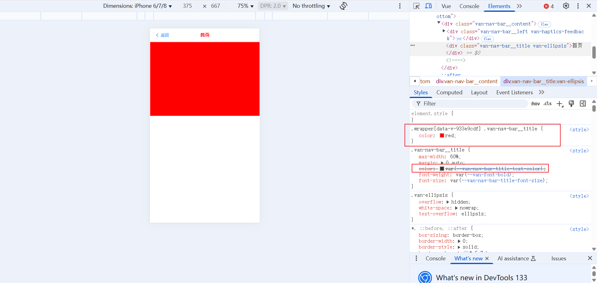

# 组件作用域 CSS

## 全局样式

```vue
<style>
/* 全局样式,可以作用于其他页面 */
.middle {
  position: absolute;
  top: 50%;
  left: 50%;
  transform: translate(-50%, -50%);
}
</style>

<style scoped>
/* 局部样式 */
</style>
```

## 局部样式

当 `<style>` 标签带有 `scoped` attribute 的时候，它的 CSS 只会影响当前组件的元素。

`bar.vue`

```vue
<template>
  <div class="wrapper"></div>
</template>
<style scoped>
.wrapper {
  height: 300px;
  background-color: red;
}
</style>
```

有时我们使用他人的组件库，或使用自己写的组件时，想要在当前页面修改这个组件的样式，可因为`scoped`属性导致无法修改。

如：

### 引入`Vant`组件库

```bash
# 通过 npm 安装
npm i vant
# 通过 pnpm 安装
pnpm add vant
# 通过 yarn 安装
yarn add vant
```

### 引入组件

**方法一：**常规用法（简单不推荐）

```vue
import { createApp } from 'vue';
// 1. 引入你需要的组件
import { Button } from 'vant';
// 2. 引入组件样式
import 'vant/lib/index.css';

const app = createApp();

// 3. 注册你需要的组件
app.use(Button);
```

这种方法，在大项目中这个use()会越来越多，app.use(...).use(...).use(...).use(...).use(...).use(...).use(...)，不推荐

**方法二：**按需引入组件样式（麻烦但推荐）

> 在基于 Rsbuild、Vite、webpack 或 vue-cli 的项目中使用 Vant 时，可以使用 [unplugin-vue-components](https://github.com/unplugin/unplugin-vue-components) 插件，它可以自动引入组件。
>
> Vant 官方基于 `unplugin-vue-components` 提供了自动导入样式的解析器 [@vant/auto-import-resolver](https://github.com/youzan/vant/tree/main/packages/vant-auto-import-resolver)，两者可以配合使用。
>
> 相比于常规用法，这种方式可以按需引入组件的 CSS 样式，从而减少一部分代码体积，但使用起来会变得繁琐一些。如果业务对 CSS 的体积要求不是特别极致，我们推荐使用更简便的常规用法。

#### 1. 安装插件

```bash
# 通过 npm 安装
npm i @vant/auto-import-resolver unplugin-vue-components unplugin-auto-import -D

# 通过 yarn 安装
yarn add @vant/auto-import-resolver unplugin-vue-components unplugin-auto-import -D

# 通过 pnpm 安装
pnpm add @vant/auto-import-resolver unplugin-vue-components unplugin-auto-import -D

# 通过 bun 安装
bun add @vant/auto-import-resolver unplugin-vue-components unplugin-auto-import -D
```

#### 2. 配置插件

如果是基于 [Rsbuild](https://github.com/web-infra-dev/rsbuild) 的项目，在 `rsbuild.config.js` 文件中配置插件：

```js
...
```

如果是基于 Vite 的项目，在 `vite.config.js` 文件中配置插件：

```js
import vue from '@vitejs/plugin-vue';
import AutoImport from 'unplugin-auto-import/vite';
import Components from 'unplugin-vue-components/vite';
import { VantResolver } from '@vant/auto-import-resolver';

export default {
  plugins: [
    vue(),
    AutoImport({
      resolvers: [VantResolver()],
    }),
    Components({
      resolvers: [VantResolver()],
    }),
  ],
};
```

如果是基于 vue-cli 的项目，在 `vue.config.js` 文件中配置插件：

```js
...
```

如果是基于 webpack 的项目，在 `webpack.config.js` 文件中配置插件：

```js
...
```

#### 3. 使用组件和 API

> 完成以上两步，就可以直接在模板中使用 Vant 组件了，`unplugin-vue-components` 会解析模板并自动注册对应的组件, `@vant/auto-import-resolver` 会自动引入对应的组件样式。

在vant官网中找一个想使用的组件：https://vant-ui.github.io/vant/#/zh-CN，复制，粘贴



`bar.vue`

```vue
<template>
  <div class="wrapper">
    <van-nav-bar title="首页" left-text="返回" left-arrow />
  </div>
</template>
<style scoped>
.wrapper {
  height: 300px;
  background-color: red;
}
</style>
```

就可以在页面上看到效果了



组件库中给的样式有时与设计稿的样式不同，这个时候我们想要改这个组件的样式，如：将`首页`这个文字的颜色改为红色，而这个组件库中的样式也因scoped而让我们无法修改

## 深度选择器		:deep()

样式穿透

处于 `scoped` 样式中的选择器如果想要做更“深度”的选择，也即：影响到子组件，可以使用 `:deep()` 这个伪类：

```js
// 格式
// 父级选择器 :deep(选择器){
//   自定义的样式表
// }
```

从控制台得知，`首页`这个文字的样式来自`.van-nav-bar__title`这个类名。



```vue
<template>
  <div class="wrapper">
    <van-nav-bar title="首页" left-text="返回" left-arrow />
  </div>
</template>
<style scoped>
.wrapper {
  height: 300px;
  background-color: red;
}
.wrapper :deep(.van-nav-bar__title) {
  color: red;
}
</style>
```



## 插槽选择器

> 默认情况下，作用域样式不会影响到 `<slot/>` 渲染出来的内容，因为它们被认为是父组件所持有并传递进来的。使用 `:slotted` 伪类以明确地将插槽内容作为选择器的目标：

```vue
<style scoped>
:slotted(div) {
  color: red;
}
</style>
```

## 全局选择器

> 如果想让其中一个样式规则应用到全局，比起另外创建一个 `<style>`，可以使用 `:global` 伪类来实现 (看下面的代码)：

```vue
<style scoped>
:global(.red) {
  color: red;
}
</style>
```


 