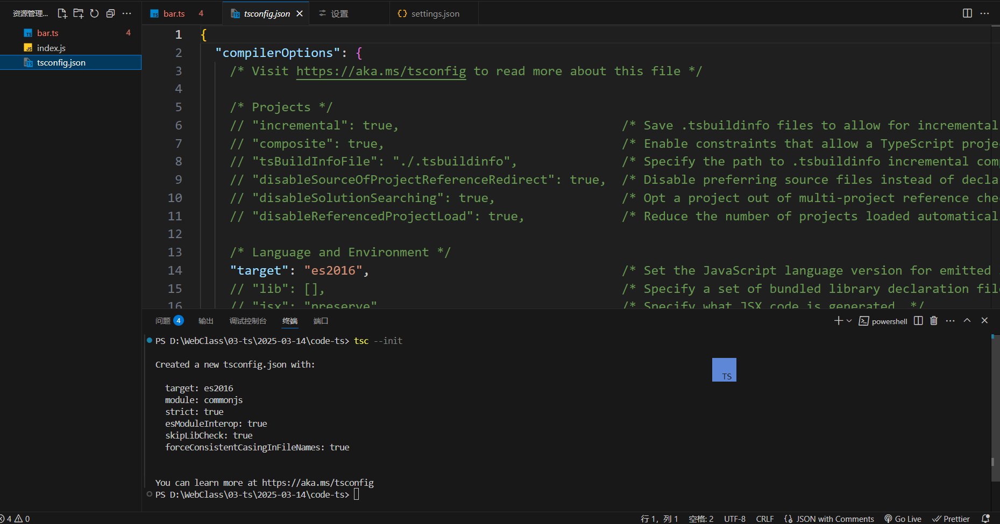

# typescript入门

为什么学习ts，二话不说看图


## 初始化ts配置文件

输入 `tsc --init`



修改配置项设置


或者直接使用vue+ts的模版`pnpm create vite 项目名称 --template vue-ts`


编译ts文件，生成对应的js文件`tsc -w`

## 类型的声明

### 基本类型的声明

> let 变量名: type = value

```typescript
// 字符串(string)、数字(number)、布尔值(boolean)、未定义(undefined)、空(null)
let v1: number = 1
let v2: string = ''
let v3: boolean = true
let v4: undefined = undefined
let v5: null = null
```

### 复杂类型的声明

#### 数组

```typescript
// 如何表达数组的类型：T[]、Array<T>、[T1,T2...]
const v1: number[] = [1, 2, 3] //表示数组中的元素只能出现数字
const v2: Array<1> = [1, 1, 1, 1, 1] //表示数组中的元素只能出现1，这里的1是类型字面量
const v3: Array<1 | false | null> = [1, false, null] //表示数组中的元素只能出现1, false, null
const v4: (1 | false | null)[] = [1, false, null] //表示数组中的元素只能出现1, false, null
const v5: never[] = [] //表示数组中的元素只能是空

// 所有数组的父类型
let vv1: any[] = [1, false, null, true, undefined]
```

##### `对象之间的类型安全`

```typescript
let vv1!: number[]
let vv2!: Array<1>
vv1 = vv2
```

#### 元组

```typescript
// 如何表达元组类型：[类型1,类型2,类型3]
let v6: [1, false, null, undefined] = [1, false, null, undefined] // 元组：定义时无法越界
// 元组依然可以越界(使用数组方法) 类型为元组成员所有类型的联合类型
v6.push(false, null, undefined, 1)
```

#### 对象

```typescript
// 如何表达对象的类型 type interface
type T2 = {
  id: number
  name: string
  age: number
  gender: boolean
  hobby: string[]
}
interface T3 {
  id: number
  name: string
  age: number
  gender: boolean
  hobby: string[]
}
let v10: T2 = {
  id: 1,
  name: 'dh',
  age: 18,
  gender: false,
  hobby: ['sing', 'jump', 'rap'],
}
let v11: T3 = {
  id: 1,
  name: 'dh',
  age: 13,
  gender: true,
  hobby: ['da'],
}
```

##### `对象之间的类型安全`

```typescript
// 对象之间的类型安全
// 满足子类型的值可以赋值给满足父类型约束的变量
type A = { name: string; age: number } // name gae
type B = { name: string } //name
// 属性越多越具体 范围越小  华为手机
// 属性越多越宽泛 范围越广  手机
// 如何判断对象类型的兼容性？
// 属性多的必须包含属性少的所有属性且其类型必须是属性少的子类型
let a!: A
let b!: B
b = a

// 所有对象的父类型：{}
let v12: {} = {
  a: 1,
  b: '',
  c: false,
}
```

##### `根据一个对象类型获取其中某一个成员的类型`

```typescript
// 如何根据一个对象类型获取其中某一个成员的类型
type A_NAME = A['name']
type B_NAME = B['name']
type A_ALL1 = A['name' | 'age'] //取到所有的对象类型 穷举法
// 通过keyof关键字 计算一个对象类型的所有成员属性字符串组成的联合类型
type A_ALL_KEYS = keyof A // 'name'/'age'
type A_ALL2 = A[keyof A] //取到所有的对象类型

// function getAttribute(element: HTMLDivElement, attrname: keyof HTMLElement) {}
// getAttribute(document.querySelector('div')!, 'innerText')
```

##### `根据一个数组类型获取其中某一个成员的类型`

```typescript
type C = [number, string, boolean, undefined, null]
type C1 = C[1]
type C2 = C[2]
type C3 = C[3]
type C_ALL1 = C[0 | 1 | 2 | 3 | 4] //取到所有的数组类型 穷举法
type C_ALL2 = C[number] //取到所有的数组类型
```

##### `对象的修饰符`

```typescript
// 只读属性readonly、可选属性?
type O = {
  a: null
  readonly b: number
  c?: string
}
let o: O = {
  a: null,
  b: 1,
  // c: 'abc',
}
// o.b = 123 //无法为“b”赋值，因为它是只读属性
```

##### `任意成员`

如何约束一个任意属性名 且值的取值类型为1

```typescript
// 如何约束一个任意属性名 且值的取值类型为1
// 用ES6 对象的属性名表达式
const k1 = 'abc'
const k2 = 'def'
const k = {
  [k1]: 123,
  [k2]: 456,
}
type K = {
  // [key: string | number | symbol]: 1
  [key: keyof any]: 1
  // keyof any === number/string/symbol
}
let o1: K = {
  a: 1,
  b: 1,
  1: 1,
  [Symbol('abc')]: 1,
}

// 增加需求，满足上面需求的同时，加一个约束，a的类型只能是boolean
type K = {
  a: boolean
  [key: keyof any]: 1 | boolean
}
let o1: K = {
  a: false, //以更加具体的类型为准，具体的类型优先级更高
  b: 1,
  1: 1,
  [Symbol('abc')]: 1,
}
```

#### 函数

```typescript
// 如何定义函数类型
// 1.在函数的定义上附加参数类型和返回值类型（函数声明的类型定义）
// ------------参数类型,参数类型----返回值类型
function f1(a: number, b: number): number {
  return a + b
}

// 2.函数的类型和函数的实现分开 (函数定义的类型定义)
let f2: (x: number, y: number) => number = function (a, b) {
  return a + b
}
// 2.定义类型
type F3 = (x: number, y: number) => number
let f3: F3 = function (a, b) {
  return a + b
}
// 2.定义类型
type F4 = (...args: [number, number]) => number
let f4: F4 = function (a, b) {
  return a + b
}
// 3.使用接口来定义函数类型(了解)
interface F5 {
  (a: number, b: number): number
}
type F55 = {
  (a: number, b: number): number
}
let f5: F5 = (a, b) => a + b
let f55: F55 = (a, b) => a + b


function echo(): void {//返回值为空
  alert('')
}
```

##### `函数的重载`

需求：需要实现一个函数reverse,输入数字123的时候，输出反转的数字321，输入字符串'hello'的时候，输出反转的字符串'olleh'

```typescript
// 如果写成这样
type ReverseType = (value: string | number) => string | number
const reverse: ReverseType = (data) => {
  if (typeof data === 'string') {
    return data.split('').reverse().join('')
  }
  return Number(data.toString().split('').reverse().join(''))
}
reverse(123)
```

如果是这样，不符合题目要求，输入数字的时候，可能返回数字或字符串，输入字符串的时候，也可能返回数字或字符串

而且，我们发现reverse(123)的返回值应该是number类型的方法居然只有三个，他们是number和string共有的方法，显然这不正确


`正确写法`

```typescript
// 重复定义多次函数的类型，最后一次是函数的实现
function reverse(data: string): string
function reverse(data: number): number
function reverse(data: string | number): number | string {
  if (typeof data === 'string') {
    return data.split('').reverse().join('')
  }
  return Number(data.toString().split('').reverse().join(''))
}
reverse(123)
```


## 类型？？集合？？

```typescript
// 类型约束？约束了啥？约束了取值范围的集合
// 类型安全？值必须在集合的范围内
// 你认为什么是type？ 数学中的集合（空集、父集、子集、交集、并集、有限集合、无限集合）
// 类型 === 集合
// 无限集合：number、string
// 有限集合：boolean、undefined、null
```

### 自定义类型(集合)

通过type关键字

```typescript
type onetowthree = 1 | 2 | 3
let v6: onetowthree = 1
// let vv6: onetowthree = 4  //错误
type one = 1
let v7: one = 1
type empty = never
let v8: empty
```

### 类型安全

```typescript
// 类型安全本质上是父子集合运算  值必须在集合的范围内
let v9: number = 1
let v10: onetowthree = 1
v9 = v10
// 类型安全本质上是父子集合运算
let v11: number
let v12: null
// v11和v12的交集为空，v11不是v12的父集，v12也不是v11的父集
type two = 2
let v13: two = 2 //类型变量
let v14: 2 = 2 //类型字面量
// 并集（联合|）
let v15: 1 | never = 1
let v16: 1 | 2 = 2
// 交集（交叉&）
let v17: number & 1 = 1    // 1
let v18: number & boolean  // nerver

// 1.将typescript中的概念和数学中集合的概念作对应（空集、父集、子集、交集、并集、有限集合、无限集合）
// 2.了解什么是类型安全/类型约束？（赋值不报错）
// 3.只有满足子集的元素或变量才可以赋值给满足父级的约束的变量
let v19: 1 | 2 | 3 = 3
let v20!: 1 | 2 | 3
let v21!: 1 | 2
v20 = v21

function sum(a: number | string, b: number): number {
  if (typeof a === 'number') {
    return a + b
  } else {
    return a.length + b
  }
}
sum('null', 1)
```

### 顶部类型和底部类型

```typescript
// number/string/boolean/null/undefined/never
// never是所有集合的子集合/never是所有类型的子类型（底部类型）
// 如果一个类型是所有类型的子类型  （底部类型）   never
// 如果一个类型是所有类型的父类型  （顶部类型）   any
// 使用any意味着你放弃类型安全 anyscript
let v22: any = 1
v22 = []
v22 = function () {}
v22 = 123
v22()
// unknown 也是所有类型 但表示你没有放弃类型约束/类型安全
```

## ts文件作用域

- ts文件中会定义很多类型 类型共享使用的概率非常大
- 所有ts文件默认不存在作用域 如果你需要 那么使用导入导出的语法

`2.ts`

```typescript
// 添加导入导出语法后，会形成作用域
import _ from 'lodash'
// 形成作用域后，其他的文件需要使用，需要导出
export interface Person {
  name: string
  age: number
}
export let Person1 = 1
export default {}
```

`3.ts`

```typescript
// 类型导入加type，值导入不用加
import { type Person, Person1 } from './2'
let person: Person = {
  name: '123',
  age: 18,
}
```

## 交叉、联合运算的本质

- 交叉类型：求多个类型的最大公共子类型
- 联合类型：求多个类型的最小公共父类型

## 添加依赖

```powershell
pnpm add @type/依赖名
```


## 总结

```typescript
/*
数组
类型的定义（T[]、Array<T>、[T1,T2...]）
数组兼容性 数组成员兼容 那么数组也兼容 例如 Array<number>兼容Array<never>
获取数组成员的联合类型 通过类似于取值运算符的语法A[B]的方式
type A = Array<number>[number]   type B = [1,2,3][number]
交叉、联合运算
*/
/*
对象
类型定义 type interface
类型兼容性
获取对象类型的属性字符串组成的联合类型 keyof T
获取对象类型的每一个成员对应的类型的联合类型 T[keyof T]
T[A | B | C] = T[A] | T[B] | T[C]
交叉、联合运算
只读属性readonly、可选属性?
*/
```


