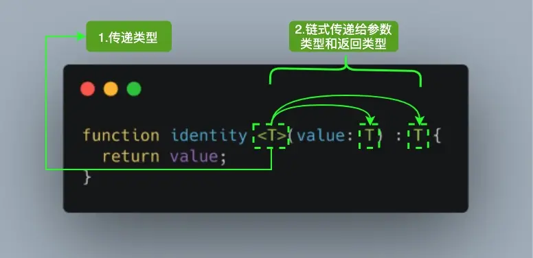
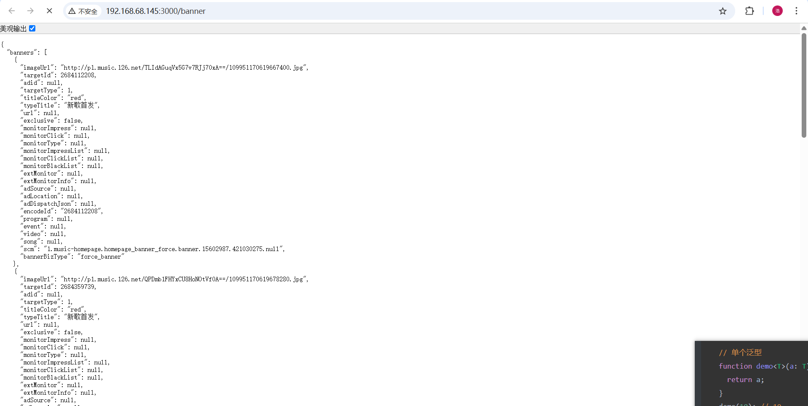
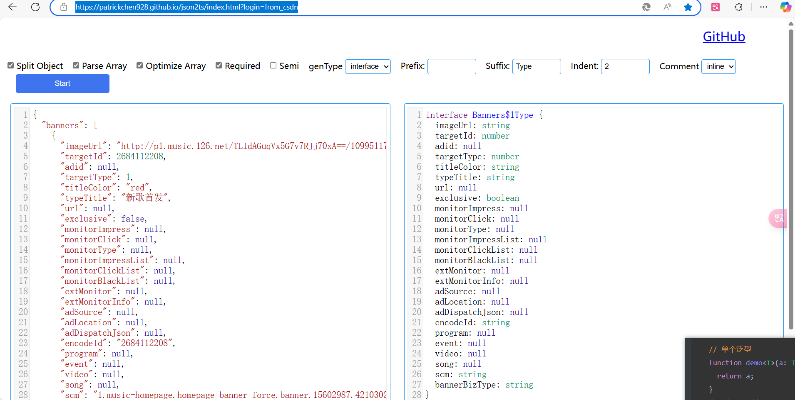

# 泛型

## 1. 前言

**泛型就是使用一个类型变量来表示一种类型，类型值通常是在使用的时候才会设置。泛型的使用场景很多，可以在函数、类、interface 接口中使用**

泛型在 TypeScript 中提供了更灵活、可重用的代码编写方式。它可以用于定义函数、类以及接口，让我们能够编写适用于不同类型的代码。

可以把泛型比喻为一个类型占位符，它告诉编译器：“嘿，这里有一个类型参数，我现在不确定具体是什么类型，但稍后会告诉你。”

例如，让我们看一个简单的例子，来解释泛型的使用。假设我们有一个名为 `identity` 的函数，它接受一个参数并返回该参数：

```typescript
function identity<T>(value: T): T {
  return value;
}
```



在上述代码中，`<T>` 表示这是一个泛型函数，`T` 是一个类型参数，可以是任何类型。函数的参数 `arg` 的类型为 `T`，返回值的类型也是 `T`。

这样，我们可以在函数调用时传入不同的类型参数，使得函数适用于各种类型的参数。

例如，我们可以这样调用 `identity` 函数：

```typescript
let result1 = identity<number>(42); // 传入 number 类型
let result2 = identity<string>("Hello, TypeScript"); // 传入 string 类型
```

在第一次调用时，类型参数 `number` 被传递给 `identity` 函数，所以返回值的类型也是 `number`。而在第二次调用时，类型参数 `string` 被传递给 `identity` 函数，所以返回值的类型是 `string`。

通过使用泛型，我们可以编写出更加通用的函数，不限于特定的类型。这样一来，我们能够避免代码的重复编写，提高代码的可复用性和灵活性。

泛型主要用在四个场合：函数、接口、类和别名。

### 基本使用

泛型使用尖括号 `<T>` 来表示，并在定义函数、类或接口时指定类型参数。下面是一些基本的使用示例：

## 2. 使用泛型变量：

泛型变量允许我们在函数或类中使用一种不确定的类型，而在实际使用时才确定具体的类型。

举个例子，考虑一个简单的函数`identity`，它接受一个参数并返回相同的值：

```typescript
function identity<T>(arg: T): T {1
  return arg;
}
```

在这个例子中，我们使用了泛型变量`T`，它可以代表任意类型。当我们调用函数`identity`时，编译器会根据传入的参数类型自动推断`T`的具体类型。

例如：

```typescript
let result = identity<string>("Hello");
console.log(result); // 输出：Hello

let value = identity<number>(42);
console.log(value); // 输出：42
```

通过使用泛型变量，函数`identity`可以适用于不同类型的参数，提供了更高的灵活性和可重用性。

## 3. 泛型类型：

泛型类型允许我们创建可以适用于不同类型的变量、函数或类。

举个例子，考虑一个简单的数组反转函数`reverse`：

```typescript
function reverse<T>(array: T[]): T[] {
  return array.reverse();
}
```

在这个例子中，我们定义了一个泛型函数`reverse`，接受一个数组参数，并返回反转后的数组。泛型类型`T`用于指定数组的元素类型。

例如：

```typescript
let numbers: number[] = [1, 2, 3, 4, 5];
let reversedNumbers = reverse(numbers);
console.log(reversedNumbers); // 输出：[5, 4, 3, 2, 1]

let strings: string[] = ["apple", "banana", "orange"];
let reversedStrings = reverse(strings);
console.log(reversedStrings); // 输出：["orange", "banana", "apple"]
```

通过使用泛型类型，函数`reverse`可以适用于不同类型的数组，提供了更高的灵活性和可重用性。

## 4. 泛型类：

泛型类允许我们创建可以适用于多种类型的类。类中的成员可以使用泛型类型进行声明和使用。

举个例子，考虑一个简单的`Box`类，用于存储任意类型的值：

```typescript
class Box<T> {
  private value: T;

  constructor(value: T) {
    this.value = value;
  }

  getValue(): T {
    return this.value;
  }
}

```

在这个例子中，我们定义了一个泛型类`Box`，它具有一个私有成员`value`和一个公共方法`getValue`用于获取值。

例如：

```typescript
let box1 = new Box<number>(42);
console.log(box1.getValue()); // 输出：42

let box2 = new Box<string>("Hello");
console.log(box2.getValue()); // 输出：Hello
```

过使用泛型参数`<T>`，可以在类的定义中引入类型变量来表示未知的类型。这样一来，我们可以在类实例化时指定具体的类型，从而创建适用于不同类型数据的类的实例。

## 5. 泛型约束：

泛型约束允许我们限制泛型类型的范围，使其满足特定条件

### 5.1. 确保属性存在

举个例子，假设我们想编写一个函数`getLength`，用于获取对象的长度。但是并不是所有的对象都有`length`属性，所以我们需要对泛型类型进行约束，确保它具有该属性。

例如：

```typescript
interface HasLength {
  length: number;
}

function getLength<T extends HasLength>(obj: T): number {
  return obj.length;
}
```

在这个例子中，我们使用泛型约束`T extends HasLength`来限制泛型类型`T`必须满足`HasLength`接口的要求，即具有`length`属性。

例如：

```typescript
let str = "Hello";
console.log(getLength(str)); // 输出：5

let arr = [1, 2, 3, 4, 5];
console.log(getLength(arr)); // 输出：5
```

通过使用泛型约束，函数`getLength`可以接受具有`length`属性的对象，并返回其长度。

### 5.2 检查对象的 key

1、keyof typescript 中检测类型的方法，以联合类型的方式方返回类型的所有 key
2、搭配泛型约、`<T,K extends keyof T >`

使用泛型，可以让我们在编译前发现错误。

## 6 泛型接口：

泛型接口允许我们定义可以适用于不同类型的接口。

举个例子，考虑一个简单的`Transformer`接口，它定义了一个将输入值转换为输出值的转换器：

```typescript
interface Transformer<T, U> {
  transform(input: T): U;
}
```

在这个例子中，我们定义了一个泛型接口`Transformer`，它有两个类型参数`T`和`U`，用于定义输入类型和输出类型。

例如，我们可以实现一个字符串到数字的转换器：

```typescript
class StringToNumberTransformer implements Transformer<string, number> {
  transform(input: string): number {
    return parseFloat(input);
  }
}
```

通过定义实现了`Transformer`接口的类，我们可以创建不同类型的转换器。

例如：

```typescript
let transformer = new StringToNumberTransformer();
let result = transformer.transform("3.14");
console.log(result); // 输出：3.14
```

通过使用泛型接口，我们可以定义可重用、可灵活的接口，适用于不同类型的转换操作。

### 接口搭配泛型，应用在 calss 类上

extend people 约束泛型类 在 people 接口范围内
此时是 泛型变量占位符，在实例化 class 类是传递类型

```typescript
interface people {
  name: string;
  age: number;
}

class Popele<T extends people> {
  data: T;
  constructor(data: T) {
    this.data = data;
  }
  hi() {
    return `${this.data.name},,${this.data.age}`;
  }
}

let zhagnsan = new Popele<people>({ name: "张三", age: 18 });
```

## 应用：

正常发`axios`请求的时候，在访问资源时没有提示

```typescript
import axios from 'axios'
axios.get('http://192.168.68.145:3000/banner').then((res) => {
  // 这里想访问res.data.banners，但在访问res.data.时没有提示，就算写错也不会报错
  console.log(res.data.)
})
```

查看要请求的数据格式，http://192.168.68.145:3000/banner



```typescript
import axios from 'axios'
// DTO 数据传输对象 服务端和客户端之间沟通传输的数据的格式
interface Banner {
  imageUrl: string
  targetId: number
  adid: null
  targetType: number
  titleColor: string
  typeTitle: string
  url: null
  exclusive: boolean
  monitorImpress: null
  monitorClick: null
  monitorType: null
  monitorImpressList: null
  monitorClickList: null
  monitorBlackList: null
  extMonitor: null
  extMonitorInfo: null
  adSource: null
  adLocation: null
  adDispatchJson: null
  encodeId: string
  program: null
  event: null
  video: null
  song: null
  scm: string
  bannerBizType: string
}

interface BannerDTO {
  banners: Array<Banner>
  code: number
}
// 泛型函数 gerenic function
axios.get<BannerDTO>('http://192.168.68.145:3000/banner').then((res) => {
  //有良好的代码提示，写错也会报错
  console.log(
    res.data.banners.forEach((item) => {
      console.log(item.song)
    })
  )
})

```

类型声明太麻烦？使用工具一键生成https://patrickchen928.github.io/json2ts/index.html?login=from_csdn



## 总结：

泛型在 TypeScript 中提供了更灵活、可重用的代码编写方式。它可以用于定义函数、类以及接口，让我们能够编写适用于不同类型的代码。

```typescript
// 这里想访问res.data.banners，在res.data.后没有提示，就算写错了也不会报错
axios.get('http://192.168.68.145:3000/banner').then((res) => {
  console.log(res.data.)
})
```
利用规定好的泛型可以获得良好的代码提示
```typescript
import axios from 'axios'
// DTO 数据传输对象 服务端和客户端之间沟通传输的数据的格式
interface Banner {
  imageUrl: string
  targetId: number
  adid: null
  targetType: number
  titleColor: string
  typeTitle: string
  url: null
  exclusive: boolean
  monitorImpress: null
  monitorClick: null
  monitorType: null
  monitorImpressList: null
  monitorClickList: null
  monitorBlackList: null
  extMonitor: null
  extMonitorInfo: null
  adSource: null
  adLocation: null
  adDispatchJson: null
  encodeId: string
  program: null
  event: null
  video: null
  song: null
  scm: string
  bannerBizType: string
}

interface BannerDTO {
  banners: Array<Banner>
  code: number
}
// 泛型函数 gerenic function
axios.get<BannerDTO>('http://192.168.68.145:3000/banner').then((res) => {
  // 获得良好的代码提示
  console.log(
    res.data.banners.forEach((item) => {
      console.log(item.song)
    })
  )
})
```

## 声明：

本章内容全部转载自 [`ts 终于搞懂TS中的泛型啦! | typescript 入门指南 04`](https://www.cnblogs.com/wangtianzhen/p/17769872.html) 

作者：王天