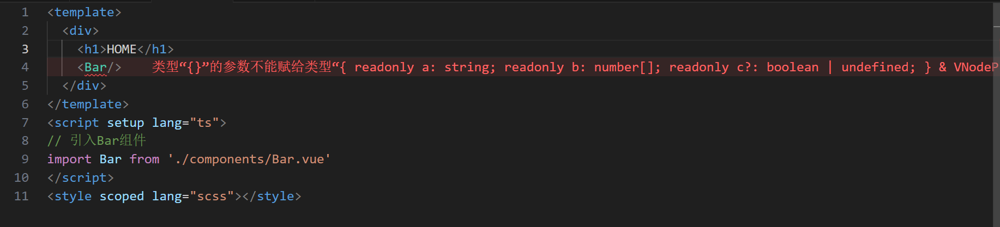
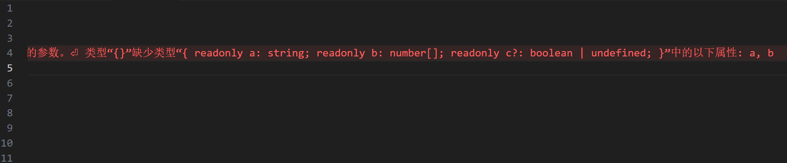

# vue-ts

## 初始化

初始化一个`vue+vite+ts`的项目`pnpm create vite 项目名称 --template vue-ts`

```powershell
pnpm create vite test --template vue-ts
```

下载项目所需依赖

```powershell
pnpm i
```

在`src/APP.vue`文件中将不需要的模版全部删除，声明`script`的语言为`ts`

```vue
<template>
  <div></div>
</template>
<script setup lang="ts"></script>
<style scoped lang="scss"></style>
```

在`vite.comfig.ts`文件中配置`server.open=true`，项目启动时自动打开浏览器

```typescript
import { defineConfig } from 'vite'
import vue from '@vitejs/plugin-vue'

// https://vite.dev/config/
export default defineConfig({
  server: {
    open: true,
  },
  plugins: [vue()],
})
```

下载`scss`

```powershell
pnpm add -D sass-embedded
```

准备工作基本完成。

## ts——defineProps

在`src/components`文件夹下新建一个`Bar.vue`文件，通常在使用`defineProps`来获取`props `时，会这样做

`src/components/Bar.vue`

```vue
<template>
  <div></div>
</template>
<script setup lang="ts">
import { defineProps } from 'vue'
const props = defineProps({
  a: {
    type: String,
    required: true,
  },
  b: {
    type: Array,
    required: true,
  },
  c: {
    type: Boolean,
    required: false,
  },
})
console.log(props.a)
</script>
```

在`App.vue`中这样使用

`App.vue`

```vue
<template>
  <div>
    <h1>HOME</h1>
    <!-- c设置了非必选参数可以不用传，但其实这样写，就算我把a(必选参数)和b(必选参数)都删了,也不会提示报错 -->
    <Bar a="123" :b="[1, 2, 3]" />
  </div>
</template>
<script setup lang="ts">
// 引入Bar组件
import Bar from './components/Bar.vue'
</script>
<style scoped lang="scss"></style>
```

**c设置了非必选参数可以不用传，但其实这样写，就算我把a(必选参数)和b(必选参数)都删了,也不会提示报错，只会在打开页面时提供一个警告**。下面看看`ts`的写法

-------------------------------------------------------------------------

`Bar.vue`

在定义 props 时提供类型注解，从而获得更好的类型检查和自动补全。

```vue
<template>
  <div></div>
</template>
<script setup lang="ts">
import { defineProps } from 'vue'
// 定义了一个类型接口
interface BarOption {
  a: string
  b: number[]
  c?: boolean
}
const props = defineProps<BarOption>()
console.log(props.a)
</script>

```

`interface` 的作用是为 `BarOption` 类型提供了一个明确的类型定义，确保使用该类型的对象符合这个结构。它帮助开发者在编写代码时进行类型检查，避免传入不符合预期的数据类型。

`App.vue`

```vue
<template>
  <div>
    <h1>HOME</h1>
    <Bar a="123" :b="[1, 2, 3]" />
  </div>
</template>
<script setup lang="ts">
// 引入Bar组件
import Bar from './components/Bar.vue'
</script>
<style scoped lang="scss"></style>
```

此时如果把a删掉，`ts`就会帮你检查到有必选参数a和b没填





这样的话，开发的时候，这种小错误可以马上被捕捉到。

-------------------------------

## ts——request

在发送请求时，我们访问的资源在某个对象的很深层中，而我们在写的过程中没有一点提示，非常容易写错，写错了也不会报错

### 准备工作

添加`axios`请求库，`pnpm add axios`

将不再使用的Bar组件删掉，在`src`文件夹中新建`utils`文件夹，用来存放功能文件，在`utils`文件夹下新建`http.ts`文件，用来创建一个配置好的`axios`实例，并将其导出，以便在项目的其他地方使用

`src/utils/http.ts`

```typescript
import axios from 'axios'

const client = axios.create({
  baseURL: 'https://netease-cloud-music-api-five-roan-88.vercel.app',
  timeout: 3000,
})
export default client
```

在`src`文件夹中新建`api`文件夹，用来存放发送请求文件，在`api`文件夹下新建`index.ts`文件，封装一个 API 请求函数，用于从指定的后端服务获取首页数据，导出以便在项目的其他地方使用

```typescript
import client from '../utils/http'
export const getHomeDate = () => client.get('/homepage/block/page')
```

此时项目结构是这样的

、、、图片

此时在`App.vue`中，我们将`getHomeDate`


