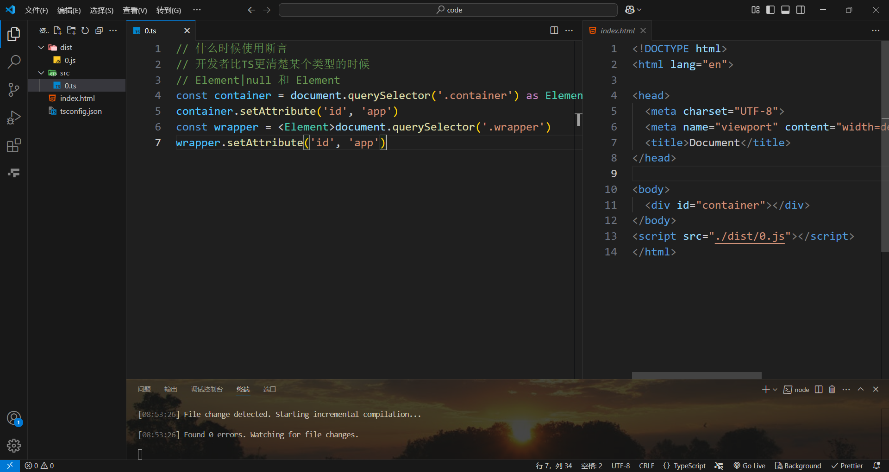

# 断言

## 什么时候使用断言？

> 开发者比TS更清楚某个类型的时候
>
> - 类型断言的本质 是让类型更加贴近实际 （将静态类型推导变得更加准确）
> - 断言后的运行时报错自己负责
> - 当代码运行时不报错 但是静态检查报错（断言只能解决类型错误，无法避免运行时报错）

## 类型断言

### `<>`语法

```ts
let someValue: any = "this is a string";
let strLength: number = (<string>someValue).length;
```

### `as`语法

```ts
let someValue: any = "this is a string";
let strLength: number = (someValue as string).length;
```

这里获取一个节点，开发者知道一定可以获取得到`container`节点，但`ts`不清楚运行时的环境，这个时候可以使用断言解决错误

可以使用`as`或`<>`语法来断言，注意，这里的`<>`不是用泛型。

## 确定赋值断言

> - 表示告诉ts已经赋值了
> - 确定赋值断言一般用在 给变量动态赋值的情况
> - 确定赋值断言是使用`!`在变量的后面
> - 不能罔顾事实 需要基于运行时

这里开发者明确知道在运行时，b一定为`string`类型，而ts不能检测到运行时环境，可以使用`as`语法断言成`string`

然而却又报了未赋值的错误，而我们知道在运行时一定赋了值，这个时候就需要用到确定赋值断言，使用`!`告诉ts已经赋值了

使用`!`告诉ts已经赋值了

## 非空断言

> 可以排除掉`null`和`undefined`

这里ts类型检测出`ele`是`Element|null`类型，而我们确定他是`Element`类型，不会为`null`，这个时候可以使用非空断言，使用`!`

使用`!`排除掉`null`和`undefined`

```ts
let c: number
let d: number | null | undefined
function fn() {
  d = 1
}
fn()
c = d!
```

## 常量断言

> - 常量断言 （做自己 不为别人断言）
> - 类型收窄
> - 改变ts自动类型推导的策略(越小越好)

这里类型推断出为`number`类型，不够准确

进行常量断言，可以看到

定义一个函数，第一个参数为`一个对象`，第二个参数为`第一个参数中的属性`，返回值为`对象中这个属性对应的值`

```ts
function getValue<O extends Record<string, any>, K extends keyof O>(
  o: O,
  k: K
): O[K] {
  return o[k]
}
```

这里`aValue`和`bValue`的类型推断都为`number`，不能看到明确的值

使用常量断言


