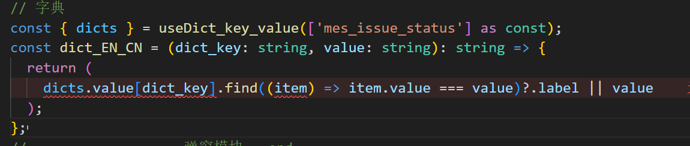
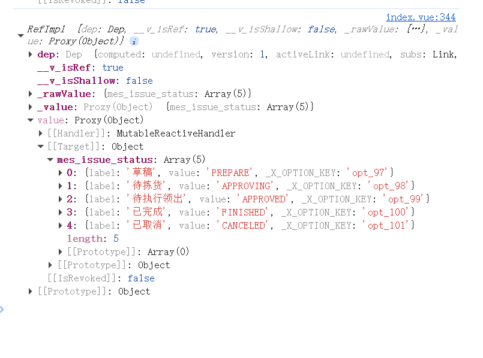
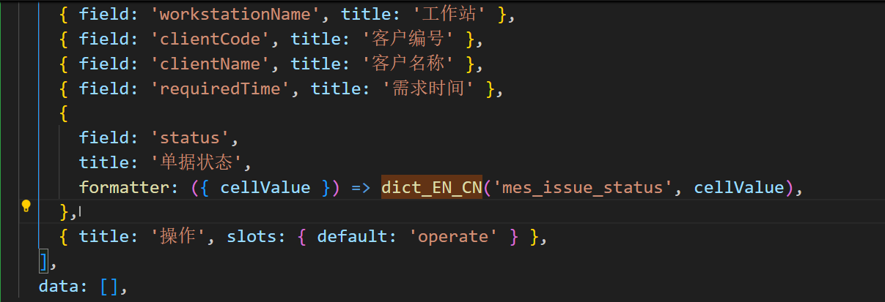
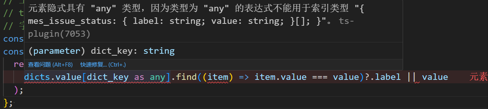
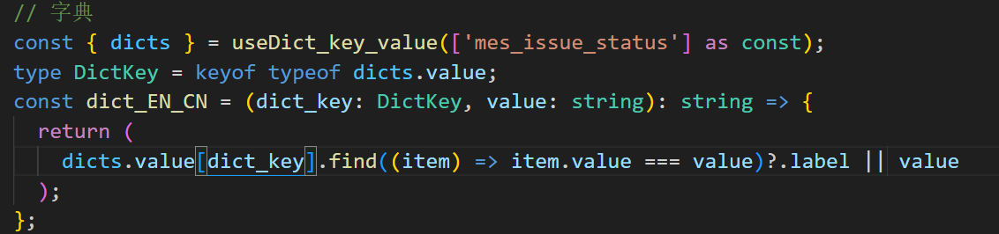
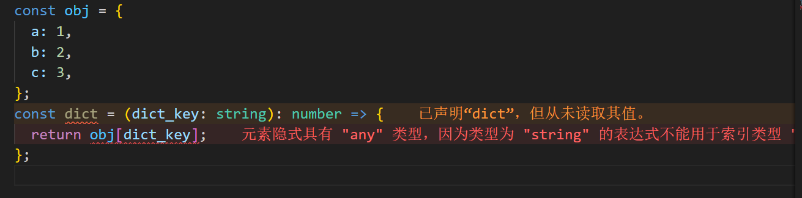
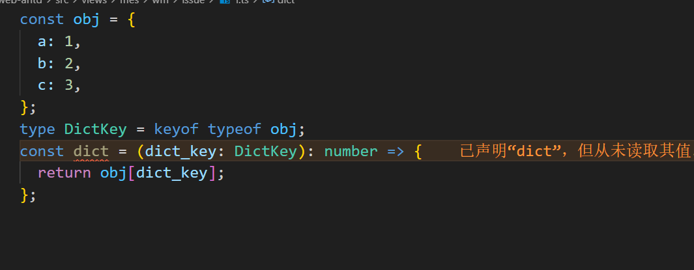

# 类型错误案例

## 元素隐式具有"any"类型，因为类型为"string"的表达式不能用于索引类型

### 项目版

今天做项目遇到此报错，

> 元素隐式具有"any"类型，因为类型为"string"的表达式不能用于索引类型

dicts是获取到的字典，格式如下，

dict_EN_CN这个函数是为了在表格列渲染时将value转化为用户看到的label，cellValue是当前行的value值，我用dict_EN_CN做一层转换

总体逻辑没有问题，页面也可以正常渲染

但这里就是报类型错误`元素隐式具有"any"类型，因为类型为"string"的表达式不能用于索引类型`，我这里用断言as any都无法解决

仔细想了一下才发现，这里报的错是因为，dict_key的类型为string，那dict.value[dict_key]的类型将会无法确定，所以才会报错，所以dict_key的类型不应该为广泛的string，而是dict.value的属性。

解决方式：将dict_key的类型设置为dict.value的属性名类型。

### 简化版

`简化版`:脱离业务来看，这里`dict_key`的类型如何是`string`的话，那么`dict(a)、dict(b)、dict(c)`都是`number`类型可以确定，那么`dict('suibian')`是什么类型呢？所以就会报错`元素隐式具有"any"类型，因为类型为"string"的表达式不能用于索引类型`

!

解决方式：

