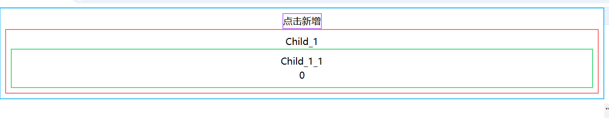
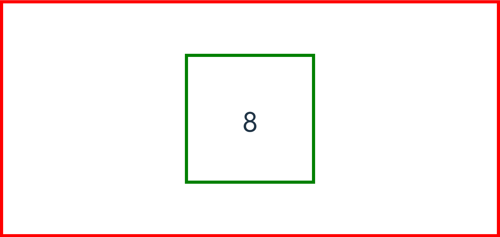
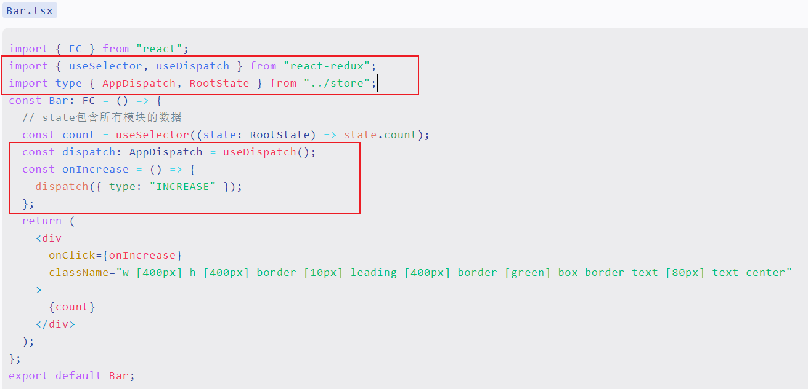

# React状态管理

## 状态变量

### useState

`useState` 是一个 React Hook，它允许你向组件添加一个 [状态变量](https://zh-hans.react.dev/learn/state-a-components-memory)。·

#### `说明：`

> const [state, setState] = useState(initialState)`
>
> - state：当前的 state。在首次渲染时，它将与你传递的 `initialState` 相匹配。
> - setState：[`set` 函数](https://zh-hans.react.dev/reference/react/useState#setstate)，它可以让你将 state 更新为不同的值并触发重新渲染。重点：触发重新渲染！
> - initialState：state 初始化的值，在初始渲染后，此参数将被忽略。

```tsx
  // const [state, setState] = useState(initialState)
  const [count, setCount] = useState(0);
```

#### `使用setState更新state`

```tsx
import { useState } from "react";

const App = () => {
  const [count, setCount] = useState(0);
  return (
    <div>
      <p>{count}</p>
      <button onClick={() => setCount(count + 1)}>点我加一</button>
    </div>
  );
};
export default App;
```

#### `更新状态中的对象和数组 `

你可以将对象和数组放入状态中。在 React 中，状态被认为是只读的，因此 **你应该替换它而不是改变现有对象!!!**。例如，如果你在状态中保存了一个 `fromData` 对象，请不要改变它：

```tsx
// 🚩 不要像下面这样改变一个对象：
fromData.count = 1;
```

相反，可以通过创建一个新对象来替换整个对象：

```tsx
// ✅ 使用新对象替换 state
setForm({
  ...form,
  count: 1
});
```

总体代码

```tsx
import { useState } from "react";

const App = () => {
  const [fromData, setFromData] = useState({
    a: "其他数据",
    b: "其他数据",
    c: "其他数据",
    d: "其他数据",
    e: "其他数据",
    count: 0,
  });
  return (
    <div>
      <p>{fromData.count}</p>
      <button
        onClick={() => setFromData({ ...fromData, count: fromData.count + 1 })}
      >
        点我加一
      </button>
    </div>
  );
};
export default App;
```

阅读有关 [更新状态中的对象](https://zh-hans.react.dev/learn/updating-objects-in-state) 和 [更新状态中的数组](https://zh-hans.react.dev/learn/updating-arrays-in-state) 来了解更多。

### immer

上面使用`...`运算符只是一个浅拷贝，对于嵌套对象或嵌套数组不适用，

如果你的 state 有多层的嵌套，你或许应该考虑 [将其扁平化](https://zh-hans.react.dev/learn/choosing-the-state-structure#avoid-deeply-nested-state)。[Immer](https://github.com/immerjs/use-immer) 是一个非常流行的库，它可以让你使用简便但可以直接修改的语法编写代码，并会帮你处理好复制的过程。通过使用 Immer，你写出的代码看起来就像是你“打破了规则”而直接修改了对象：

#### `安装immer`

```powershell
pnpm add immer
```

#### `引入produce`

```powershell
import { produce } from "immer";
```

#### `说明`

> produce(currentState, recipe: (draftState) => void): nextState
>
> - `currentState`：当前的需要“修改”的状态
> - `recipe`：处理状态的函数
> - `draftState`：`recipe`的参数，是一个草稿，可以理解为`currentState`的副本，可以在函数体中直接对他修改，`nextState`将反映对`DraftState`所做的所有更改

#### `使用`

```tsx
produce(fromData, (draft) => {
  draft.count++;
})
```

#### `例子`

```tsx
import { useState } from "react";
import { produce } from "immer";
const App = () => {
  const [fromData, setFromData] = useState({
    a: "其他数据",
    b: "其他数据",
    c: "其他数据",
    d: "其他数据",
    e: "其他数据",
    count: 0,
  });
  return (
    <div>
      <p>{fromData.count}</p>
      <button
        onClick={() =>
          setFromData(
      		// 使用 Immer，你写出的代码看起来就像是你“打破了规则”而直接修改了对象：
            produce(fromData, (draft) => {
              draft.count++;
            })
          )
        }
      >
        点我加一
      </button>
    </div>
  );
};
export default App;
```

### 扩展:useImmer

`useImmer` 是一个基于 `immer` 库实现的 React Hook。它专门为 React 应用程序设计，用于简化状态管理中的不可变数据更新。

在React中，使用 `useState` 更新复杂的嵌套状态通常较为繁琐，而 `useImmer` 提供了一种简便的方式来创建可变代理对象，通过这个代理对象修改状态，React组件的状态就会自动更新，并且始终保持不可变原则。

#### `安装use-immer`

```powershell
pnpm add immer use-immer
```

#### `引入`

```tsx
import { useImmer } from "use-immer";
```

#### `说明`

与`useState`非常相似。区别在于在`修改数组或对象属性时`，`useState`需要手动展开每层结构，useImmer可以直接“修改”属性。

> const [state, updateState] = useImmer(initialState);
>
> - `state`：当前的 state。在首次渲染时，它将与你传递的 `initialState` 相匹配。
> - `updateState`：更新函数，与produce类似，但无需传递currentState
> - `initialState`：state 初始化的值，在初始渲染后，此参数将被忽略。

#### `案例`

```tsx
import { useImmer } from "use-immer";
const App = () => {
  const [fromData, setFromData] = useImmer({
    a: "其他数据",
    b: "其他数据",
    c: "其他数据",
    d: "其他数据",
    e: "其他数据",
    count: 0,
  });
  return (
    <div>
      <p>{fromData.count}</p>
      <button
        onClick={() =>
          setFromData((draft) => {
            draft.count++;
          })
        }
      >
        点我加一
      </button>
    </div>
  );
};
export default App;
```

## 状态管理

### 前景

在跨组件传递数据时，通过props的方式传参，会有很多缺点

`App.tsx`父页面

```tsx
import { useState } from "react";
import Child_1 from "./components/child_1";
const App = () => {
  const [count, setCount] = useState(0);
  return (
    <div className="border-2 border-sky-400 p-2 text-center">
      <button
        onClick={() => setCount(count + 1)}
        className="border-2 border-purple-400"
      >
        点击新增
      </button>
      <Child_1 data={count} />
    </div>
  );
};
export default App;
```

`src/components/Child_1.tsx`儿子页面

```tsx
import Child_1_1 from "./child_1_1";

interface Args_1 {
  data: number;
}
const Child_1 = (args: Args_1) => {
  return (
    <div className="border-2 border-red-400 p-2">
      <p>Child_1</p>
      <Child_1_1 data={args.data} />
    </div>
  );
};
export default Child_1;
```

`src/components/Child_1_1.tsx`孙子页面

```tsx
interface Args_2 {
  data: number;
}
const Child_2 = (arg: Args_2) => {
  return (
    <div className="border-2 border-green-400 p-2">
      <p>Child_1_1</p>
      <p>{arg.data}</p>
    </div>
  );
};
export default Child_2;
```

`效果`

点击新增可以新增count的值，页面正常变化

> 这种通过类似props(组件函数的参数)的传参方式，实现了组件之间的数据传递，但是有一个缺点就是，`Child_1.tsx`组件并不需要使用count数据，但为了数据的传递，必须要这么做，这样做的缺点：
>
> 1. 数据在组件中一层一层被传递，即使中间的组件不需要用到这个数据，消耗了不必要的性能。
> 2. 对于组件嵌套比较深的情况，后期的可维护性非常差，一旦中间有一层props被改动导致数据未传递，那么数据将在这里被断开。
> 3. 污染了中间组件的props，可读性差。

### useState + createContext + useContext

适用于：数据简单、逻辑单一的情况

#### `创建context`

首先，你需要创建这个 context，并 **将其从一个文件中导出**，这样你的组件才可以使用它：

`src/contexts/Counter.ts`

```ts
import { createContext } from "react";

export const CountContext = createContext(0);
```

#### `使用context`

引入你刚刚创建的 context：

```tsx
import { useState } from "react";
import { CountContext } from "./contexts/Counter";
```

`提供context`

**用 context provider 包裹起来** 以提供 `CountContext` 给它们：

```tsx
<CountContext value={count}>
  <Child_1 />
</CountContext>
```

这告诉 React：“如果在 `<CountContext>` 组件中的任何子组件请求 `CountContext`，给他们这个 `count`。”组件会使用 UI 树中在它上层最近的那个 `<CountContext>` 传递过来的值。

#### `在其他组件获取`

引入`useContext` Hook和刚刚创建的 context

```tsx
import { useContext } from "react";
import { CountContext } from "../contexts/Counter";

const Child_2 = () => {
  const count = useContext(CountContext);
  return (
    <div className="border-2 border-green-400 p-2">
      <p>Child_1_1</p>
      <p>{count}</p>
    </div>
  );
};
export default Child_2;
```

#### `完整代码`

```tsx
// App.tsx
import { useState } from "react";
import { CountContext } from "./contexts/Counter";
import Child_1 from "./components/Child_1";
const App = () => {
  const [count, setCount] = useState(0);
  return (
    <div className="border-2 border-sky-400 p-2 text-center">
      <button
        onClick={() => setCount(count + 1)}
        className="border-2 border-purple-400"
      >
        点击新增
      </button>
      <CountContext value={count}>
        <Child_1 />
      </CountContext>
    </div>
  );
};
export default App;

// child_1.tsx child_1无需传递数据，没有污染props
import Child_1_1 from "./Child_1_1";
const Child_1 = () => {
  return (
    <div className="border-2 border-red-400 p-2">
      <p>Child_1</p>
      <Child_1_1 />
    </div>
  );
};
export default Child_1;

// child_1_1.tsx
import { useContext } from "react";
import { CountContext } from "../contexts/Counter";

const Child_2 = () => {
  const count = useContext(CountContext);
  return (
    <div className="border-2 border-green-400 p-2">
      <p>Child_1_1</p>
      <p>{count}</p>
    </div>
  );
};
export default Child_2;
```

这样就完成了通过`useState` + `createContext` + `useContext`来管理简单的、逻辑单一的状态。

### useReducer + createContext + useContext

适用于：数据较复杂、逻辑较复杂

#### `前景`

> 随着组件复杂度的增加，你将很难一眼看清所有的组件状态更新逻辑。例如，下面的 `App` 组件有一个数组类型的状态 `countArr`，并通过三个不同的事件处理程序来实现任务的添加、删除和修改：

`App.tsx`

```tsx
import { useState } from "react";
import { produce } from "immer";
import { CountContext } from "./contexts/Counter";
import Child_1 from "./components/Child_1";
const App = () => {
  const [countArr, setCount] = useState([] as number[]);
  return (
    <div className="border-2 border-sky-400 p-2 text-center">
      <button
        onClick={() =>
          setCount(
            produce(countArr, (draft) => {
              draft.push(Math.round(Math.random()));
            })
          )
        }
        className="border-2 border-purple-400"
      >
        点击增加
      </button>
      <button
        onClick={() =>
          setCount(
            produce(countArr, (draft) => {
              draft.pop();
            })
          )
        }
        className="border-2 border-purple-400"
      >
        点击减少
      </button>
      <button
        onClick={() =>
          setCount(
            produce(countArr, (draft) => {
              draft.length = 0;
            })
          )
        }
        className="border-2 border-purple-400"
      >
        点击清空
      </button>
      <CountContext value={countArr}>
        <Child_1 />
      </CountContext>
    </div>
  );
};
export default App;
```

> 这个组件的每个事件处理程序都通过 `setTasks` 来更新状态。随着这个组件的不断迭代，其状态逻辑也会越来越多。为了降低这种复杂度，并让所有逻辑都可以存放在一个易于理解的地方，你可以将这些状态逻辑移到组件之外的一个称为 **reducer** 的函数中。
>

#### 第一步：编写一个 reducer 函数 

在`src`文件夹下新建reducers文件夹，用来专门存放reducer函数，在`reducers`文件夹下新建count.ts文件，将对`countArr`的所有操作的逻辑全部存放在这里。

`src/reducers/count.ts`

```ts
import { produce } from "immer";

type Action = {
  type: "COUNT/INCREASE" | "COUNT/DECREASE" | "COUNT/RESET";
};
const countArrReducer = (countArr: number[], action: Action) => {
  switch (action.type) {
    case "COUNT/INCREASE":
      return produce(countArr, (draft) => {
        draft.push(Math.round(Math.random()));
      });
    case "COUNT/DECREASE":
      return produce(countArr, (draft) => {
        draft.pop();
      });
    case "COUNT/RESET":
      return produce(countArr, (draft) => {
        draft.length = 0;
      });
    default:
      return countArr; // 一定要给默认返回，否则报错
  }
};
export default countArrReducer;
```

#### 第二步：在组件中使用 reducer

引入`useReduce` hook和刚刚写的reducer函数

```tsx
import countArrReducer from "./reducers/count";
import { useReducer } from "react";
```

替换掉之前的 `useState`，像下面这样使用 `useReducer`:

```tsx
const [countArr, dispatch] = useReducer(countArrReducer, []);
```

`useReducer` 钩子接受 2 个参数：

1. 一个 reducer 函数
2. 一个初始的 state，这里给的是空数组

``useReducer` 钩子返回值：`

1. 一个有状态的值
2. 一个 dispatch 函数（用来 “派发” 用户操作给 reducer）

#### 第三步：将设置状态的逻辑修改成 dispatch 的一个 action

```tsx
      <button
        // 派发新增操作
        onClick={() => dispatch({ type: "COUNT/INCREASE" })}
        className="border-2 border-purple-400"
      >
        点击增加
      </button>
      <button
        // 派发减少操作
        onClick={() => dispatch({ type: "COUNT/DECREASE" })}
        className="border-2 border-purple-400"
      >
        点击减少
      </button>
      <button
        // 派发清空操作
        onClick={() => dispatch({ type: "COUNT/RESET" })}
        className="border-2 border-purple-400"
      >
        点击清空
      </button>
```

#### `完整代码`

```tsx
// App.vue
import { CountContext } from "./contexts/Counter";
import Child_1 from "./components/Child_1";
import countArrReducer from "./reducers/count";
import { useReducer } from "react";
const App = () => {
  const [countArr, dispatch] = useReducer(countArrReducer, []);
  return (
    <div className="border-2 border-sky-400 p-2 text-center">
      <button
        // 派发新增操作
        onClick={() => dispatch({ type: "COUNT/INCREASE" })}
        className="border-2 border-purple-400"
      >
        点击增加
      </button>
      <button
        // 派发减少操作
        onClick={() => dispatch({ type: "COUNT/DECREASE" })}
        className="border-2 border-purple-400"
      >
        点击减少
      </button>
      <button
        // 派发清空操作
        onClick={() => dispatch({ type: "COUNT/RESET" })}
        className="border-2 border-purple-400"
      >
        点击清空
      </button>
      <CountContext value={countArr}>
        <Child_1 />
      </CountContext>
    </div>
  );
};
export default App;

// src/reducers/count.ts
import { produce } from "immer";

type Action = {
  type: "COUNT/INCREASE" | "COUNT/DECREASE" | "COUNT/RESET";
};
const countArrReducer = (countArr: number[], action: Action) => {
  switch (action.type) {
    case "COUNT/INCREASE":
      return produce(countArr, (draft) => {
        draft.push(Math.round(Math.random()));
      });
    case "COUNT/DECREASE":
      return produce(countArr, (draft) => {
        draft.pop();
      });
    case "COUNT/RESET":
      return produce(countArr, (draft) => {
        draft.length = 0;
      });
    default:
      return countArr; // 一定要给默认返回，否则报错
  }
};
export default countArrReducer;

```


## 状态管理库

### redux

为所有UI框架提供状态管理服务 哪怕是原生JS也可以

`react` + `react-redux` + `redux` + `redux-thunk`

> react-redux为react和redux之间做适配
>
> redux提供状态管理服务，但都是同步的
>
> redux-thunk提供异步的状态管理服务

安装依赖

```powershell
pnpm add react-redux redux redux-shunk
```

准备工作：定义目录

`src`下新建store用来管理状态；在store中新建index.ts用来集中引入状态仓库，创建store；在store中新建reducers文件夹，用来存放状态仓库。


#### 第一步：使用`redux`引入仓库,创建store

`src/store/index`

```ts
/**
 * redux 为所有UI框架提供状态管理服务 哪怕是原生JS也可以
 * react + [state lib] redux/zustand/mobx...
 * react + react-redux + redux + redux-thunk
 */
import { legacy_createStore as createStore, combineReducers } from "redux";
import count from "./reducers/count";
// import todo from "./reducers/todo";
// import user from "./reducers/user";

const rootReducer = combineReducers({
  count,
  // todo,
  // user,
});

const store = createStore(rootReducer);

export type RootState = ReturnType<typeof store.getState>;
export type AppDispatch = typeof store.dispatch;

export default store;
```

在src/store下新建reduce文件夹用来专门存放状态，创建count.ts、todo.ts、user.ts

`count.ts`

```tsx
type Action = {
  type: "COUNT/INCREASE" | "COUNT/DECREASE" | "COUNT/RESET";
};
// ----------- 函数的初始值就是state的默认值，必须写
const count = (state: number = 0, action: Action) => {
  switch (action.type) {
    case "COUNT/INCREASE":
      return state + 1;
    case "COUNT/DECREASE":
      return state - 1;
    case "COUNT/RESET":
      return 0;
    default:
      return state;
  }
};

export default count;
```

#### 第二步：使用`react-redux`全局共享状态

在`src/main.tsx`中

```tsx
import { createRoot } from "react-dom/client";
// 引入react-redux的Provider
import { Provider } from "react-redux";
// 引入store
import store from "./store/index.ts";
import "./index.css";
import App from "./App.tsx";

createRoot(document.getElementById("root")!).render(
  // 需要全局共享的，用Provider包起来，与context类似
  <Provider store={store}>
    <App />
  </Provider>
);
```

#### 第三步：使用`react-redux`查看并操作状态

在`src/component`中新建`Bar.tsx`，在App.vue中引入他

```tsx
import { FC } from "react";
import Bar from "./components/Bar";
const App: FC = () => {
  return (
    <div className="w-screen h-screen border-[10px] border-[red] box-border flex justify-center items-center">
      <Bar />
    </div>
  );
};

export default App;
```

使用`useSelector`来拿到所有模块的数据，使用useDispatch来初始化一个修改的工具

`Bar.tsx`

```tsx
import { FC } from "react";
import { useSelector, useDispatch } from "react-redux";
import type { AppDispatch, RootState } from "../store";
const Bar: FC = () => {
  // state包含所有模块的数据
  const count = useSelector((state: RootState) => state.count);
  const dispatch: AppDispatch = useDispatch();
  const onIncrease = () => {
    dispatch({ type: "INCREASE" });
  };
  return (
    <div
      onClick={onIncrease}
      className="w-[400px] h-[400px] border-[10px] leading-[400px] border-[green] box-border text-[80px] text-center"
    >
      {count}
    </div>
  );
};
export default Bar;
```

`效果`：点击count如预期+1



#### `优化`

每个需要用到状态的组件中，总要写这四行，可以基于他封装一下



可以基于他封装一下

`src/store/index.ts`

```ts
/**
 * redux 为所有UI框架提供状态管理服务 哪怕是原生JS也可以
 * react + [state lib] redux/zustand/mobx...
 * react + react-redux + redux + redux-thunk
 */
import { legacy_createStore as createStore, combineReducers } from "redux";
import { useSelector, useDispatch } from "react-redux";
import count from "./reducers/count";
// import todo from "./reducers/todo";
// import user from "./reducers/user";
const rootReducer = combineReducers({
  count,
  // todo,
  // user,
});

const store = createStore(rootReducer);
export type RootState = ReturnType<typeof store.getState>;
export type AppDispatch = typeof store.dispatch;

// 自定义的hook函数
export function useAppDispatch() {
  return useDispatch() as AppDispatch;
}
export function useAppSelector<T>(selector: (state: RootState) => T) {
  return useSelector(selector);
}

export default store;
```

`src/components/Bar.tsx`

```tsx
import { FC } from "react";
// import { useSelector, useDispatch } from "react-redux";
// import type { AppDispatch, RootState } from "../store";
import { useAppDispatch, useAppSelector } from "../store";
const Bar: FC = () => {
  // state包含所有模块的数据
  const count = useAppSelector((state) => state.count);
  const dispatch = useAppDispatch();
  // const count = useSelector((state: RootState) => state.count);
  // const dispatch: AppDispatch = useDispatch();
  const onIncrease = () => {
    dispatch({ type: "COUNT/DECREASE" });
  };
  return (
    <div
      onClick={onIncrease}
      className="w-[400px] h-[400px] border-[10px] leading-[400px] border-[green] box-border text-[80px] text-center"
    >
      {count}
    </div>
  );
};
export default Bar;
```

> 目前：我们现在的状态管理不能作异步操作，需要用到(redux-thunk或redux-saga)

### 异步的状态更新`redux-thunk`

