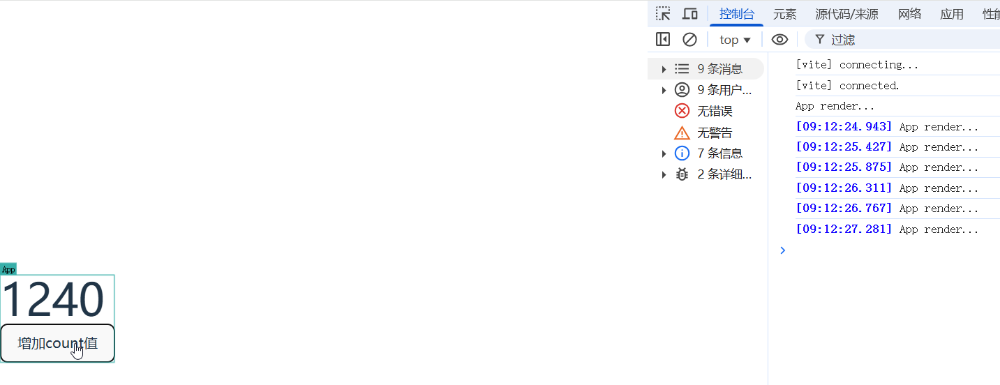
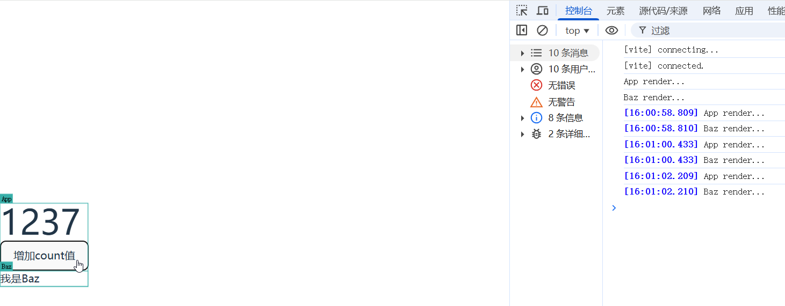
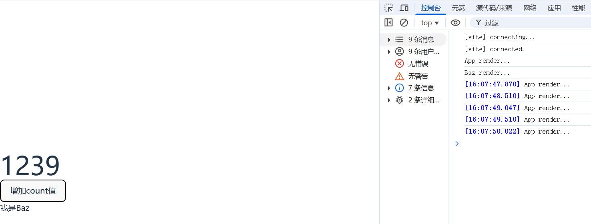
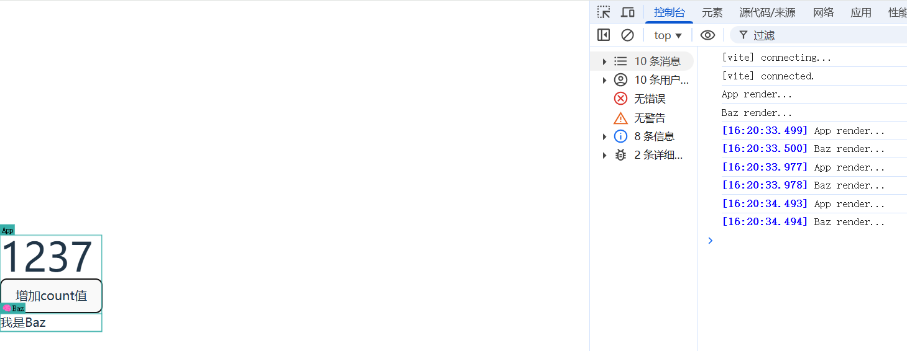
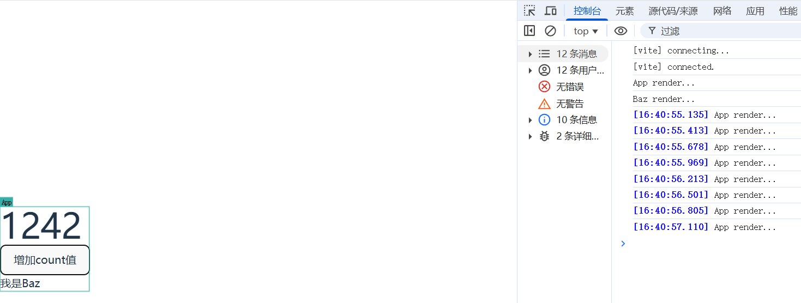
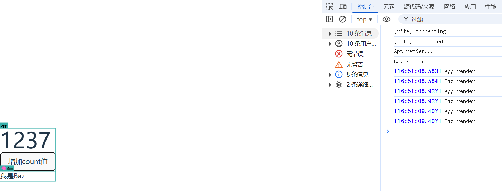
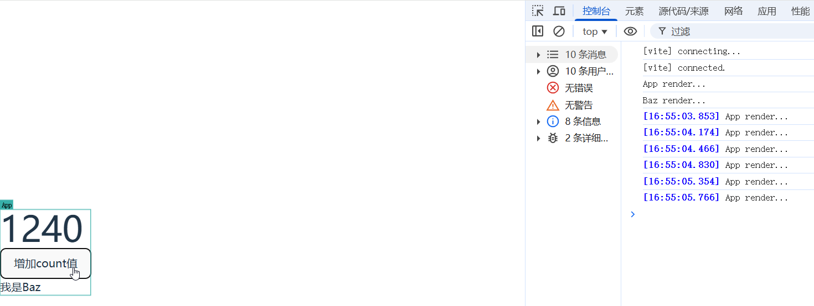
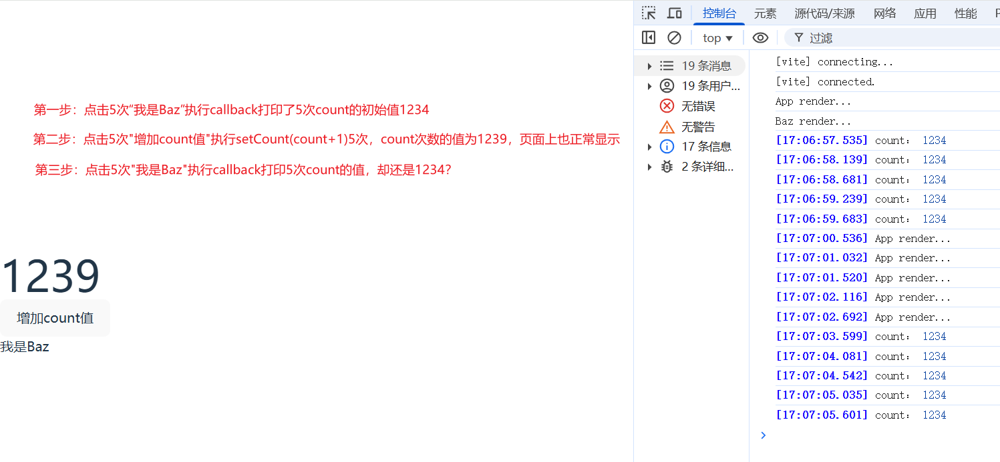
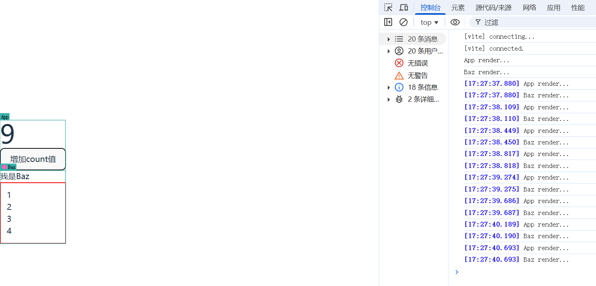
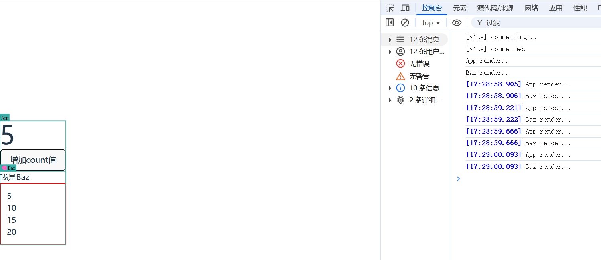

# React性能优化

## 父组件的更新导致子组件不必要的重新渲染

### 什么情况下会触发组件的重新渲染：

### 1、useState返回值数组 的第二个方法

`以下代码，点击按钮，页面上显示的数字加1，setCount触发了APP函数重新执行-页面的重新渲染，这是必要的我们需要的的更新`

```tsx
import { FC, useState } from "react";
const App: FC = () => {
  console.log("App render...");
  const [count, setCount] = useState(1234);
  return (
    <div>
      <h1>{count}</h1>
      <button onClick={() => setCount(count + 1)}>增加count值</button>
    </div>
  );
};
export default App;
```



### 2、【父组件更新 + 子组件 + props没有实际参数】父组件更新会间接导致子组件更新（无论子组件的UI是否需要更新）

`在component下新建Baz.tsx组件`

```tsx
import { FC } from "react";

const Baz: FC = () => {
  console.log("Baz render...");
  return (
    <div>
      <h2>我是Baz</h2>
    </div>
  );
};
export default Baz;
```

`在App.tsx引入Baz组件，以下代码，点击按钮，触发APP重新执行-页面重新渲染-子组件Baz也重新渲染，但Baz的数据都没有变化，Baz的渲染是没必要的，可以使用memo这个API避免重新渲染`

```tsx
import { FC, useState } from "react";
import Baz from "./components/Baz";
const App: FC = () => {
  console.log("App render...");
  const [count, setCount] = useState(1234);
  return (
    <div>
      <h1>{count}</h1>
      <button onClick={() => setCount(count + 1)}>增加count值</button>
      <Baz />
    </div>
  );
};
export default App;
```



### 使用memo避免重新渲染

> `memo` 允许你的组件在 props 没有改变的情况下跳过重新渲染。
>
> ```tsx
> const MemoizedComponent = memo(SomeComponent, arePropsEqual?)
> ```
>
> - `Component`：要进行记忆化的组件。`memo` 不会修改该组件，而是返回一个新的、记忆化的组件。它接受任何有效的 React 组件，包括函数组件和 [`forwardRef`](https://zh-hans.react.dev/reference/react/forwardRef) 组件。
> - **可选参数** `arePropsEqual`：一个函数，接受两个参数：组件的前一个 props 和新的 props。如果旧的和新的 props 相等，即组件使用新的 props 渲染的输出和表现与旧的 props 完全相同，则它应该返回 `true`。否则返回 `false`。通常情况下，你不需要指定此函数。默认情况下，React 将使用 [`Object.is`](https://developer.mozilla.org/zh-CN/docs/Web/JavaScript/Reference/Global_Objects/Object/is) 比较每个 prop。
>
> #### 返回值 
>
> `memo` 返回一个新的 React 组件。它的行为与提供给 `memo` 的组件相同，只是当它的父组件重新渲染时 React 不会总是重新渲染它，除非它的 props 发生了变化。

将`Baz`组件使用memo包裹起来，使其在 props 没有改变的情况下跳过重新渲染。

```tsx
import { FC, memo } from "react";

const Baz: FC = () => {
  console.log("Baz render...");

  return (
    <div>
      <h2>我是Baz</h2>
    </div>
  );
};
export default memo(Baz);
```



### 3、【父组件更新 + memo(子组件) + props传递的参数(函数)】=> "似乎memo失效"

`如果Baz组件需要传递一个函数参数`

```tsx
import { FC, memo } from "react";

interface BazProps {
  cb: () => void;
}
const Baz: FC<BazProps> = (props) => {
  console.log("Baz render...");
  return (
    <div>
      <h2 onClick={props.cb}>我是Baz</h2>
    </div>
  );
};
export default memo(Baz);
```

```tsx
import { FC, useState } from "react";
import Baz from "./components/Baz";
const App: FC = () => {
  console.log("App render...");
  const [count, setCount] = useState(1234);
  const callback = () => {
    console.log("我是App传递过来的回调函数");
  };
  return (
    <div>
      <h1>{count}</h1>
      <button onClick={() => setCount(count + 1)}>增加count值</button>
      <Baz cb={callback} />
    </div>
  );
};
export default App;
```

`此时点击按钮，即使子组件使用了memo，但还是会重新渲染`

为什么会“失效”？props参数`callback`不是没有变化吗？其实变化了

> 流程：
>
> 初始化——>callback(内存地址1)——>点击按钮——>App重新渲染——>callback(内存地址2)——callback变化——Baz重新渲染

callback名字没变，结构没变，只是内存地址变了，导致了Baz的重新渲染

`但是callback一直都没变，它的内存地址没必要变化，导致Baz重新渲染，可以使用useCallback来避免每次重新初始化导致内存地址变化`

### 使用useCallback缓存函数避免每次重新初始化内存地址

> `useCallback` 是一个允许你在多次渲染中缓存函数的 React Hook。
>
> ```
> const cachedFn = useCallback(fn, dependencies)
> ```
>
> - `fn`：想要缓存的函数。此函数可以接受任何参数并且返回任何值。在初次渲染时，React 将把函数返回给你（而不是调用它！）。当进行下一次渲染时，如果 `dependencies` 相比于上一次渲染时没有改变，那么 React 将会返回相同的函数。否则，React 将返回在最新一次渲染中传入的函数，并且将其缓存以便之后使用。React 不会调用此函数，而是返回此函数。你可以自己决定何时调用以及是否调用。
> - `dependencies`：有关是否更新 `fn` 的所有响应式值的一个列表。响应式值包括 props、state，和所有在你组件内部直接声明的变量和函数。如果你的代码检查工具 [配置了 React](https://zh-hans.react.dev/learn/editor-setup#linting)，那么它将校验每一个正确指定为依赖的响应式值。依赖列表必须具有确切数量的项，并且必须像 `[dep1, dep2, dep3]` 这样编写。React 使用 [`Object.is`](https://developer.mozilla.org/zh-CN/docs/Web/JavaScript/Reference/Global_Objects/Object/is) 比较每一个依赖和它的之前的值。

```tsx
import { FC, useCallback, useState } from "react";
import Baz from "./components/Baz";
const App: FC = () => {
  console.log("App render...");
  const [count, setCount] = useState(1234);
  // 初始化的时候 callback 内存地址1
  // 函数重新初始化 callback 内存地址2
  // 函数地址发生变化，props发生了变化，所以Baz组件就会重新渲染
  // 使用useCallback缓存函数避免每次重新初始化内存地址
  const callback = useCallback(() => {
    console.log("我是App传递过来的回调函数");
  }, []);
  return (
    <div>
      <h1>{count}</h1>
      <button onClick={() => setCount(count + 1)}>增加count值</button>
      <Baz cb={callback} />
    </div>
  );
};
export default App;
```



### 4、【父组件更新 + memo(子组件) + props传递的参数(非函数的引用数据类型)】=> "似乎memo失效"

```tsx
import { FC, memo } from "react";

interface BazProps {
  cb: () => void;
  value: number[];
}
const Baz: FC<BazProps> = (props) => {
  console.log("Baz render...");
  return (
    <div>
      <h2 onClick={props.cb}>我是Baz</h2>
    </div>
  );
};
export default memo(Baz);
```

```tsx
import { FC, useCallback, useState } from "react";
import Baz from "./components/Baz";
const App: FC = () => {
  console.log("App render...");
  const [count, setCount] = useState(1234);
  // 初始化的时候 callback 内存地址1
  // 函数重新初始化 callback 内存地址2
  // 函数地址发生变化，props发生了变化，所以Baz组件就会重新渲染
  const callback = useCallback(() => {
    console.log("我是App传递过来的回调函数");
  }, []);
  const value = [1, 2, 3, 4];
  return (
    <div>
      <h1>{count}</h1>
      <button onClick={() => setCount(count + 1)}>增加count值</button>
      <Baz cb={callback} value={value} />
    </div>
  );
};
export default App;
```



> 与上一点是一样的原理，内存地址变化了，导致了，Baz组件的重新渲染，可以使用useMemo计算结果避免初始化内存地址，类似与computed

### 使用useMemo计算结果避免初始化内存地址

> `useMemo` 是一个 React Hook，它在每次重新渲染的时候能够缓存计算的结果。
>
> ```tsx
> const cachedValue = useMemo(calculateValue, dependencies)
> ```
>
> - `calculateValue`：要缓存计算值的函数。它应该是一个没有任何参数的纯函数，并且可以返回任意类型。React 将会在首次渲染时调用该函数；在之后的渲染中，如果 `dependencies` 没有发生变化，React 将直接返回相同值。否则，将会再次调用 `calculateValue` 并返回最新结果，然后缓存该结果以便下次重复使用。
> - `dependencies`：所有在 `calculateValue` 函数中使用的响应式变量组成的数组。响应式变量包括 props、state 和所有你直接在组件中定义的变量和函数。如果你在代码检查工具中 [配置了 React](https://zh-hans.react.dev/learn/editor-setup#linting)，它将会确保每一个响应式数据都被正确地定义为依赖项。依赖项数组的长度必须是固定的并且必须写成 `[dep1, dep2, dep3]` 这种形式。React 使用 [`Object.is`](https://developer.mozilla.org/zh-CN/docs/Web/JavaScript/Reference/Global_Objects/Object/is) 将每个依赖项与其之前的值进行比较。

```tsx
import { FC, useCallback, useMemo, useState } from "react";
import Baz from "./components/Baz";
const App: FC = () => {
  console.log("App render...");
  const [count, setCount] = useState(1234);
  // 初始化的时候 callback 内存地址1
  // 函数重新初始化 callback 内存地址2
  // 函数地址发生变化，props发生了变化，所以Baz组件就会重新渲染
  const callback = useCallback(() => {
    console.log("我是App传递过来的回调函数");
  }, []);
  // 使用useMemo计算结果避免初始化内存地址
  const value = useMemo(() => [1, 2, 3, 4], []);
  return (
    <div>
      <h1>{count}</h1>
      <button onClick={() => setCount(count + 1)}>增加count值</button>
      <Baz cb={callback} value={value} />
    </div>
  );
};
export default App;
```



### 总结

> 如何避免子组件的重新渲染：
>
> - 如果没有props参数传递   memo(子组件)
> - props参数类型不是函数   memo(子组件) + useMemo
> - props参数类型是函数      memo(子组件) + useCallback

### 扩展

#### 1、被`useCallback`缓存的函数里面引用组件内部的变量，变量在其他地方正常变化，似乎在函数的代码块中“不会变”？

```tsx
import { FC, useCallback, useMemo, useState } from "react";
import Baz from "./components/Baz";
const App: FC = () => {
  console.log("App render...");
  const [count, setCount] = useState(1234);
  const callback = useCallback(() => {
    // console.log("我是App传递过来的回调函数");
    // 打印组件内部的变量
    console.log('count：',count);
  }, []);
  const value = useMemo(() => [1, 2, 3, 4], []);
  return (
    <div>
      <h1>{count}</h1>
      <button onClick={() => setCount(count + 1)}>增加count值</button>
      <Baz cb={callback} value={value} />
    </div>
  );
};
export default App;
```



> 原因：callback函数I缓存了，在初始化的时候，由于静态作用域的关系，引用的是第一次count的值，后面每一次重新渲染，callback没有重新执行，这里打印的count的值也不会引用新的count的值
>
> 解决：将count加入依赖，count值变化的时候重新执行callback

```tsx
import { FC, useCallback, useMemo, useState } from "react";
import Baz from "./components/Baz";
const App: FC = () => {
  console.log("App render...");
  const [count, setCount] = useState(1234);
  const callback = useCallback(() => {
    // console.log("我是App传递过来的回调函数");
    // 打印组件内部的变量
    console.log("count：", count);
    // 添加count依赖,count值变化的时候重新执行callback
  }, [count]);
  const value = useMemo(() => [1, 2, 3, 4], []);
  return (
    <div>
      <h1>{count}</h1>
      <button onClick={() => setCount(count + 1)}>增加count值</button>
      <Baz cb={callback} value={value} />
    </div>
  );
};
export default App;
```

此时就正常了

2、被`useMemo`缓存的 非函数引用数据 里面使用了组件内部的变量，变量在其他地方正常变化，似乎在 非函数引用数据 中“没有响应”？

```tsx
import { FC, memo } from "react";

interface BazProps {
  cb: () => void;
  value: number[];
}
const Baz: FC<BazProps> = (props) => {
  console.log("Baz render...");
  return (
    <div>
      <h2 onClick={props.cb}>我是Baz</h2>
      {/* 渲染value的值，便于查看value是否变化 */}
      <ul className="border-2 p-3 border-[red]">
        {props.value.map((item) => {
          return <li key={item}>{item}</li>;
        })}
      </ul>
    </div>
  );
};
export default memo(Baz);
```

```tsx
import { FC, useCallback, useMemo, useState } from "react";
import Baz from "./components/Baz";
const App: FC = () => {
  console.log("App render...");
  const [count, setCount] = useState(1);
  const callback = useCallback(() => {
    // console.log("我是App传递过来的回调函数");
    // 打印组件内部的变量
    console.log("count：", count);
    // 添加count依赖
  }, [count]);
  // ------------------------------------------count变化，希望导致value变化
  const value = useMemo(() => [1, 2, 3, 4].map((item) => item * count), []);
  return (
    <div>
      <h1>{count}</h1>
      <button onClick={() => setCount(count + 1)}>增加count值</button>
      <Baz cb={callback} value={value} />
    </div>
  );
};
export default App;
```

count值增加，页面1234没有变化

> 与上一个同理，添加依赖即可

```tsx
  const value = useMemo(() => [1, 2, 3, 4].map((item) => item * count), [count]);
```




