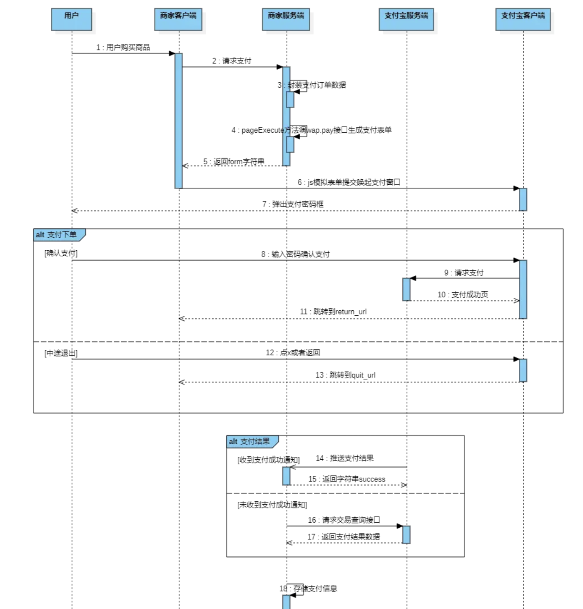
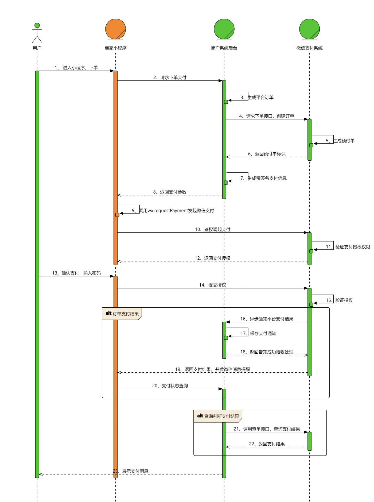

# 支付宝支付流程

接口文档：https://opendocs.alipay.com/open/59da99d0_alipay.trade.page.pay?scene=22&pathHash=e26b497f

npm包：https://www.npmjs.com/package/alipay-sdk

沙箱平台：https://open.alipay.com/develop/sandbox/app

流程：

【支付前准备工作】
appid: 微信公众平台分配的小程序AppID。
secret: 微信公众平台分配的小程序AppSecret。
mchid: 微信支付商户号。
mchKey: 微信支付商户密钥。
serial_no: 商户API证书序列号。
publicKey: 公钥。
privateKey: 秘钥。

【PC端二维码】
https://opendocs.alipay.com/support/01rfuy?pathHash=e35759a0
【支付产品列表】
https://opendocs.alipay.com/open/02ivbs?scene=21&pathHash=0a6313c7
【沙箱测试服务】
https://open.alipay.com/develop/sandbox/service
【沙箱支持产品列表】
https://opendocs.alipay.com/common/097jyi?pathHash=9fcbe0d0

# 微信支付流程

【微信支付具体流程】
1.用户通过分享或扫描二维码进入商户小程序，用户选择购买，完成选购流程
2.调用 wx.login 获取用户临时登录凭证code，发送到后端服务器换取openId
3.在下单时，小程序需要将购买的商品Id，商品数量，以及用户的openId传送到服务器
4.服务器在接收到商品Id、商品数量、openId后，生成服务期订单数据，同时经过一定的签名算法，向微信支付发送请求，获取预付单信息prepay_id，同时将获取的数据再次进行相应规则的签名，向小程序端响应必要的信息
5.小程序端在获取对应的参数后，调用wx.requestPayment发起微信支付，唤醒支付工作台，进行支付
6.接下来的一些列操作都是由用户来操作的包括了微信支付密码，指纹等验证，确认支付之后执行鉴权调起支付
7.鉴权调起支付：在微信后台进行鉴权，微信后台直接返回给前端支付的结果，前端收到返回数据后对支付结果进行展示
8.推送支付结果：微信后台在给前端返回支付的结果后，也会向后台也返回一个支付结果，后台通过这个支付结果来更新订单的状态

