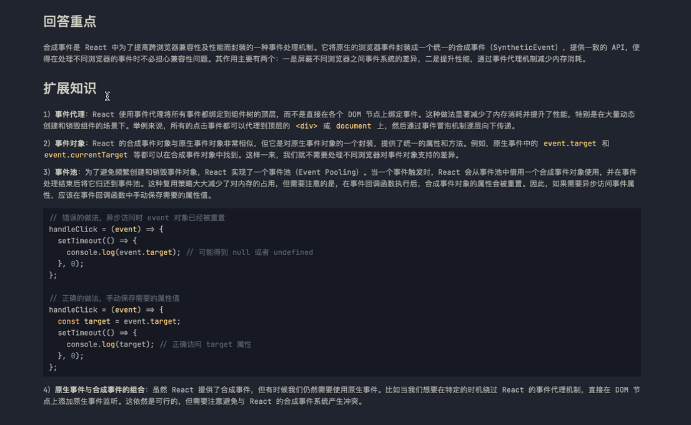

# 22.React中，什么是合成事件？它的作用是什么？

## 回答重点

合成事件是 React 中为了提高跨浏览器兼容性及性能而封装的一种事件处理机制。它将原生的浏览器事件封装成一个统一的合成事件（SyntheticEvent），提供一致的 API，使得在处理不同浏览器的事件时不必担心兼容性问题。其作用主要有两个：一是屏蔽不同浏览器之间事件系统的差异，二是提升性能，通过事件代理机制减少内存消耗。

## 扩展知识

1）**事件代理**：React 使用事件代理将所有事件都绑定到组件树的顶层，而不是直接在各个 DOM 节点上绑定事件。这种做法显著减少了内存消耗并提升了性能，特别是在大量动态创建和销毁组件的场景下。举例来说，所有的点击事件都可以代理到顶层的 `<div>` 或 `document` 上，然后通过事件冒泡机制逐层向下传递。

2）**事件对象**：React 的合成事件对象与原生事件对象非常相似，但它是对原生事件对象的一个封装，提供了统一的属性和方法。例如，原生事件中的 `event.target` 和 `event.currentTarget` 等都可以在合成事件对象中找到。这样一来，我们就不需要处理不同浏览器对事件对象支持的差异。

3）**事件池**：为了避免频繁创建和销毁事件对象，React 实现了一个事件池（Event Pooling）。当一个事件触发时，React 会从事件池中借用一个合成事件对象使用，并在事件处理结束后将它归还到事件池。这种复用策略大大减少了对内存的占用，但需要注意的是，在事件回调函数执行后，合成事件对象的属性会被重置。因此，如果需要异步访问事件属性，应该在事件回调函数中手动保存需要的属性值。

```js
// 错误的做法，异步访问时 event 对象已经被重置
handleClick = (event) => {
  setTimeout(() => {
    console.log(event.target); // 可能得到 null 或者 undefined
  }, 0);
};

// 正确的做法，手动保存需要的属性值
handleClick = (event) => {
  const target = event.target;
  setTimeout(() => {
    console.log(target); // 正确访问 target 属性
  }, 0);
};
```

4）**原生事件与合成事件的组合**：虽然 React 提供了合成事件，但有时候我们仍然需要使用原生事件。比如当我们想要在特定的时机绕过 React 的事件代理机制，直接在 DOM 节点上添加原生事件监听。这依然是可行的，但需要注意避免与 React 的合成事件系统产生冲突。


