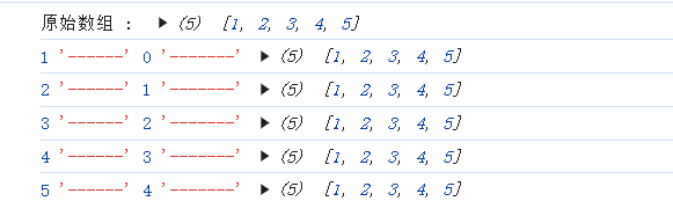

# 数组的常用方法

## 一、改变原数组的方法

### 1、增

#### 直接赋值法

> 数组名[索引] = 内容 如：var arr = []; arr[0] = "bbb";

```js
  let arr = []
  arr[0] = 1
  arr[1] = 2
  arr[arr.length] = 3
  console.log(arr);  //[1, 2, 3]
```

#### push()

> 添加到末尾
>
> 数组名.push(需要添加到的内容1个或多个)

```js
  let arr = [1,2,3]
  arr.push(4,5,6)
  console.log(arr);  //[1, 2, 3, 4, 5, 6]
```

#### unshift()

> 添加到开头
>
> 数组名.unshift(需要添加到的内容1个或多个)

```js
  let arr = [1, 2, 3]
  arr.unshift('a', 'b', 'c')
  console.log(arr);  //['a', 'b', 'c', 1, 2, 3]
```

#### splice()

> splice(index,howmany,item)
>
> index：必填。规定从何处添加/删除元素
>
> howmany：选填。规定应该删多少个元素，如不填就删除从index开始到原数组结尾的所有元素
>
> item：选填。要添加到数组的新元素
>
> 注意splice可用于添加、删除、替换数组中的元素

```js
  let arr = [23, 54, 66, 63, 3]
  arr.splice(2, 0, 'a', 'b')
  console.log(arr);  //[23, 54, 'a', 'b', 66, 63, 3]
  arr.splice(0,0,1)  //添加到开头
  arr.splice(arr.length,0,99)  //添加到结尾
  console.log(arr);  //[1, 23, 54, 'a', 'b', 66, 63, 3, 99]
```

### 2、删

#### pop()

> 删除最后一个
>
> 数组名.pop()

```js
  let arr = [1,2,3,4,5]
  arr.pop()
  console.log(arr);  //[1, 2, 3, 4]
```

#### shift()

> 删除第一个
>
> 数组名.shift()

```js
  let arr = [1,2,3,4,5]
  arr.shift()
  console.log(arr);  //[2, 3, 4, 5]
```

#### splice()

> splice(index,howmany,item)
>
> index：必填。规定从何处添加/删除元素
>
> howmany：选填。规定应该删多少个元素，如不填就删除从index开始到原数组结尾的所有元素
>
> item：选填。要添加到数组的新元素
>
> 注意splice可用于添加、删除、替换数组中的元素

```js
  let arr = [1, 2, 3, 4, 5, 6, 7, 8, 9]
  arr.splice(3, 1)
  console.log(arr);  //[1, 2, 3, 5, 6, 7, 8, 9]
  arr.splice(0, 1)  //删除开头元素
  arr.splice(arr.length - 1, 1)  //删除结尾元素
  console.log(arr);  //[2, 3, 5, 6, 7, 8]
```

#### 直接赋值法

> 数组.length = 数组.length-n
>
> n为1时，表示删除末尾1个
> n为2时，表示删除末尾2个
> 以此类推

```js
  let arr = [1,2,3,4,5]
  arr.length = arr.length-3
  console.log(arr);  //[1, 2]
```

### 3、改

#### 直接赋值法

> 数组名[索引] = 内容

```js
  let arr = [1, 2, 3, 4, 5]
  arr[0] = 9
  arr[1] = 8
  arr[2] = 7
  console.log(arr);  //[9, 8, 7, 4, 5]
```

#### splice()

> splice(index,howmany,item)
>
> index：必填。规定从何处添加/删除元素
>
> howmany：选填。规定应该删多少个元素，如不填就删除从index开始到原数组结尾的所有元素
>
> item：选填。要添加到数组的新元素
>
> 注意splice可用于添加、删除、替换数组中的元素

```js
  let arr = [1, 2, 3, 4, 5, 6]
  arr.splice(0, 3, 'a', 'b', 'c')
  console.log(arr);  //['a', 'b', 'c', 4, 5, 6]
```

#### reverse()

> 翻转数组元素的顺序
>
> 数组名.reverse()

```js
  let arr = [1,2,3,4,5]
  arr.reverse()
  console.log(arr);//[5, 4, 3, 2, 1]
```

#### sort()

> ①数组名.sort() 字母按照a-z顺序排序，首字母相同的比较第二位，以此类推
> ②数组名.sort(function(a,b){ return a-b}) 从小到大,如果要从大到小，就改为b-a即可，或者直接在后
> 面加.reserve()

```js
  let ZiMu = ['apple', 'pear', 'banner', 'cofe', 'milk', 'beef']
  ZiMu.sort()
  console.log(ZiMu);  //['apple', 'banner', 'beef', 'cofe', 'milk', 'pear']
  let num = [1,5,24,4,57,100,22]
  num.sort((a,b)=>{return a-b})
  console.log(num);//[1, 4, 5, 22, 24, 57, 100]
```


### 4、查

```js
  let arr = [1, 2, 3, 4, 5, 6]
  console.log(arr[3]);//4
  console.log(arr[0]);//1
  console.log(arr[arr.length-1]);//6
```

## 二、不改变数组的方法

### 1、增

#### concat()

> 将一个元素或一个数组合并到一个数组中，返回合并后的结果，这个方法不会改变原数组
>
> 数组1.concat(数组2,数组3.....)

```js
  let arr1 = [1, 2, 3, 4]
  let arr2 = ['a', 'b', 'c', 'd']
  let arr3 = [9, 10]
  let newArr = arr1.concat(arr2, arr3)
  console.log(newArr);  //[1, 2, 3, 4, 'a', 'b', 'c', 'd', 9, 10]
  console.log(newArr.concat(11));//[1, 2, 3, 4, 'a', 'b', 'c', 'd', 9, 10, 11]
```

#### ...

> 用...扩展运算符可以在数组构造时，将数组表达式在语法层面展开

```js
  let arr = [1,2,3,4,5]
  let newArr = [...arr,6,7,8]
  console.log(newArr);  //[1, 2, 3, 4, 5, 6, 7, 8]
```

### 2、删

#### slice()

> 数组名.slice(开始的索引,结束的索引) 截取数组某个部分，包前不包后,返回新数组

```js
  let arr = [1, 2, 3, 4, 5]
  let newArr = arr.slice(1, 3)
  console.log(arr);//[1, 2, 3, 4, 5]
  console.log(newArr);//[2, 3]
```

### 3、改

#### join()

> 数组名.join(分隔符) 将数组中的元素用分隔符连接为一个字符串

```js
  let arr = ['x', 'y', 10]
  let str = arr.join('-')
  console.log(arr);//['x','y',10]
  console.log(str);//'x-y-10'
```

### 4、查

#### indexOf()

> 数组名.indexOf(指定的元素，从哪里开始找) 查找指定元素的索引

```js
  let arr = [10, 20, 10, 30, 40, 50, 60]
  res = arr.indexOf(10, 1)
  console.log(arr);//[10, 20, 10, 30, 40, 50, 60]
  console.log(res);//2
```

#### lastIndexOf()

> ⑤ 数组名.lastIndexOf(指定的元素，从哪里开始找) 从右往左找，找到了返回的索引是从左往右

```js
let arr = [10, 20, 10, 30, 40, 50, 60]
let res = arr.lastIndexOf(60, 4)
let res2 = arr.lastIndexOf(40, -1)
console.log(arr);//[10, 20, 10, 30, 40, 50, 60]
console.log(res);//-1  找不到
console.log(res2);//4
```

## 三、ES6新增的数组方法

#### forEach()   

> 用来循环遍历的 for
>
> 语法: 数组名.forEach(function (item,index,array) {})
>
> - item : 这个表示的是数组中的每一项
> - index : 这个表示的是每一项对应的索引
> - array : 这个表示的是原数组

```js
  let arr = [1, 2, 3, 4, 5]
  console.log('原始数组 : ', arr);
  arr.forEach((item, index, arr) => {
    console.log(item, "------", index, "-------", arr);
  })
```



> 利用forEach让数组所有元素+1

```js
  let arr = [1, 2, 3, 4, 5]
  console.log('原始数组 : ', arr);
  arr.forEach((item, index) => arr[index] += 1)
  console.log(arr);//[2, 3, 4, 5, 6]
```

```js
console.log('++++++++++++++++++++++++++forEach+++++++++++++++++++++++++++++');
// forEach对数组进行遍历
let arr1 = [11, 12, 31, 41, 15, 51, 67]
// 求和
let res = 0
arr1.forEach(value => res += value)
console.log(res);//228

// 了解原理
// 给所有数组的原型添加公共的方法
Array.prototype.dhForEach = function (callback) {
  // this --> 调用我的数组
  for (let i = 0; i < this.length; i++) {
    callback(this[i], i, this)
  }
}
let arr2 = [1, 2, 3, 4, 5, 6, 7, 8, 9, 10]
let res2 = 0
arr2.dhForEach(value => res2 += value)
console.log(res2);//55
console.log('++++++++++++++++++++++++++forEach+++++++++++++++++++++++++++++');
```

#### map()

> 映射数组
>
> 语法: 数组名.map(function (item,index,array) {})
>
> `map` 方法与 `forEach` 类似，都是对数组元素进行遍历，但 `map` 方法会返回一个新数组。`forEach` 适用于只需要遍历但不返回新数组的场景，而 `map` 适合在遍历的同时生成新的数组。

> 给数组的所有元素*2，返回一个乘以2的新数组

```js
let numbers = [1, 2, 3];
  let doubled = numbers.map(function (number) {
    return number * 2;
  });
  console.log(doubled); // [2, 4, 6]
```

```js
console.log('++++++++++++++++++++++++++ map +++++++++++++++++++++++++++++');
// 将数组的每一个元素平方后组成一个新数组
let a1 = [1, 2, 3, 4, 5] //[1,4,3,16,25]
let res1 = a1.map(value => Math.pow(value, 2))
console.log(res1);

// 了解原理
// 给所有数组的原型添加公共的方法
Array.prototype.dhMap = function (callback) {
  let result = []
  for (let i = 0; i < this.length; i++) {
    result.push(callback(this[i], i, this))
  }
  return result
}
let a2 = [1, 4, 9, 16, 25]  //[1, 2, 3, 4, 5]
let res2 = a2.dhMap(value => Math.sqrt(value))
console.log(res2);
console.log('++++++++++++++++++++++++++ map +++++++++++++++++++++++++++++');
```

> 扩展

#### filter()

> 过滤数组
>
> 语法: 数组名.filter(function (item,index,array) {})
>
> 返回值: 如果有就是过滤(筛选)出来的数据 保存在一个数组中；如果没有返回一个空数组

```js
  let arr = [1, 2, 3, 4, 5]
  console.log('原始数组 : ', arr);
  let res = arr.filter(function (item) {
    return item > 2
  })
  console.log(res);//[3, 4, 5]
```

#### every()

> 判断数组是不是都满足所有条件
>
> 返回值: 是一个布尔值 注意: 要以return的形式执行返回条件

```js
  let arr = [1, 2, 3, 4, 5]
  console.log('原始数组 : ', arr);
  let res = arr.every(function (item) {
    return item > 0
  })
  console.log(res);//打印结果  true
```

#### some()

> 只有有一个满足条件返回的是true
>
> 只要都不满足返回的就是false

```js
  let arr = [1, 2, 3, 4, 5]
  console.log('原始数组 : ', arr);
  let res = arr.some(function (item) {
    return item > 3
  })
  console.log(res);//true
```

#### find() / findLast()

> 返回数组中满足提供的测试函数的第一个元素的值。否则返回undefined
>
> 语法: 数组名.find(function (item,index,array) {})
>
> - item : 这个表示的是数组中的每一项
> - index : 这个表示的是每一项对应的索引
> - array : 这个表示的是原数组
>
> 用来获取数组中满足条件的第一个数据
>
> 如果有 就是满足条件的第一个数据；如果没有就是undefined

```js
  let arr = [1, 2, 3, 4, 5]
  console.log('原始数组 : ', arr);
  let res = arr.find(function (item) {
    return item > 3
  })
  console.log(res)//4

  // find(从前往后) findLast(从后往前)  查找符合条件的第一个元素
  let arr1 = [1, 3, 549, 22, 15, 645, 145, 321]
  // 从前往后找第一个偶数
  // let res = arr1.find(function(item){item%2===0})
  let res1 = arr1.find(item => item % 2 === 0)
  console.log(res1);
  // 从后往前找第一个奇数
  let res2 = arr1.findLast(item => item % 2 !== 0)
  console.log(res2);

  // 从前往后找第一个素数(一个大于1的自然数，除了1和它自身外，不能被其他自然数整除的数就是素数) 2、3、5、7、11、13、17、19
  function isPrime(element, index, array) {
    let start = 2;
    // 如果一个数不能被小于等于它平方根的所有质数整除，那么它就是素数。
    // 素数是因子为1和本身， 如果数c不是素数，则还有其他因子，其中的因子，假如为a, b.其中必有一个大于sqrt(c) ，一个小于sqrt(c) 。所以c必有一个小于或等于其平方根的因数，那么验证素数时就只需要验证到其平方根就可以了。
    while (start <= Math.sqrt(element)) {
      if (element % start++ === 0) {
        return false;
      }
    }
    return element > 1;
  }
  console.log([4, 6, 8, 12].find(isPrime)); // undefined，未找到
  console.log([4, 5, 8, 12].find(isPrime)); // 5
```

#### reduce()

```
arr.reduce(function(callback){},initialValue)
```

```
callback （执行数组中每个值的函数，包含四个参数）

    1、previousValue （上一次调用回调返回的值，或者是提供的初始值（initialValue））
    2、currentValue （数组中当前被处理的元素）
    3、index （当前元素在数组中的索引）
    4、array （调用 reduce 的数组）

initialValue （作为第一次调用 callback 的第一个参数。）
```

```js
  let arr = [1, 2, 3, 4, 5]
  let res = arr.reduce(function (prev, item) {
    return prev *= item
  }, 1)
  console.log(res);//120
```

reduce()初级用法：求和

```js
  let arr = [1, 2, 3, 4];
  let sum = arr.reduce((x, y) => x + y)
  let mul = arr.reduce((x, y) => x * y)
  console.log(sum); //求和，10
  console.log(mul); //求乘积，24
```

