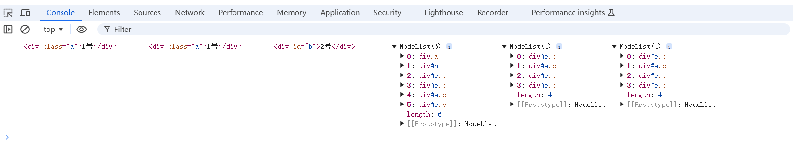

# DOM

## 一、获取DOM节点

### 1、通过标签名获取

> document.getElementsByTagName('标签名')

### 2、通过class名称获取

> document.getElementByClassName('类名')

### 3、通过id名获取

> document.getElementById('id名')

### 4、HTML5新增获取方式

```js
<body>
  <div class="a">1号</div>
  <div id="b">2号</div>
  <div class="c" id="e">3号</div>
  <div class="c" id="e">4号</div>
  <div class="c" id="e">5号</div>
  <div class="c" id="e">6号</div>
</body>
```

```js
// 通过标签名
let div = document.querySelector('div')
// 通过类名
let aDiv = document.querySelector('.a')
// 通过id名
let bDiv = document.querySelector('#b')
// 以上方法只能获取到一个
// 通过标签名获取所有节点
let divAll = document.querySelectorAll('div')
// 通过类名获取所有节点
let cDivAll = document.querySelectorAll('.c')
// 通过id名获取所有节点
let eDivAll = document.querySelectorAll('#e')
console.log(div,aDiv,bDiv,divAll,cDivAll,eDivAll);
```



### 5、根据层级关系获取元素

#### parentNode

> 返回节点的父节点

#### childNodes

> 返回子节点集合，childNodes[i]

#### firstElementChild

> 返回节点的第一个子节点

#### lastElementChild

> 返回节点的最后一个子节点

#### nextElementSibling

> 返回节点的下一个节点

#### previousElementSibling

> 返回节点的上一个节点

-----------------------------------------------------------------------

#### firstChild

> 返回节点的第一个子节点，包含元素节点和文本节点，所以会输出#text

#### lastChild

> 返回节点的最后一个子节点，包含元素节点和文本节点，所以会输出#text

#### nextSibling

> 返回节点的下一个节点，包含元素节点和文本节点，所以会输出#text

#### previousElementSibling

> 返回节点的上一个节点，包含元素节点和文本节点，所以会输出#text


## 二、js事件

> addEventListener()	给元素添加事件
>
> removeEventListener()	删除使用 addEventListener() 方法添加的事件

### 1、鼠标事件

#### click

> 鼠标单击

#### contextmenu

> 右击鼠标时触发并打开上下文菜单（鼠标右键点击） 

#### dblclick

> 鼠标双击

#### auxclick

> 除左键以外单击

#### mousedown

> 鼠标按下

#### mouseup

> 鼠标抬起

#### mouseenter

> 鼠标移入，没有冒泡效果，只有自己可以触发

#### mouseleave

> 鼠标移出，没有冒泡效果，只有自己可以触发

#### mouseover

> 鼠标移入，有冒泡效果，自己和子元素都可以触发

#### mouseout

> 鼠标移出，有冒泡效果，自己和子元素都可以触发

#### mousemove

> 鼠标移动

#### where

> 当用户在鼠标上旋转滚轮按钮时触发（鼠标滚轮事件）

### 2、表单事件

#### focus

> 获得焦点

#### blur

> 失去焦点

#### change

> 内容改变(在文本框输入数据) + 失焦 才会触发

#### input

> 输入事件

#### submit

> 提交事件。点击提交后会提交到服务器并刷新页面，在刷新页面前执行的操作，一遍给form绑定

#### reset

> 在重置表单元素之前调用执行


### 3、键盘事件

#### keydown

> 键盘按下某个键

#### keyup

> 键盘松开某个键


