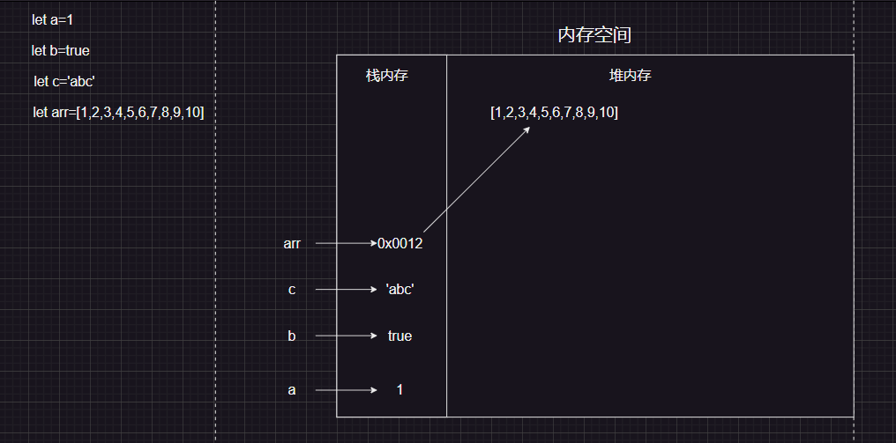
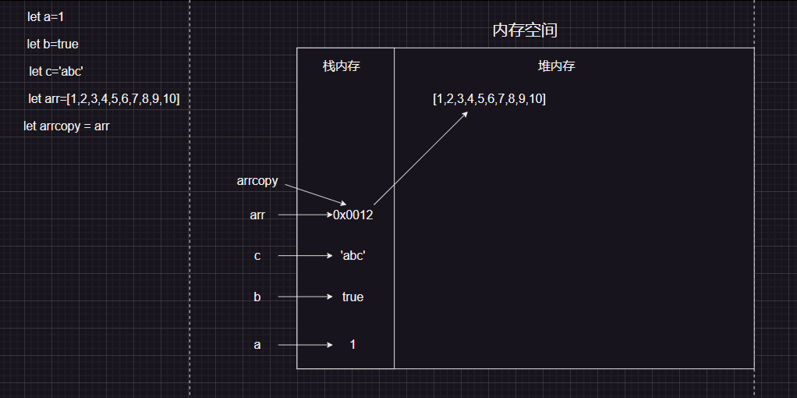
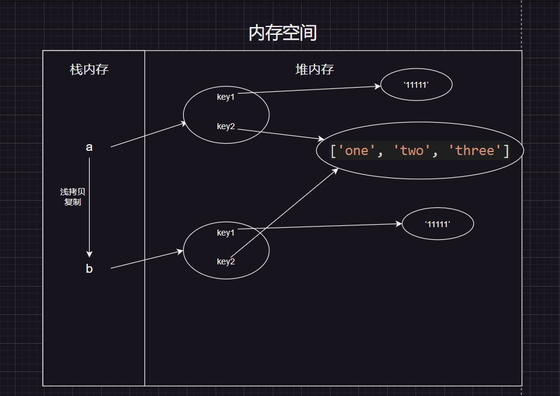
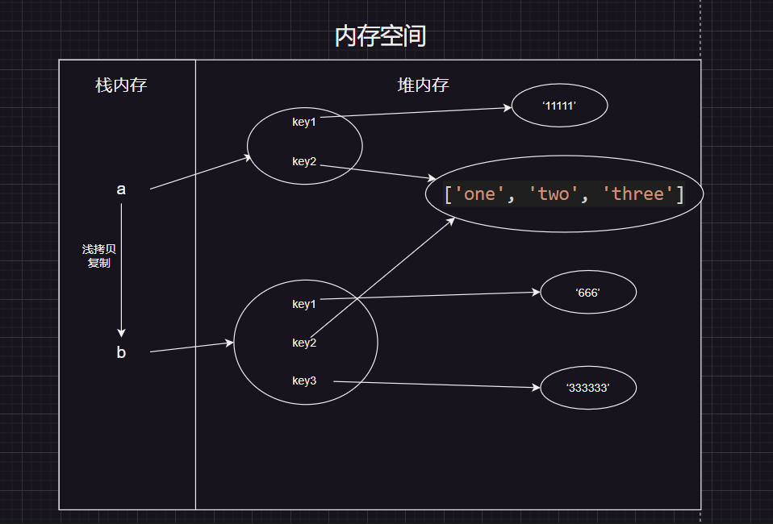
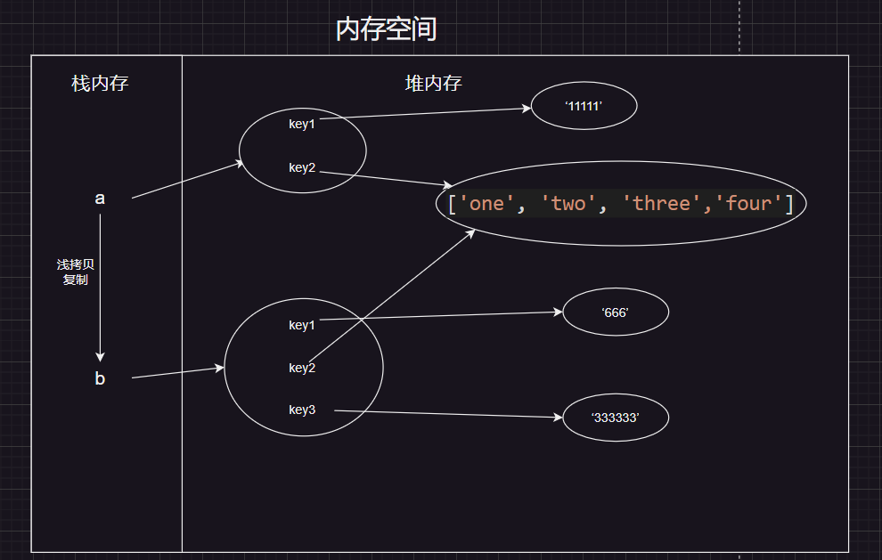
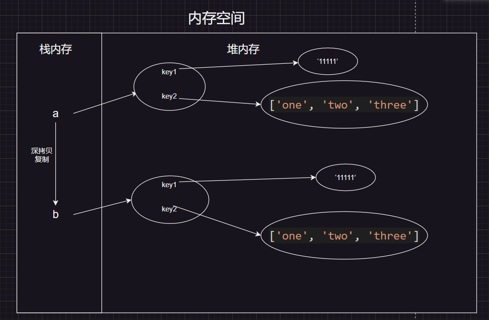
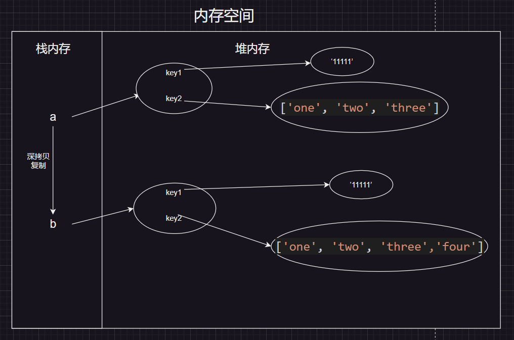

# 基本数据类型和引用数据类型的区别

## 基本数据类型

> 基本数据类型是指存放在栈中的简单数据段，数据大小确定，内存空间大小可以分配，它们是直接按值存放的，所以可以直接按值访问
>
> undefined / null / number / string / boolean / bigint / symbol
>
> 基本数据类型的数据放在栈内存中

## 引用数据类型

> 引用类型是存放在堆内存中的对象，变量其实是保存的在栈内存中的一个指针（保存的是堆内存中的引用地址），这个指针指向堆内存。
>
> 引用类型数据在栈内存中保存的实际上是对象在堆内存中的引用地址。通过这个引用地址可以快速查找到保存中堆内存中的对象
>
> Object / Array / Function等，本质上都属于Object
>
> 引用类型以：`地址-->数据` 的映射关系来进行存储，其中地址放在`栈内存`，数据放在`堆内存`，若两个或 N 个变量指向同一个地址，则共用一份数据。

## 两者区别

> **基本数据类型** 的数据放在栈内存中，**引用数据类型**的地址放在栈内存，数据放在堆内存中



## 注意事项

> 对于一个基本数据类型，如 let a=123 , 如果我们想复制一个a的值，只需要let b = a 即可

```js
// 基本数据类型------
let a=1
let b=a
console.log(b);//1
console.log(a);//1
b=2
console.log(b);//2
console.log(a);//1
```

> 对于一个引用数据类型，由于声明 引用数据类型 的变量存放的仅仅只是放在栈内存中的一个地址，那如果重复上面的操作的话，复制到的仅仅是在堆内存中的引用地址,而每个地址又是唯一的，即 两个变量共同一个地址，如图



> 那么，也就代表修改一个，另外那个也会改变

```js
// 引用数据类型--------------------
let arr1 = [1,2,3,4,5]
let arr2 = arr1
arr2.pop()
console.log(arr2);//[1, 2, 3, 4]
// arr1的值也发生了改变，说明arr1和arr2共用一个地址
console.log(arr1);//[1, 2, 3, 4]


let obj1 = {
  name:'张三'
}
let obj2 = obj1
obj2.name = '李四'
console.log(obj2.name);//李四
console.log(obj1.name);//李四
```

## 深拷贝和浅拷贝

### 浅拷贝

> 前面已经提到，在定义一个对象或数组时，变量存放的往往只是一个地址。当我们使用对象拷贝时，如果属性是对象或数组时，这时候我们传递的也只是一个地址。因此子对象在访问该属性时，会根据地址回溯到父对象指向的堆内存中，即父子对象发生了关联，两者的属性值会指向同一内存空间

```js
  let a = {
    key1: "11111",
    key2: ['one', 'two', 'three']
  }
  //浅拷贝函数
  function Copy(p) {
    let c = {};
    for (let i in p) c[i] = p[i]
    return c;
  }

  let b = Copy(a);// 浅拷贝一份a
  console.log(b.key1, b.key2)//11111  ['one', 'two', 'three']
```



```js
  b.key3 = "33333"
  console.log(b.key3, a.key3)//33333  undefined  //没有影响到a
  b.key1 = '666'
  console.log(b.key1, a.key1)//666  11111  //没有影响到a
```



> 但是若是修改的属性变为对象或数组时，那么父子对象之间就发生关联



```js
  b.key2.push("four")
  // a.key2的值也发生了改变
  console.log(b.key2, a.key2);//['one', 'two', 'three', 'four']  ['one', 'two', 'three', 'four']
```

> 原因是key1的值属于基本类型，所以拷贝的时候传递的就是该数据段；但是key2的值是堆内存中的对象，所以key2在拷贝的时候传递的是指向key2对象的地址，无论复制多少个key2，其值始终是指向父对象的key2对象的内存空间。

-------------------------------------------------------------------------------------------------------------

```js
  //ES6实现浅拷贝的方法
  var a = { name: "张三" }
  var b = Object.assign({}, a);
  b.age = 18;
  console.log(a.age);//undefined
```

### 深拷贝

> 或许以上并不是我们在实际编码中想要的结果，我们不希望父子对象之间产生关联，那么这时候可以用到深拷贝。既然属性值类型是数组和或对象(引用数据类型)时只会传址，那么我们就用递归来解决这个问题，把父对象中所有属于对象的属性类型都遍历赋给子对象即可。测试代码如下：

```js
  var a = {
    key1: '11111',
    key2: ['one', 'two','three']
  }
  function deepCopy(obj, copyObj) {
    var copyObj = copyObj || {};
    for (var i in obj) {
      if (typeof obj[i] === "object") {
        // 如果typeof检测是object,说明是引用数据类型,
        // 判断是数组还是对象,如果是数组,则创建一个空数组,如果是对象,则创建一个空对象
        copyObj[i] = (obj[i].constructor === Array) ? [] : {}
        // 递归调用
        deepCopy(obj[i], copyObj[i]);
      } else {
        // 如果typeof检测不是object,说明是普通数据类型,直接加入拷贝对象中
        copyObj[i] = obj[i]
      }
    }
    return copyObj;
  }
  var b = {}
  b = deepCopy(a, b);
```



```js
  b.key2.push("four");
  console.log(b.key2);//['one', 'two', 'three', 'four]
  console.log(a.key2);//['one', 'two', 'three']
```



> 遇到引用数据类型，就递归，这样就能保证拷贝的都是基本数据类型，都不会互相产生影响

---------------

> es6中的深拷贝--->最简单的深拷贝
>
> 思路，先对 对象用JSON.stringify()方法转为字符串，再赋值给另外一个变量，如何使用JSON.parse()转换回来即可

```js
let obj = {
  name: 'zhangsan',
  age: 18,
  height: 1.88
}
let obj2 = JSON.parse(JSON.stringify(obj))
obj2.name = 'lisi'
console.log(obj2)// { name: 'lisi', age: 18, height: 1.88 }
console.log(obj)// { name: 'zhangsan', age: 18, height: 1.88 }
```

## 总结

> 基本数据类型和引用数据类型区别

1、声明变量时`内存分配`不同

　*原始类型：在栈中，因为占据空间是固定的，可以将他们存在较小的内存中-栈中，这样便于迅速查询变量的值

　*引用类型：存在堆中，栈中存储的变量，只是用来查找堆中的引用地址。

　 这是因为：引用值的大小会改变，所以不能把它放在栈中，否则会降低变量查寻的速度。相反，放在变量的栈空间中的值是该对象存储在堆中的地址。地址的大小是固定的，所以把它存储在栈中对变量性能无任何负面影响

2、不同的内存分配带来不同的`访问机制`

在javascript中是不允许直接访问保存在堆内存中的对象的，所以在访问一个对象时，首先得到的是这个对象在堆内存中的地址，然后再按照这个地址去获得这个对象中的值，这就是传说中的按引用访问。

而原始类型的值则是可以直接访问到的。

3、`复制变量`时的不同

1）原始值：在将一个保存着原始值的变量复制给另一个变量时，会将原始值的副本赋值给新变量，此后这两个变量是完全独立的，他们只是拥有相同的value而已。

2）引用值：在将一个保存着对象`内存地址`的变量复制给另一个变量时，会把这个内存地址赋值给新变量，

　　　　也就是说这两个变量都指向了堆内存中的同一个对象，他们中任何一个作出的改变都会反映在另一个身上。

　　　　（这里要理解的一点就是，复制对象时并不会在堆内存中新生成一个一模一样的对象，只是多了一个保存指向这个对象指针的变量罢了）。多了一个指针

4、`参数传递`的不同（把实参复制给形参的过程）

首先我们应该明确一点：ECMAScript中所有函数的参数都是按值来传递的。

　　但是为什么涉及到原始类型与引用类型的值时仍然有区别呢？还不就是因为内存分配时的差别。 　

　　1）原始值：只是把变量里的值传递给参数，之后参数和这个变量互不影响。

　　2）引用值：对象变量它里面的值是这个对象在堆内存中的内存地址，这一点你要时刻铭记在心！

　　　　因此它传递的值也就是这个内存地址，这也就是为什么函数内部对这个参数的修改会体现在外部的原因了，因为它们都指向同一个对象。


