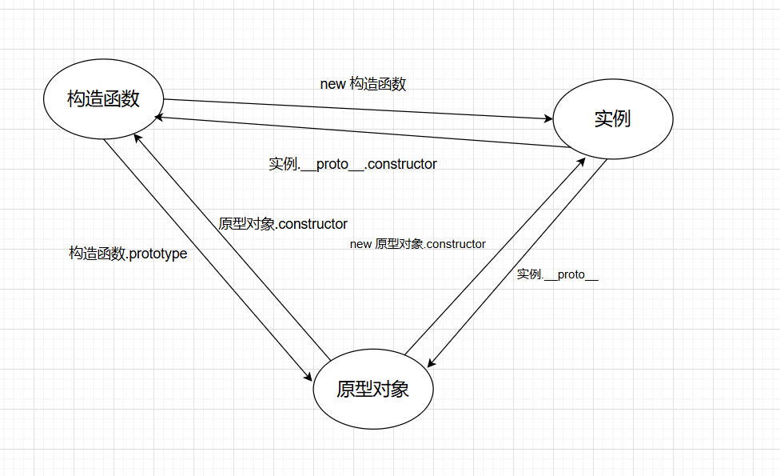
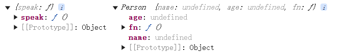
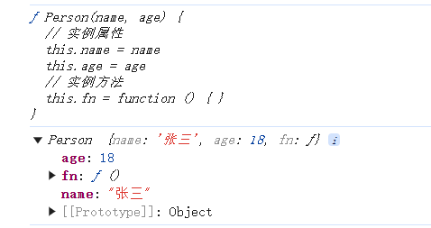
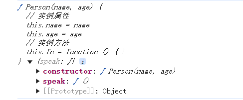
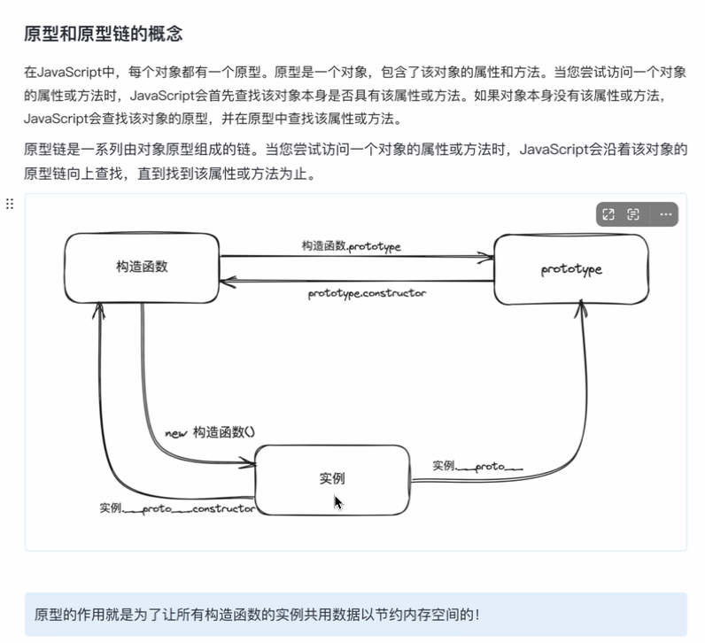

# 构造函数

> 在了解构造函数函数之前，先看看工厂函数

## 工厂函数

> 现实世界中“工厂”生产制造物品，所以用类比的方法，“工厂函数”制造对象。
>
> 工厂函数是用于**生成特定数据类型的新数据项**的函数。
>
> 下面是定义一个类数组对象的工厂函数

```js
!function (window) {
  // 定义的是公共的方法
  let prototype = {
    push: function (value) {
      this[this.length] = value
      this.length++
      return this.length
    },
    pop: function () {
      let deleteItem = this[this.length - 1]
      delete this[this.length - 1]
      this.length--
      return deleteItem
    },
    shift: function () {
      let deleteItem = this[0]
      for (let i = 0; i < this.length; i++) {
        this[i] = this[i + 1]
      }
      delete this[this.length - 1]
      this.length--
      return deleteItem
    },
    unshift: function (value) {
      for (let i = 0; i < this.length; i++) {
        this[i + 1] = this[i]
      }
      this[0] = value
      this.length++
      return this.length
    },
    indexOf: function (value, start = 0) {
      if (start > this.length - 1) return `传入数组的长度为${this.length},从0开始从左往右查找,索引不能超过${this.length - 1}`
      for (let i = start; i < this.length; i++) {
        if (this[i] === value) return i
      }
      return -1
    },
    lastIndexOf: function (value, start = this.length) {
      if (Math.floor(start) > this.length) return `传入数组的长度为${this.length},从${this.length}开始从右往左查找,索引不能超过${this.length - 1}`
      for (let i = this.length-1; i >0; i--) {
        if (this[i] === value) return i
      }
      return -1
    },
    slice: function (start = 0, end = this.length) {
      let resArr = { length: 0 }
      if (start > 0 && end > 0 && start > end || start < 0 && end < 0 && start > end) return resArr
      if (start < 0 && Math.abs(start) > this.length) start = 0
      if (end > this.length) end = this.length
      if (start < 0) start = this.length + start
      if (end < 0) end = this.length + end
      for (let j = start; j < end; j++) {
        resArr[resArr.length] = this[j]
        resArr.length++
      }
      return resArr
    },
    reverse: function () {
      let temp
      for (let i = 0; i < Math.floor(this.length / 2); i++) {
        temp = this[i]
        this[i] = this[this.length - 1 - i]
        this[this.length - 1 - i] = temp
      }
    },
    concat: function () {
      // 如果不加{...}只是复制了一个引用地址,那么就会改变原数组
      let { ...newArr } = this
      for (let i = 0; i < arguments.length; i++) {
        for (let j = 0; j < arguments[i].length; j++) {
          newArr[newArr.length] = arguments[i][j]
          newArr.length++
        }
      }
      return newArr
    },
    join: function (str) {
      let res = ''
      for (let i = 0; i < this.length; i++) {
        if (i === this.length - 1) {
          res += this[i]
        } else {
          res += this[i] + str
        }
      }
      return res
    },
    splice: function () { },
  }
  function creatArray(arr) {
    let res = {}
    for (let i in arguments) {
      res[i] = arguments[i]
    }
    res.length = arguments.length
    res.__proto__ = prototype
    return res
  }
  window.creatArray = creatArray
}(window)
let a1 = creatArray(1, 2, 3, 4, 5, 6, 7, 8, 9)
let a2 = ['a', 'b', 'c']
let a3 = [6, 7, 133]
// a1.push(1)
// a1.shift()
// console.log(a1.indexOf(2));
console.log(a1.lastIndexOf(2));
// a1.reverse()
// console.log(a1.concat(a2, a3));
// console.log(a1.join('-'));
// console.log(a1.slice(1, 5));
// console.log(a1.slice(-5, -1));
// console.log(a1.slice(5, -1));
// console.log(a1.slice(-5, 5));
// console.log(a1.slice(-100,100));
// console.log(a1.slice(-0,8));

```

> 上面的工厂函数太全了，做一下简化，以下是一个简化版的工厂函数

```js
// fn和bar是公共的方法
(function (window) {
  let prototype = {
    fn: function () {
      console.log('公共方法fn');
    },
    bar: function () {
      console.log('公共方法fn');
    }
  }
  function createArrayLike() {
    let res = {}  //每一个工厂函数必须写的
    for (let i = 0; i < arguments.length; i++) {
      res[i] = arguments[i]
    }
    res.length = arguments.length
    res.__proto__ = prototype  //每一个工厂函数必须写的
    return res  //每一个工厂函数必须写的
  }
  window.createArrayLike = createArrayLike  //每一个工厂函数必须写的
})(window)
```

> 以下是一个生产动物的工厂函数

```js
// 定义一个产生动物的工厂函数
  ; (function (window) {
    let prototype = {
      eat: function () {
        console.log('吃');
      }
    }
    function creatAnimal(name, category) {
      let res = {} //每一个工厂函数必须写的
      res.name = name
      res.category = category
      res.__proto__ = prototype //每一个工厂函数必须写的
      return res //每一个工厂函数必须写的
    }
    window.creatAnimal = creatAnimal
  })(window)
```

> 可以看到，每次定义一个工厂函数，都要写一些重复的代码，如何避免这些情况呢？构造函数可以

## 构造函数

> 构造函数是对工厂函数的升级
>
> 工厂函数的缺点：
>
> ​	1.模板代码太多
>
> ​	2.无法产生的对象和产生该对象的函数关系不明

> // 构造函数
>
> 1.构造函数的首字母必须大写
>
> 2.构造函数的使用(执行)  必须使用new关键字
>
> // new关键字的作用
>
> 在被new关键字修饰调用的函数中
>
> // 1.自动定义一个res对象
>
> // 2.this指向res空对象
>
> // 3.自动绑定原型(将res的__proto__属性赋值为该函数的prototype属性)
>
> // 4.自动返回res

```js
function Animal(name, category) {
  // let res = {}
  this.name = name
  this.category = category
  // this.__proto__ = Animal.prototype
  // return this
}
Animal.prototype = {
  // 在原型上有一个固定的属性是必须提供的 constructor 构造器
  constructor: Animal,
  eat: function () {
    console.log('吃');
  }
}
let a1 = new Animal('小黑', 'cat')
console.log(a1);

// 如何判断一个对象就是某个构造函数的实例
console.log(a1 instanceof Animal);  //true
console.log(a1 instanceof Object);  //true
```

## 构造函数-原型对象- 实例  三者之间的关系

> // 构造函数-->   实例 = new 构造函数()       原型对象 = 构造函数.prototype
>
> // 原型对象-->   构造函数=原型对象.constructor      实例 = new 原型对象.constructor
>
> // 实例-->       原型对象=实例.__proto__           构造函数=实例.__proto__.constructor



```js
function Person(name, age) {
  // 实例属性/实例方法
  this.name = name
  this.age = age
  this.fn = function () { }
}
Person.prototype = {
  // 公共属性/公共方法
  speak: function () {
    console.log('speak...');
  }
}
```

```js
// 已知构造函数Person，得原型对象pro和实例living
let pro = Person.prototype
let living = new Person('张三',18)
console.log(pro,living);
```



```js
// 已知原型对象Person.prototype，得构造函数Person和实例living
let shili = Person.prototype
let Personnn = shili.constructor
let living = new shili.constructor('张三', 18)
console.log(Personnn);
console.log(living);
```



```js
// 已知实例living，得构造函数Person和原型对象pro
let living = new Person('张三', 18)
let Personnn = living.__proto__.constructor
let pro = living.__proto__
console.log(Personnn,pro);
```



## 原型和原型链的概念




