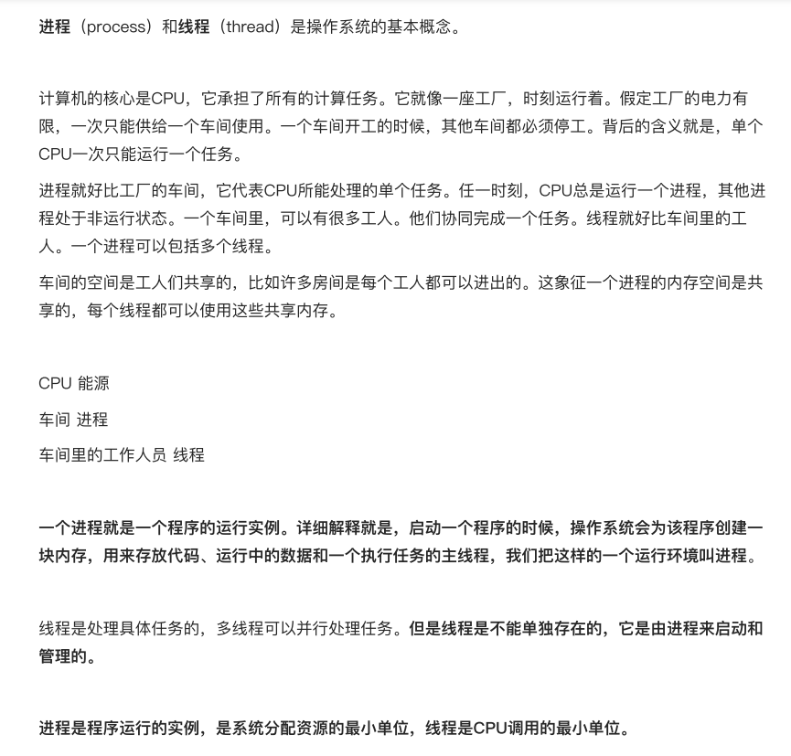

# 异步与事件循环

## 异步

**异步**在计算机科学中指的是一种编程模型，其核心特征是任务或函数的执行不需要等待完成，而是继续执行其他任务。异
步操作允许程序在等待某个操作完成时，可以继续执行其他任务，从而提高程序的效率和响应性。

### 异步与同步的区别

#### 同步(Synchronous)：

> 任务按顺序执行，一个任务完成后才能开始下一个任务。同步执行意味着任务是按顺序执行的，一个任务必须等到前一个任务完成后才能开始执行。

```js
  //同步
  console.log(1);
  console.log(2);
  console.log(3);
  console.log(4);
  // 打印顺序 1 2 3 4
```

> 一个进程在执行某个请求的时候，若该请求需要一段时间才能返回信息，那么这个进程将会一直等待下去，直到收到返回信息才继续执行下去;

```js
  //同步
  console.log(1);
  console.log(2);
  console.log(3);
  for (let i = 0; i < 2000000000; i++) { }
  console.log(4);
  // 打印顺序 先输出 1 2 3 等待for循环执行完,再输出4
```

#### 异步(Asynchronous)：

> 任务可以独立执行，不需要等待其他任务完成。异步操作允许程序在等待某个操作完成时，继续执行其他任务，从而提高程序的效率和响应性。

```js
  //异步
  console.log(1);
  console.log(2);
  setTimeout(() => {
    console.log(3);
  }, 3000)
  console.log(4);
  // 打印顺序 1 2 4 等待三秒后 输出3
```

常见的异步任务：定时器、ajax、事件绑定、回调函数、async await、promise。

## 进程与线程




