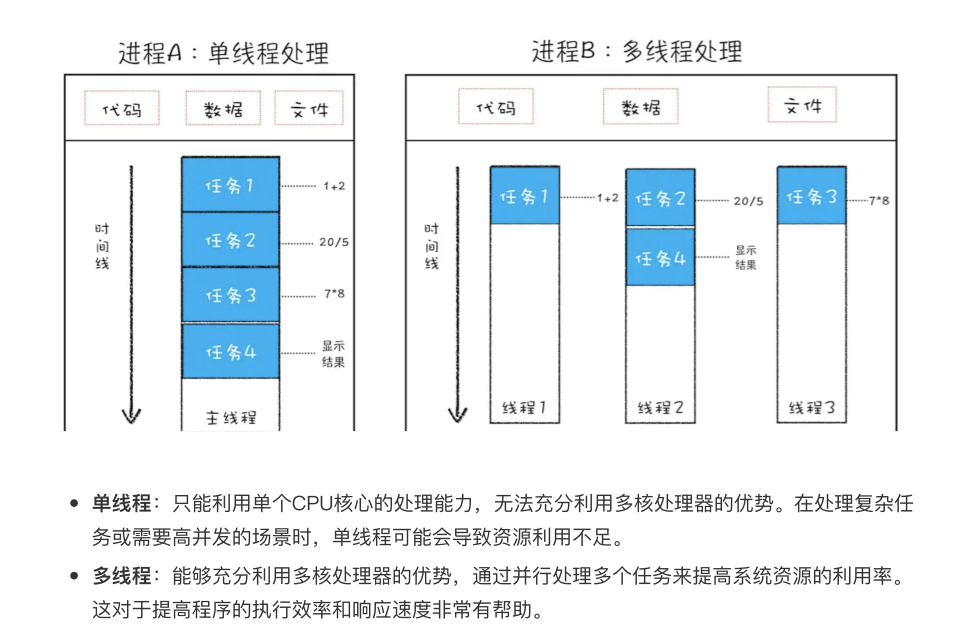
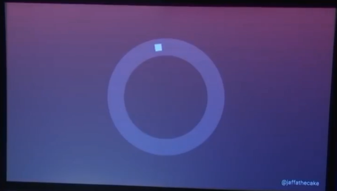

# 异步与事件循环

## 异步

**异步**在计算机科学中指的是一种编程模型，其核心特征是任务或函数的执行不需要等待完成，而是继续执行其他任务。异
步操作允许程序在等待某个操作完成时，可以继续执行其他任务，从而提高程序的效率和响应性。

### 异步与同步的区别

#### 同步(Synchronous)：

> 任务按顺序执行，一个任务完成后才能开始下一个任务。同步执行意味着任务是按顺序执行的，一个任务必须等到前一个任务完成后才能开始执行。

```js
  //同步
  console.log(1);
  console.log(2);
  console.log(3);
  console.log(4);
  // 打印顺序 1 2 3 4
```

> 一个进程在执行某个请求的时候，若该请求需要一段时间才能返回信息，那么这个进程将会一直等待下去，直到收到返回信息才继续执行下去;

```js
  //同步
  console.log(1);
  console.log(2);
  console.log(3);
  for (let i = 0; i < 2000000000; i++) { }
  console.log(4);
  // 打印顺序 先输出 1 2 3 等待for循环执行完,再输出4
```

#### 异步(Asynchronous)：

> 任务可以独立执行，不需要等待其他任务完成。异步操作允许程序在等待某个操作完成时，继续执行其他任务，从而提高程序的效率和响应性。

```js
  //异步
  console.log(1);
  console.log(2);
  setTimeout(() => {
    console.log(3);
  }, 3000)
  console.log(4);
  // 打印顺序 1 2 4 等待三秒后 输出3
```

常见的异步任务：定时器、ajax、事件绑定、回调函数、async await、promise。

## 进程与线程


### 单线程与多线程

> 你早上上班正要打卡的时候，⼿机响了。你如果先接了电话，等接完了在打卡就是单线程。
> 如果你⼀⼿接电话⼀⼿打卡就是多线程。
> 两件事的结果是⼀样的，你接了电话且打了卡。

- 单线程：在同⼀时间内，程序只能执⾏⼀个任务。任务按照顺序逐个执⾏，每个任务完成后才能执⾏下⼀个任务。这种执⾏⽅式简单直观，易于理解和调试。
- 多线程：在同⼀时间内，程序可以同时执⾏多个任务。每个线程可以独⽴执⾏不同的任务，这些任务之间可以并⾏进⾏，从⽽提⾼程序的执⾏效率。



## Chrome的多进程架构

### Chrome的进程模型

- 浏览器进程 (Browser Process)：负责浏览器的TAB的前进、后退、地址栏、书签栏的⼯作和处理浏览器的⼀些不可⻅的底层操作，⽐如⽹络请求和⽂件访问。
- 渲染进程 (Renderer Process)：负责⼀个Tab内的显示相关的⼯作，也称渲染引擎。
- 插件进程 (Plugin Process)：负责控制⽹⻚使⽤到的插件
- GPU进程 (GPU Process)：负责处理整个应⽤程序的GPU任务

### 渲染进程

*GUI渲染线程*

- HTML Parser 解析HTML
- CSS Parser 解析Style数据
- Layout过程，为每个可⻅节点的⼏何信息
- Painting过程，遍历Render Tree，调⽤UI接⼝绘制每个节点

*JavaScript 引擎线程（V8）*

- 负责解析Javascript脚本，运⾏代码

*定时触发器线程*

- 浏览器定时计数器并不是由 JavaScript 引擎计数的, 因为 JavaScript 引擎是单线程的, 如果处于阻塞线程状态就会影响记计时的准确, 因此通过单独线程来计时并触发定时

*事件触发线程*

- 当⼀个事件被触发时该线程会把事件添加到待处理队列的队尾，等待 JavaScript 引擎的处理

*⽹络线程*

- XMLHttpRequest 请求会在浏览器中新开⼀个线程请求， 将检测到状态变更时，如果设置有回调函数，异步线程就产⽣状态变更事件放到 JavaScript 引擎的处理队列中

### Javascript单线程模型

*javaScript是单线程的*

> 作为浏览器脚本语⾔，javascript的主要⽤途是与⽤户互动，以及操作DOM,这决定了它只能是单线程，
> 否则会带来很复杂的同步问题。
> 假定javascript同时有两个线程，⼀个线程在某个DOM节点上添加内容，另⼀个线程删除了这个节点，这
> 时浏览器不知道应该以哪个线程为准？所以，为了避免复杂性，从⼀诞⽣javascript就是单线程的。

*单线程的优势*

- 不会出现因线程之间争夺资源导致的死锁现象
- 所有代码都是同步执⾏的
- 没有线程切换的资源开销

*单线程的缺点*

- 单线程就意味着，所有任务需要排队，前⼀个任务结束，才会执⾏后⼀个任务。如果前⼀个任务耗时很⻓，后⼀个任务就不得不⼀直等着！

## 事件循环(EventLoop)

### 前言

这段代码正向DOM添加节点，然后把它隐藏起来，大概是为了后面点击按钮再显示出来

```js
document.body.appendChild(el)
el.style.display = 'none'
```

你会不会感到很紧张？难道你不担心他会在页面上闪一下吗

其实这种情况不可能，难道说代码执行的太快了看不出来？？那么这样呢？

```js
document.body.appendChild(el)
for (let i = 0; i < 5000000000; i++) { }
el.style.display = 'none'
```

由于for循环是同步任务，我们第一反应是el元素先是正常显示，然后执行那段花费时间很长的for循环后，再隐藏

但结果与我们的预期不相符，它任然是一直隐藏着的，这是为什么，接下来了解事件循环与浏览器渲染机制，以及解答上述问题为什么不会看到el在页面上闪一下

--------------------------------

**JavaScript 的事件循环（Event Loop）是其运行时环境的一部分，它允许 JavaScript 在单线程中实现异步编程。事件循环的核心在于协调调用栈、任务队列（也称为消息队列）和微任务队列（microtask queue）之间的关系。以下是事件循环的基本工作原理：**

### 调用栈（Call Stack）
- 调用栈是一个后进先出（LIFO）的栈结构，用于跟踪正在执行的函数。
- 当一个函数被调用时，它会被压入调用栈。
- 当函数执行完毕后，它会被从调用栈中弹出。

### 任务队列（Task Queue）
- 任务队列用于存储宏任务（macro tasks），如 `setTimeout`、`setInterval`、`setImmediate`、I/O 事件等。
- 当一个宏任务完成时，它会被放入任务队列中等待执行。

### 微任务队列（Microtask Queue）
- 微任务队列用于存储微任务（micro tasks），如 `Promise` 的回调、`MutationObserver` 等。
- 微任务的优先级高于宏任务，会在当前任务执行完毕后立即执行。

### 事件循环的工作流程
1. **执行栈中的代码**：JavaScript 引擎首先执行调用栈中的代码。
2. **检查微任务队列**：一旦调用栈为空，事件循环会检查微任务队列。如果有微任务，它会依次执行这些微任务，直到微任务队列为空。
3. **渲染更新**：在执行完所有微任务后，浏览器会进行一次渲染更新，以反映页面的最新状态。
4. **检查任务队列**：接下来，事件循环会检查任务队列。如果有宏任务，它会取出一个宏任务并执行。
5. **重复上述过程**：事件循环会不断重复上述步骤，直到所有任务都执行完毕。

### 特点
- **单线程**：JavaScript 在浏览器中运行于单个线程，事件循环确保了即使在单线程中，也能实现异步操作。
- **非阻塞 I/O**：事件循环允许 JavaScript 进行非阻塞的 I/O 操作，如网络请求、文件读取等。
- **优先级**：微任务的优先级高于宏任务，这意味着在执行宏任务之前，会先执行所有可用的微任务。

### 示例
假设你有以下代码：

```javascript
console.log('script start');

setTimeout(function() {
  console.log('setTimeout');
}, 0);

Promise.resolve().then(function() {
  console.log('promise1');
}).then(function() {
  console.log('promise2');
});

console.log('script end');
```

输出顺序将是：
1. `script start`
2. `script end`
3. `promise1`
4. `promise2`
5. `setTimeout`

解释：
- `script start` 和 `script end` 是同步代码，首先执行。
- `setTimeout` 是一个宏任务，被放入任务队列。
- `Promise.resolve().then()` 是微任务，被放入微任务队列。
- 在调用栈为空时，事件循环首先执行微任务队列中的 `promise1` 和 `promise2`。
- 然后执行任务队列中的 `setTimeout`。

事件循环是 JavaScript 异步编程的基础，它使得 JavaScript 能够在单线程中高效地处理异步任务和事件.

----------------------------

以上是AI 给出的关于js事件循环的简要解释，我个人认为解释的还不错

------------------------

每一个渲染进程都有一个主线程，主线程要处理大量的事情，处理 DOM，计算样式，处理布局等等...

这意味着网页上大部分的活动都具有确定性的顺序，这也就避免了我们同时运行多段代码去修改同一处DOM，让你处于一个可怕的竞争条件的世界，但它意味着，如果主线程上的任务需要很长时间，像是500ms，从用户交互体验来说，这是一段很长的时间，用户会注意到，因为它阻止了的加载，渲染和交互，因此，虽然我们有主线程，我们还需要其他线程用来网络请求，编码和解码，加密、监控输入设备，但是，一旦这些线程有了需要页面响应的操作，他们需要通知主线程，这里是事件环来协调所有这些活动

**事件环的原理**

把自己想象成一个制定网络标准的工作者，想想下面的代码应该怎么运作

```js
setTimeout(callback,ms)
```

- 我们决定为他指定一个标准：

> setTimeout方法，在调用时，运行以下步骤:
>
> 1. 等待指定时间
> 2. 触发回调函数

这样已经可以了吗？显然还不够，因为setTimeout方法和回调函数运行在同一个线程上，在主线程上运行，所以当我们等待5000毫秒时，我们是在主线程上等待，阻止了主线程上的其他活动，所以这个标准现在还不严谨

- 所以我们要将其改成，离开这个线程，同时运行那两个步骤。

但是有了一个新问题，因为现在我们在主线程以外触发回调函数，最终会有大量并行运行的JavaScript，编辑相同的DOM，你最终会面临竞争条件，所以我们要做的就是，创建一个任务加到住务队列，以便在某个时刻回到主线程继续执行，现在我们在JavaScript所在的线程
上调用JavaScript，所以这种方案行得通。**这是浏览器原理的核心部分**

> 当你单击鼠标，操作系统如何通知javaScript呢?通过向任务队列里加入任务
>
> 请求响应数据如何进入到javascript中呢?通过向任务队列加入任务
>
> 当你从页面发送消息到web worker时，同样通过向任务队列中加入任务

事件环中首先关注任务队列，这也是事件环中历史最悠久的部分



当我们向任务队列加入任务时，事件环会绕道而行到这里。这是执行任务的地方


