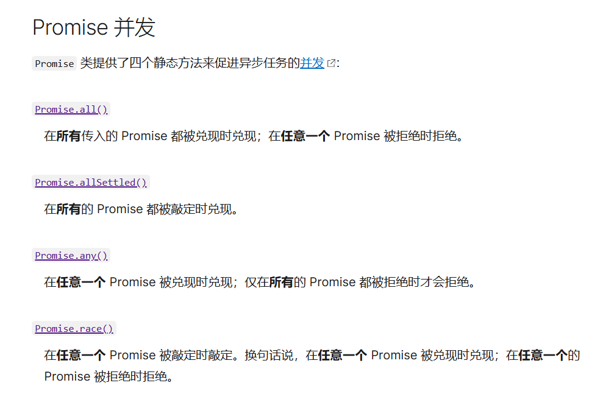

# Promise

## Promise是什么？

> 对于当前发生的事情，在现在无法去拿到结果，需要时间验证(异步操作)
>
> 例子：
>
> ​      生活中：借钱(给出承诺) --- 还钱(兑现承诺) --- 联系不到(没有兑现承诺)
>
> ​      js中：     new Promise    ---       resolve        ---       reject

一个 `Promise` 必然处于以下几种状态之一：

- *待定（pending）*：初始状态，既没有被兑现，也没有被拒绝。
- *已兑现（fulfilled）*：意味着操作成功完成。
- *已拒绝（rejected）*：意味着操作失败。

## Promise的常用原型方法

### promise.then

### promise.catch

### promise.finally

## Promise常用的静态方法

### Promise.all

### Promise.race

### Promise.resolve

### Promise.reject

-------------

> 在创建Promise实例的时候，传递给Promise构造函数的参数函数中去异步调用resolve/reject，
>
> 用来触发提前注册给Promise实例的then回调函数和catch回调函数

```js
let promise = new Promise(function (resolve, reject) {
    setTimeout(function () {
      let random = Math.random()
      console.log(random);
      if (random >= 0.5) {
        resolve(1000)
      } else {
        reject('联系不上')
      }
    }, 2000)
  })
  promise
    // 提前注册回调函数（收集成功的回调）
    // 如果内部调用resolve 那么传递给then的参数就会被执行
    .then(function (result) {
      console.log('成功的原因:还了:', result);
      console.log('下次还借你');
    })
    // 提前注册回调函数（收集失败的回调）
    // 如果内部调用resolve 那么传递给then的参数就会被执行
    .catch(function (reason) {
      console.log('失败的原因:', reason);
      console.log('花钱买教训，以后谁都不借');
    })
    .finally(function () {
      console.log('无论成功失败,我总执行');
    })
```

> 在创建Promise实例的时候，传递给Promise构造函数的参数函数中去异步调用resolve/reject，
>
> 用来触发提前注册给Promise实例的then回调函数和catch回调函数

--------------

#### 案例1：通过浏览器打开本地文件夹

```js
  let button = document.querySelector('.openDir')
  button.addEventListener('click', () => {
    let p = showDirectoryPicker()  //打开文件夹方法,返回一个promise,打开成功调用resolve,打开失败调用reject
    p.then(function (result) {// 如果调用了resolve则执行then
      console.log(result);
    }).catch(function (reason) {// 如果调用了reject则执行catch
      console.log(reason);
    })
  })
```

#### 案例2：全屏/退出全屏

```html
  <div>
    <button class="openFullscreen">全屏</button>
    <button class="exitFullscreen">退出全屏</button>
  </div>
```

```css
    div {
      width: 200px;
      height: 200px;
      background-color: red;
    }
```

```js
  // 例子2：元素全屏/退出全屏
  let openButton = document.querySelector('.openFullscreen')
  let exitButton = document.querySelector('.exitFullscreen')
  openButton.addEventListener('click', function () {
    //this.parentElement.requestFullscreen()返回一个promise
    let r = this.parentElement.requestFullscreen()
    r.then(function () {
      console.log('全屏操作成功');
    }).catch(function () {
      console.log('全屏操作失败');
    })
  })
  exitButton.addEventListener('click', function () {
    //document.exitFullscreen()返回一个promise
    let r = document.exitFullscreen()
    r.then(function () {
      console.log('退出成功');
    }).catch(function () {
      console.log('退出失败');
    })
  })
```

## 补充：Promise常用的静态方法

### resolve / reject

**Promise.resolve()** 静态方法以给定值“解决（resolve）”一个 `Promise`。如果该值本身就是一个 Promise，那么该 Promise 将被返回；如果该值不是一个 Promise，`Promise.resolve()` 将调用其 `then()` 方法及其两个回调函数；

**Promise.reject()** 静态方法返回一个已拒绝（rejected）的 `Promise` 对象，拒绝原因为给定的参数。

```js
  //实例化一个promise 一秒后调用resolve,参数为一个随机数
  let promise = new Promise(function (resolve, reject) {
    setTimeout(() => {
      resolve(Math.random())
    }, 1000)
  })
  promise
    .then(res => {
      console.log('success:', res)
      return new Promise(function (resolve) { resolve(11) })
    })
    .then(res1 => {
      console.log('res1', res1)
      return Promise.resolve(22) // 等同于 new Promise(function (resolve) { resolve(22) })
    })
    .then(res2 => {
      console.log('res2', res2)
      return 33 // 等同于 Promise.resolve(33) --> 等同于 new Promise(function (resolve) { resolve(33) })
    })
    .then(res3 => {
      console.log('res3:', res3);
      // 等同于new Promise(function (resolve) { resolve(44) })
      return Promise.resolve(new Promise(function (resolve) { resolve(44) }))
    })
    .then(res4 => {
      console.log('res4:', res4);
      // 等同于new Promise(function (reject) { reject(55) })-->等同于 new Promise(function (reject) { reject(55) })
      return Promise.reject(55)
    })
    .catch(err => {
      console.log('error:', err);
    })
```

### all

*Promise.all()* 静态方法接受一个 Promise 可迭代对象作为输入，并返回一个`Promise`。当所有输入的 Promise 都被兑现时，返回的 Promise 也将被兑现（即使传入的是一个空的可迭代对象），并返回一个包含所有兑现值的数组。如果输入的任何 Promise 被拒绝，则返回的 Promise 将被拒绝，并带有第一个被拒绝的原因。

```js
  /* 
    Promise.all是处理一组 promise对象的结果
    当每一个promise都成功时，走then方法返回成功数组
    当有一个 promise失败时，直接走catch方法返回失败原因
    all方法可以看成旅行乘车，当乘客全都坐上时再走
  */
  let list = [111, 222, 333, 444, 555]
  let promiseList = list.map((item, index) => {
    if (index === 4) {
      return Promise.reject(item)
    } else {
      return Promise.resolve(item)
    }
  });
  console.log(promiseList);//promise数组
  
  Promise.all(promiseList)
    .then(res => {
      console.log('res:', res)
    })
    .catch(err => {
      console.log('err:', err) // err: 555
    })
```

### any

**Promise.any()** 静态方法将一个 Promise 可迭代对象作为输入，并返回一个 [`Promise`](https://developer.mozilla.org/zh-CN/docs/Web/JavaScript/Reference/Global_Objects/Promise)。当输入的任何一个 Promise 兑现时，这个返回的 Promise 将会兑现，并返回第一个兑现的值。当所有输入 Promise 都被拒绝（包括传递了空的可迭代对象）时，它会以一个包含拒绝原因数组的 [`AggregateError`](https://developer.mozilla.org/zh-CN/docs/Web/JavaScript/Reference/Global_Objects/AggregateError) 拒绝。

```js
  let promise1 = Promise.reject(0);
  let promise2 = new Promise((resolve) => setTimeout(resolve, 100, 'quick'));
  let promise3 = new Promise((resolve) => setTimeout(resolve, 500, 'slow'));

  let promises = [promise1, promise2, promise3];
  //有一个成功就返回第一个成功的值
  Promise.any(promises).then((value) => console.log(value));//quick
```

### allSettled

*Promise.allSettled()* 静态方法将一个 Promise 可迭代对象作为输入，并返回一个单独的`Promise`。当所有输入的 Promise 都已敲定时（包括传入空的可迭代对象时），返回的 Promise 将被兑现，并带有描述每个 Promise 结果的对象数组。

```js
  let promise1 = Promise.resolve(3);
  let promise2 = new Promise((resolve, reject) =>
    setTimeout(reject, 100, 'foo'),
  );
  let promises = [promise1, promise2];

  Promise.allSettled(promises).then((results) =>
    results.forEach((result) => console.log(result.status)),
    // "fulfilled"
    // "rejected"
  );
```


### race

*Promise.race()* 静态方法接受一个 promise 可迭代对象作为输入，并返回一个`Promise`。这个返回的 promise 会随着第一个 promise 的敲定而敲定。

白话：比谁快，一旦有一个完成，就返回结果

```js
  let arr = [500, 2000, 10, 40, 5000]
  // Promise.race  赛跑 
  // 比谁快，一旦有一个完成，就返回结果
  let promiseArr = arr.map((item, index) => {
    return new Promise((resolve, reject) => {
      setTimeout(() => {
        index === 4 ? reject(item) : resolve(item)
      }, item)
    })
  })
  Promise.race(promiseArr)
    .then(res => {
      console.log('res:', res);
    })
    .catch(err => {
      console.log('err:', err);
    })
```



## 总结Promise

- Promise.resolve是实现直接创建一个成功态的promise
- Promise.reject是实现直接创建一个失败态的 promise
- Promise,all是处理一组 promise对象的结果，只有当每个 promise 都成功时，走,then 方法返回成功数组，当有一个 promise失败时，直接走catch 方法返回失败原因，all 可以看成旅行乘车，当乘客全都坐上时再走
- Promise.race也是处理一组 promise 对象的结果，一旦有一个 promise 完成，无论成功失败均标记 promise 的完成，race 可以看作是赛跑，一旦有一个完成，就返回结果
- .catch 是 promise 的实例方法，当返回失败态的 promise 时，会走该函数处理异常问题
- .finally 是 promise 的实例方法，无论返回成功失败，都会走该逻辑，比如当发送一个请求时展示了loading 组件，无论请求成功或失败都要关闭该loading 组件，否则用户将无法操作

## Promise的作用和实用性

promise主要是用来解决回调地狱的问题，通过使用,then来使得代码成链式调用，方便维护和使用。

**需求**：

> 1s后打印1，再3s后打印3，再5s后打印5，再8s打印8

```js
  setTimeout(() => {
    console.log(1);
    setTimeout(() => {
      console.log(3);
      setTimeout(() => {
        console.log(5);
        setTimeout(() => {
          console.log(8);
        }, 8000)
      }, 5000)
    }, 3000)
  }, 1000)
```

是不是头晕眼花了？再加两句根本看不了了

用Promise优化一下

```js
  new Promise(resolve => {
    setTimeout(() => {
      resolve(1)
    }, 1000)
  })
    .then((res) => {
      console.log(res);
      return new Promise(resolve => {
        setTimeout(() => {
          resolve(3)
        }, 3000)
      })
    })
    .then((res) => {
      console.log(res);
      return new Promise(resolve => {
        setTimeout(() => {
          resolve(5)
        }, 5000)
      })
    })
    .then((res) => {
      console.log(res);
      return new Promise(resolve => {
        setTimeout(() => {
          resolve(8)
        }, 8000)
      })
    })
    .then((res) => {
      console.log(res);
    })
```

看着可读性是强了一点，但代码变长了好多，我们发现return 一个Promise是重复的操作，所以把它封装成一个函数

```js
  function setTimeoutFn(num, time) {
    return new Promise(resolve => {
      setTimeout(() => {
        console.log(num);
        resolve(num)
      }, time)
    })
  }
  setTimeoutFn(1, 1000)
    .then((res) => {
      return setTimeoutFn(3, 3000)
    })
    .then((res) => {
      return setTimeoutFn(5, 5000)
    })
    .then((res) => {
      return setTimeoutFn(8, 8000)
    })
```

虽然我们把new promise这个操作封装到了函数中，但这里看起来还是一个promise，存在链式调用，进一步优化

使用`async`   `await` 语法糖，

`async`   `await` 作用:让Promise以同步的形式展现出来 本质上没有改变还是异步

**async**关键字可用于在表达式中定义一个异步生成器函数。

**await**操作符用于等待一个 `Promise` 兑现并获取它兑现之后的值。就是await后面的代码会等待await右边的`Promise` 兑现并获取它兑现之后的值才会执行

对于`async`   `await` 我们遵循以下规则：

1. await关键字只能在async函数内部使用
2. await后面只能跟Promise的实例或返回Promise实例的函数的执行
3. await的返回值是后面跟的Promise的实例resolve的数据
4. 可以使用try catch捕获错误

优化后的代码：

```js
  function setTimeoutFn(num, time) {
    return new Promise(resolve => {
      setTimeout(() => {
        console.log(num)
        resolve(num)
      }, time)
    })
  }

  async function fn() {
    await setTimeoutFn(1, 1000)  //等待1s后打印1，兑现 resolve(1)
    await setTimeoutFn(3, 3000)	 //上方的await等待完成，开始等待3s后打印3，兑现 resolve(3)
    await setTimeoutFn(5, 5000)  //上方的await等待完成，开始等待5s后打印5，兑现 resolve(5)
    await setTimeoutFn(8, 8000)  //上方的await等待完成，开始等待8s后打印8，兑现 resolve(8)
  }
  fn()
```

此时代码简洁明了，对于后期维护非常方便

在实际开发中，可能存在请求成功或失败，为了防止报错我们用try-catch包裹起来

```js
  function setTimeoutFn(num, time) {
    return new Promise(resolve => {
      setTimeout(() => {
        console.log(num)
        resolve(num)
      }, time)
    })
  }

  async function fn() {
    try {
    	await setTimeoutFn(1, 1000)
    	await setTimeoutFn(3, 3000)
    	await setTimeoutFn(5, 5000)
    	await setTimeoutFn(8, 8000)
    } catch (error) {
      console.error(error)
    }
  }
  fn()
```

最后存在一个问题，那就是我们每次写一个`async`   `await`语法糖，都要命名一个函数，这对于命名困难症的人来说很痛苦，我们可以将这段代码用立即执行函数包裹起来，就不用起名字了。最终代码版本：

```js
  function setTimeoutFn(num, time) {
    return new Promise(resolve => {
      setTimeout(() => {
        console.log(num)
        resolve(num)
      }, time)
    })
  }
  (async function () {
    try {
      await setTimeoutFn(1, 1000)
      await setTimeoutFn(3, 3000)
      await setTimeoutFn(5, 5000)
      await setTimeoutFn(8, 8000)
    } catch (error) {
      console.error(error)
    }
  })()
```