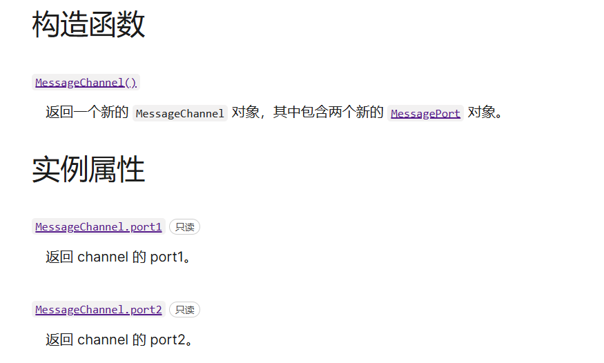

# 使用 Web Worker

> Web Worker 为 Web 内容在后台线程中运行脚本提供了一种简单的方法。线程可以执行任务而不干扰用户界面。
>
> 一旦创建，一个 worker 可以将消息发送到创建它的 JavaScript 代码，通过将消息发布到该代码指定的事件处理器。

## 专用worker

### 生成一个专用 worker

> 调用`Worker()`构造器，指定一个脚本的 URI 来执行 worker 线程

```js
const myWorker = new Worker("worker.js");
```

### 专用 worker 中消息的接收和发送

> *postMessage()*：向 worker 发送消息。第一个参数是要发送到 worker 的数据。
>
> *onmessage*：当 worker 的父级接收到来自其 worker 的消息时，会在`Worker`对象上触发 `message` 事件。

### 终止 worker

> 从主线程中立刻终止一个运行中的 worker

```js
myWorker.terminate();
```

###  worker的应用场景

```html
<div></div>
```

```css
div {
      position: relative;
      width: 100px;
      height: 100px;
      background-color: red;
    }
```
> 因为js是单线程的，一个任务完成后才能开始下一个任务，一个任务必须等到前一个任务完成后才能开始执行。
>
> 这里三秒后，会执行一段花时很久的for循环，而for循环是同步任务，所以div在两秒后会卡住不动，等待for循环执行完毕再开始动，这对于用户的体验极差，要避免这种情况

>
> 事件循环、浏览器渲染参考：[【事件循环】【前端】事件原理讲解，超级硬核，忍不住转载](https://www.bilibili.com/video/BV1K4411D7Jb/?spm_id_from=333.337.search-card.all.click&vd_source=46701261108fb127bbce6fe959a52d40)

```js
let div = document.querySelector('div')
setTimeout(() => {
  for (var i = 0; i < 2000000000; i++) { }
}, 2000);
let leftValue = 0;
function animate() {
  // 注册一个事件(事件的回调函数总是在主线程执行渲染任务前执行)
  requestAnimationFrame(function () {
    leftValue++
    div.style.left = `${leftValue}px`
    animate()
  })
}
animate()
```

**使用worker优化代码**

```js
  let div = document.querySelector('div');
  let myWorker = new Worker('work.js');
  // 发消息
  myWorker.postMessage([0, 80000000]);
  myWorker.onmessage = (e) => {
    // 收到消息后打印
    console.log(e.data);
  };
  let leftValue = 0;
  function animate() {
    // 注册一个事件(事件的回调函数总是在主线程执行渲染任务前执行)
    requestAnimationFrame(function () {
      leftValue++
      div.style.left = `${leftValue}px`
      animate()
    })
  }
  animate()
  // 注意：使用web worker通信  -->  打开时使用Open with Live Server
```

```js
//work.js
onmessage = (e) => {
  var res = 0;
  for (var i = e.data[0]; i < e.data[1]; i++) {
    res += i;
  }
  postMessage(res);
};
```

> 这样可以保证线程可以执行任务而不干扰用户界面，但使用上述方法数据的收发消息是通过克隆实现的，克隆需要很长时间，虽然不会影响其他线程，但等待计算完成的时间太长了，80000000已经要等很久了，如何能优化这种情况呢

### MessageChannel

> 允许我们创建一个新的消息通道，并通过它的两个 [`MessagePort`](https://developer.mozilla.org/zh-CN/docs/Web/API/MessagePort) 属性发送数据。



```js
  let div = document.querySelector('div')
  let x = 0
  function animate() {
    if (x > 1000) x = 0
    requestAnimationFrame(function () {
      div.style.transform = `translate3D(${++x}px,0,0)`
      animate()
    })
  }
  animate()
  // 发消息 postMessage()   收消息 onmessage
  let worker = new Worker('./myWorker.js')
  // 信息通道 消息端口
  let channel = new MessageChannel()
  worker.postMessage({ type: 'connect' }, [channel.port2])
  // channel.port1 channel.port2
  setTimeout(function () {
    channel.port1.postMessage(200000)
  }, 2000)
  channel.port1.onmessage = function (evt) {
    console.log(evt.data);
  }
  // 注意：使用web worker通信  -->  打开时使用Open with Live Server
```

```js
//myWorker.js
let port2 = null
onmessage = function (event) {
  if (event.data.type === 'connect') {
    port2 = event.ports[0]
    port2.onmessage = function (e) {
      let res = []
      for (let i = 0; i < e.data; i++) {
        res.push([i])
      }
      port2.postMessage(res)
    }
  }
}
```


## 共享 worker