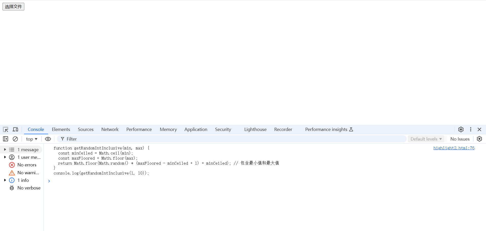
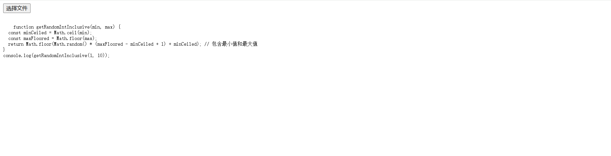
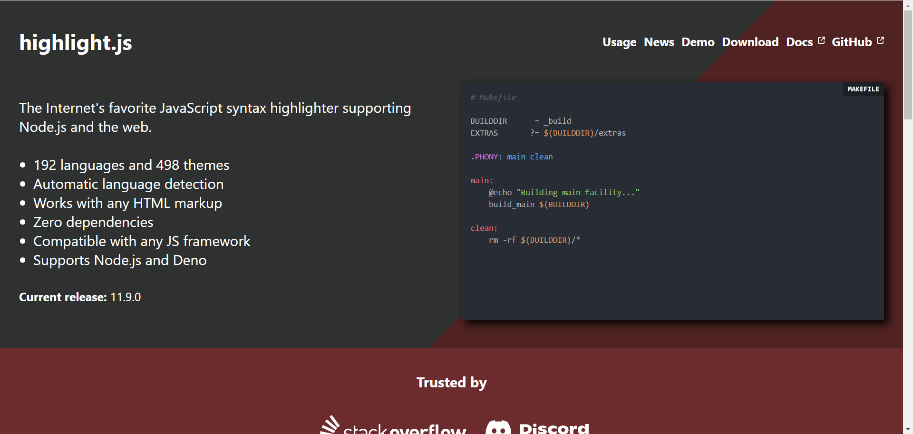
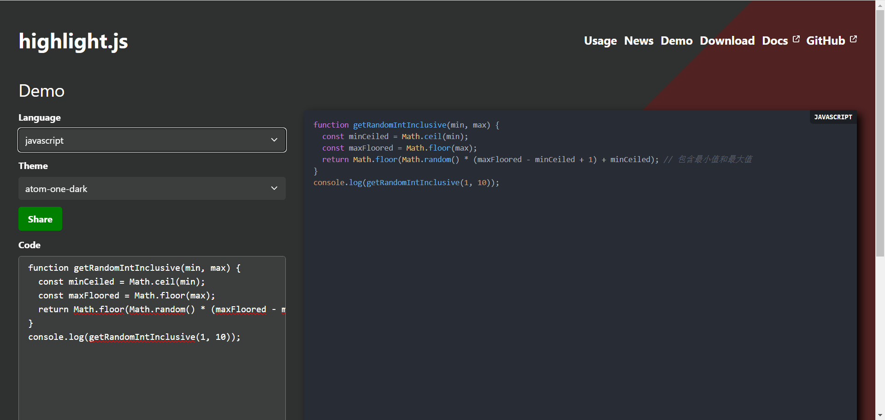
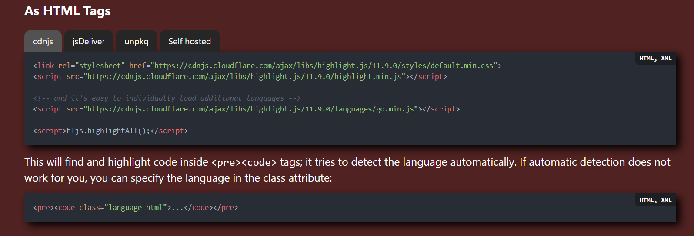
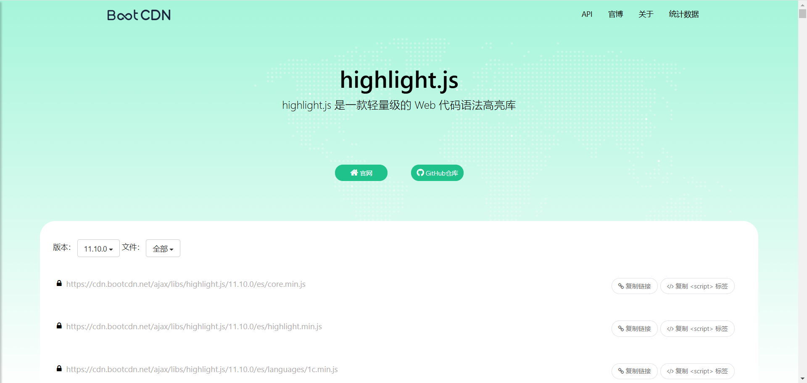
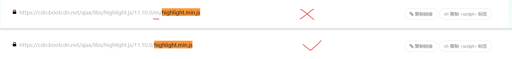
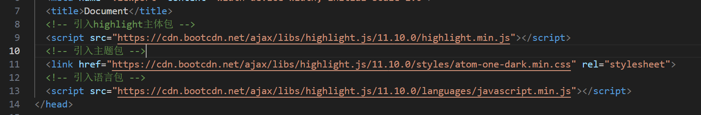
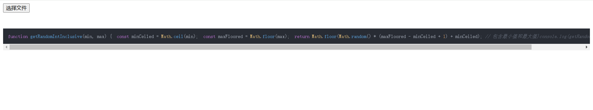
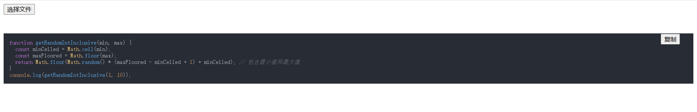

# FileReader

> *FileReader* 接口允许 Web 应用程序异步读取存储在用户计算机上的文件（或原始数据缓冲区）的内容，使用 [`File`](https://developer.mozilla.org/zh-CN/docs/Web/API/File) 或 [`Blob`](https://developer.mozilla.org/zh-CN/docs/Web/API/Blob) 对象指定要读取的文件或数据。

## 实例属性

- [`FileReader.error`](https://developer.mozilla.org/zh-CN/docs/Web/API/FileReader/error) 只读

  一个表示在读取文件时发生的错误的 [`DOMException`](https://developer.mozilla.org/zh-CN/docs/Web/API/DOMException)。

- [`FileReader.readyState`](https://developer.mozilla.org/zh-CN/docs/Web/API/FileReader/readyState) 只读

  表示`FileReader`状态的数字。取值如下：常量名值描述`EMPTY``0`还没有加载任何数据。`LOADING``1`数据正在被加载。`DONE``2`已完成全部的读取请求。

- [`FileReader.result`](https://developer.mozilla.org/zh-CN/docs/Web/API/FileReader/result) 只读

  文件的内容。该属性仅在读取操作完成后才有效，数据的格式取决于使用哪个方法来启动读取操作。

## 实例方法

- [`FileReader.abort()`](https://developer.mozilla.org/zh-CN/docs/Web/API/FileReader/abort)

  中止读取操作。在返回时，`readyState` 属性为 `DONE`。

- [`FileReader.readAsArrayBuffer()`](https://developer.mozilla.org/zh-CN/docs/Web/API/FileReader/readAsArrayBuffer)

  开始读取指定的 [`Blob`](https://developer.mozilla.org/zh-CN/docs/Web/API/Blob) 中的内容，一旦完成，`result` 属性中将包含一个表示文件数据的 [`ArrayBuffer`](https://developer.mozilla.org/zh-CN/docs/Web/JavaScript/Reference/Global_Objects/ArrayBuffer) 对象。

- [`FileReader.readAsBinaryString()`](https://developer.mozilla.org/zh-CN/docs/Web/API/FileReader/readAsBinaryString) 已弃用

  开始读取指定的 [`Blob`](https://developer.mozilla.org/zh-CN/docs/Web/API/Blob) 中的内容。一旦完成，`result` 属性中将包含一个表示文件中的原始二进制数据的字符串。

- [`FileReader.readAsDataURL()`](https://developer.mozilla.org/zh-CN/docs/Web/API/FileReader/readAsDataURL)

  开始读取指定的 [`Blob`](https://developer.mozilla.org/zh-CN/docs/Web/API/Blob) 中的内容。一旦完成，`result` 属性中将包含一个表示文件数据的 `data:` URL。

- [`FileReader.readAsText()`](https://developer.mozilla.org/zh-CN/docs/Web/API/FileReader/readAsText)

  开始读取指定的 [`Blob`](https://developer.mozilla.org/zh-CN/docs/Web/API/Blob) 中的内容。一旦完成，`result` 属性中将包含一个表示所读取的文件内容的字符串。可以指定可选的编码名称。

## 事件

使用 [`addEventListener()`](https://developer.mozilla.org/zh-CN/docs/Web/API/EventTarget/addEventListener) 方法或通过将事件侦听器分配给此接口的 `oneventname` 属性来侦听这些事件。一旦不再使用 `FileReader`，请使用 [`removeEventListener()`](https://developer.mozilla.org/zh-CN/docs/Web/API/EventTarget/removeEventListener) 删除事件侦听器，以避免内存泄漏。

- [`abort`](https://developer.mozilla.org/zh-CN/docs/Web/API/FileReader/abort_event)

  当读取被中止时触发，例如因为程序调用了 [`FileReader.abort()`](https://developer.mozilla.org/zh-CN/docs/Web/API/FileReader/abort) 方法。

- [`error`](https://developer.mozilla.org/zh-CN/docs/Web/API/FileReader/error_event)

  当读取由于错误而失败时触发。

- [`load`](https://developer.mozilla.org/zh-CN/docs/Web/API/FileReader/load_event)

  读取成功完成时触发。

- [`loadend`](https://developer.mozilla.org/zh-CN/docs/Web/API/FileReader/loadend_event)

  读取完成时触发，无论成功与否。

- [`loadstart`](https://developer.mozilla.org/zh-CN/docs/Web/API/FileReader/loadstart_event)

  读取开始时触发。

- [`progress`](https://developer.mozilla.org/zh-CN/docs/Web/API/FileReader/progress_event)

  读取数据时定期触发。

## FileReader应用

### 上传图片（自定义）
```html
<!-- html -->
<div class="imgBox">
    
  </div>
```
> 素材图片


```css
    /* css */
    * {
      margin: 0;
      padding: 0;
      box-sizing: border-box;
    }

    .imgBox {
      display: flex;
      flex-wrap: wrap;
      align-items: center;
      width: 95%;
      border: 1px solid #ccc;
      margin: 0 auto;
      padding: 5px;
    }

    .addImg {
      border: 1px solid #ccc;
      height: 90px;
    }
```

```js
  // js
  (function () {
    // 判断传入数据的类型
    function typeOf(data) {
      return Object.prototype.toString.call(data).slice(8, -1).toLowerCase()
    }
    // 定义一个按照指定要求创建节点的函数
    function createElement(tag, attrs, children) {
      if (typeof tag !== 'string') throw new Error('tag参数类型必须是字符串')
      let element = document.createElement(tag)
      if (element instanceof HTMLUnknownElement) throw new Error('tag标签名不合法')
      attrs = typeOf(attrs === 'object') ? attrs : {}
      Object.entries(attrs).forEach(attr => {
        let attrName = attr[0]
        let attrValue = typeOf(attr[1]) === 'object' ? Object.entries(attr[1]).join(';').split(',').join(':') : attr[1]
        element[attrName] = attrValue
      })
      if (typeof children === 'string') element.innerHTML = children
      return element
    }
    // 封装一个函数，返回一个promise，增加可读性
    function readAsDataURL(file) {
      return new Promise(function (resolve, reject) {
        let reader = new FileReader()
        reader.readAsDataURL(file)
        reader.onload = function (e) {
          // 成功则返回resolve，传入读取到的地址
          resolve(e.currentTarget.result)
        }
        reader.onerror = function (e) {
          reject(e)
        }
      })
    }
    // 向parent中的第一项插入图片，注册事件
    function createImgBox(parent, srcValue) {
      let myImage = createElement('div', { className: 'myImage', style: `position: relative;display: flex;justify-content: center;margin: 0 5px;border: 1px solid #ccc;width:90px;height:90px;` })
      let img = new Image(90, 90)
      img.src = srcValue
      let closeP = createElement('p', { style: 'display:none;width:100%;height:20px;position:absolute;top:0;left:0;background-color: rgba(1, 1, 1, .3);text-align:end;line-height:16px;' })
      let closeIco = createElement('span', { className: 'closeIco', style: 'margin-right:5px;color:#fff;cursor:pointer;' }, 'x')
      closeP.appendChild(closeIco)
      myImage.appendChild(closeP)
      myImage.appendChild(img)
      parent.insertBefore(myImage, parent.children[0])
      myImage.addEventListener('mouseenter', () => {
        myImage.children[0].style.display = 'block'
      })
      myImage.addEventListener('mouseleave', () => {
        myImage.children[0].style.display = 'none'
      })
      closeIco.addEventListener('click', () => {
        myImage.parentElement.removeChild(myImage)
      })
    }
    let imgBox = document.querySelector('.imgBox')
    let addImg = document.querySelector('.addImg')
    addImg.addEventListener('click', () => {
      let imgPromise = showOpenFilePicker()
      imgPromise
        .then(function (result) {
          return result[0].getFile()
        })
        .then(function (result) {
          return readAsDataURL(result)
        })
        .then(function (result) {
          createImgBox(imgBox, result)
        })
        .catch(function () {
          console.error('选择图片失败')
        })
    })
  })()
```

### 上传图片（input）

```html
  <input type="file" style="display: none;" />
  <button class="renderBtn">选择图片</button><br />
  
```

```js
  (function () {
    function previewFile() {
      const preview = document.querySelector("img");
      const file = document.querySelector("input[type=file]").files[0];
      const reader = new FileReader();
      reader.readAsDataURL(file);
      reader.addEventListener('load', () => {
        // 将图像文件转换为 Base64 字符串
        preview.src = reader.result;
      });
    }
    let input = document.querySelector('input[type = file]')
    input.addEventListener('change', previewFile)
    let renderBtn = document.querySelector('.renderBtn')
    renderBtn.addEventListener('click', e => input.click())
  })()
```

### 读取代码并高亮显示（自定义）

#### 1、读取上传的代码

```html
<button class="file">选择文件</button>
```

```js
  // 封装一个函数，返回一个promise，增加可读性
  function readTextFile(file) {
    return new Promise(function (resolve, reject) {
      let reader = new FileReader()
      reader.readAsText(file)//读取的文件内容的字符串
      reader.onload = function (e) {
        resolve(e.currentTarget.result)
      }
      reader.onerror = function (e) {
        reject(e)
      }
    })
  }
  let button = document.querySelector('.file')
  button.addEventListener('click', function () {
    let p1 = showOpenFilePicker()//打开一个文件
    p1
      .then(function (result) {
        return result[0].getFile()
      })
      .then(function (res) {
        return readTextFile(res)
      })
      .then(function (content) {
        console.log(content);

      })
      .catch(function (reason) {
        console.log(reason);
      })
  })
```

> 当前效果：已经可以读取文件并在控制台打印



#### 2、将读取的文件渲染到页面上

```html
  <button class="file">选择文件</button>
  <pre class="parent" style="position: relative;"><!-- HTML <pre> 元素表示预定义格式文本。在该元素中的文本通常按照原文件中的编排，以等宽字体的形式展现出来，文本中的空白符（比如空格和换行符）都会显示出来。 -->
    <code class="language-js"></code><!-- HTML <code> 元素为其显示的内容添加用以表明其中的文本是一段简短的计算机代码的样式。 -->
  </pre>
```

```js
  // 封装一个函数，返回一个promise，增加可读性
  function readTextFile(file) {
    return new Promise(function (resolve, reject) {
      let reader = new FileReader()
      reader.readAsText(file)//读取的文件内容的字符串
      reader.onload = function (e) {
        resolve(e.currentTarget.result)
      }
      reader.onerror = function (e) {
        reject(e)
      }
    })
  }
  let button = document.querySelector('.file')
  button.addEventListener('click', function () {
    let p1 = showOpenFilePicker()//打开一个文件
    p1
      .then(function (result) {
        return result[0].getFile()
      })
      .then(function (res) {
        return readTextFile(res)
      })
      .then(function (content) {
        let preElement = document.querySelector('pre')
        let wrapper = document.querySelector('pre>code')
        wrapper.innerText = content
      })
      .catch(function (reason) {
        console.log(reason);
      })
  })
```

> 当前效果：已经可以读取文件并渲染到页面上



#### 3、使用highlight高亮显示代码

**highlight官网**：https://highlightjs.org/



**点击Demo**

> 选择语言-->选择主题-->填一些代码看看效果



**点击Usage**查看用法



##### 第一步：插入html

> 这一步我们已经做了
>
> <pre><code class="language-js">...</code></pre>

##### 第二步：引入文件

> 前往bootcdn官网搜索highlight.js



> **首先引入**highlight主体包
>
> ctrl + f 查找highlight.min.js
>
> 注意不要用带es的，因为当前的浏览器不能解析带模块化语法的，那个带模块化语法，浏览器不能直接执行



> **然后引入**主题包，我这里选的是之前看的atom-one-dark，那就搜索atom-one-dark.min.css

> **最后引入**对应语言的语言包，用来识别对应的语言，我的是javaScript，所以搜索javascript.min.js



##### 第三步：启动highlight

> 执行下面代码

```js
hljs.highlightAll()
```

```js
  // 封装一个函数，返回一个promise，增加可读性
  function readTextFile(file) {
    return new Promise(function (resolve, reject) {
      let reader = new FileReader()
      reader.readAsText(file)//读取的文件内容的字符串
      reader.onload = function (e) {
        resolve(e.currentTarget.result)
      }
      reader.onerror = function (e) {
        reject(e)
      }
    })
  }
  let button = document.querySelector('.file')
  button.addEventListener('click', function () {
    let p1 = showOpenFilePicker()//打开一个文件
    p1
      .then(function (result) {
        return result[0].getFile()
      })
      .then(function (res) {
        return readTextFile(res)
      })
      .then(function (content) {
        let preElement = document.querySelector('pre')
        let wrapper = document.querySelector('pre>code')
        wrapper.innerText = content
        hljs.highlightAll();
      })
      .catch(function (reason) {
        console.log(reason);
      })
  })
```

**效果**



> 代码高亮已经完成了，但是居然没有换行（格式化代码），这对于查看代码的体验不佳

##### 第四步：解决换行问题

> 大佬给的代码（不用看，直接用）

```js
        // -------------解决代码换行start
        var brPlugin = {
          "before:highlightBlock": ({ block }) => {
            block.innerHTML = block.innerHTML.replace(/\n/g, '').replace(/<br[ /]*>/g, '\n');
          },
          "after:highlightBlock": ({ result }) => {
            result.value = result.value.replace(/\n/g, "<br>");
          }
        };
        hljs.addPlugin(brPlugin);
        // -------------解决代码换行end
```

```js
  // 封装一个函数，返回一个promise，增加可读性
  function readTextFile(file) {
    return new Promise(function (resolve, reject) {
      let reader = new FileReader()
      reader.readAsText(file)//读取的文件内容的字符串
      reader.onload = function (e) {
        resolve(e.currentTarget.result)
      }
      reader.onerror = function (e) {
        reject(e)
      }
    })
  }
  let button = document.querySelector('.file')
  button.addEventListener('click', function () {
    let p1 = showOpenFilePicker()//打开一个文件
    p1
      .then(function (result) {
        return result[0].getFile()
      })
      .then(function (res) {
        return readTextFile(res)
      })
      .then(function (content) {
        let preElement = document.querySelector('pre')
        let wrapper = document.querySelector('pre>code')
        wrapper.innerText = content
        // -------------解决代码换行start
        var brPlugin = {
          "before:highlightBlock": ({ block }) => {
            block.innerHTML = block.innerHTML.replace(/\n/g, '').replace(/<br[ /]*>/g, '\n');
          },
          "after:highlightBlock": ({ result }) => {
            result.value = result.value.replace(/\n/g, "<br>");
          }
        };
        hljs.addPlugin(brPlugin);
        // -------------解决代码换行end
        hljs.highlightAll();
      })
      .catch(function (reason) {
        console.log(reason);
      })
  })
```

**效果**：已经可以换行了


-----------------------

**此时基本上已经完成了读取代码并高亮显示**，我们可以给他加一个扩展功能，比如一键复制代码

##### 扩展功能：一键复制代码

> 思路：点击按钮复制
>
> 核心代码：navigator.clipboard.writeText(content)
>
> //Clipboard 接口的 writeText() 方法可以写入特定字符串到操作系统的剪切板。

```js
  (function () {
    // 检测数据类型
    function typeOf(data) {
      return Object.prototype.toString.call(data).slice(8, -1).toLowerCase()
    }
    // 定义一个按照指定要求创建节点的函数
    function createElement(tag, attrs, children) {
      if (typeof tag !== 'string') throw new Error('tag参数类型必须是字符串')
      let element = document.createElement(tag)
      if (element instanceof HTMLUnknownElement) throw new Error('tag标签名不合法')
      attrs = typeOf(attrs === 'object') ? attrs : {}
      Object.entries(attrs).forEach(attr => {
        let attrName = attr[0]
        let attrValue = typeOf(attr[1]) === 'object' ? Object.entries(attr[1]).join(';').split(',').join(':') : attr[1]
        element[attrName] = attrValue
      })
      if (typeof children === 'string') element.innerHTML = children
      return element
    }
    // 封装一个函数，返回一个promise，增加可读性
    function readTextFile(file) {
      return new Promise(function (resolve, reject) {
        let reader = new FileReader()
        reader.readAsText(file)//读取的文件内容的字符串
        reader.onload = function (e) {
          resolve(e.currentTarget.result)
        }
        reader.onerror = function (e) {
          reject(e)
        }
      })
    }
    let button = document.querySelector('.file')
    button.addEventListener('click', function () {
      let p1 = showOpenFilePicker()//打开一个文件
      p1
        .then(function (result) {
          return result[0].getFile()
        })
        .then(function (res) {
          return readTextFile(res)
        })
        .then(function (content) {
          let preElement = document.querySelector('pre')
          let wrapper = document.querySelector('pre>code')
          wrapper.innerText = content
          // -------------解决代码换行start
          var brPlugin = {
            "before:highlightBlock": ({ block }) => {
              block.innerHTML = block.innerHTML.replace(/\n/g, '').replace(/<br[ /]*>/g, '\n');
            },
            "after:highlightBlock": ({ result }) => {
              result.value = result.value.replace(/\n/g, "<br>");
            }
          };
          hljs.addPlugin(brPlugin);
          // -------------解决代码换行end
          hljs.highlightAll();
          // -------------点击复制start
          let copyBtn = createElement('button', { className: 'cope-btn', style: { width: '80', height: '50', position: 'absolute', top: '30px', right: '30px' } }, '复制')
          preElement.appendChild(copyBtn)
          copyBtn.addEventListener('click', function () { navigator.clipboard.writeText(content) })//Clipboard 接口的 writeText() 方法可以写入特定字符串到操作系统的剪切板。
          // -------------点击复制end
        })
        .catch(function (reason) {
          console.log(reason);
        })
    })
  })()
```

**最终效果**



### 读取代码并高亮显示（input）

```html
<head>
  <meta charset="UTF-8">
  <meta name="viewport" content="width=device-width, initial-scale=1.0">
  <title>Document</title>
  <!-- 引入highlight主体包 -->
  <script src="https://cdn.bootcdn.net/ajax/libs/highlight.js/11.10.0/highlight.min.js"></script>
  <!-- 引入主题包 -->
  <link href="https://cdn.bootcdn.net/ajax/libs/highlight.js/11.10.0/styles/atom-one-dark.min.css" rel="stylesheet">
  <!-- 引入语言包 -->
  <script src="https://cdn.bootcdn.net/ajax/libs/highlight.js/11.10.0/languages/javascript.min.js"></script>
</head>
```

```html
  <button class="renderBtn">选择文件</button>
  <input type="file" style="display: none;" />
  <pre class="parent" style="position: relative;"><!-- HTML <pre> 元素表示预定义格式文本。在该元素中的文本通常按照原文件中的编排，以等宽字体的形式展现出来，文本中的空白符（比如空格和换行符）都会显示出来。 -->
    <code class="language-js"></code><!-- HTML <code> 元素为其显示的内容添加用以表明其中的文本是一段简短的计算机代码的样式。 -->
  </pre>
```

```js
  (function () {
    // 检测数据类型
    function typeOf(data) {
      return Object.prototype.toString.call(data).slice(8, -1).toLowerCase()
    }
    // 定义一个按照指定要求创建节点的函数
    function createElement(tag, attrs, children) {
      if (typeof tag !== 'string') throw new Error('tag参数类型必须是字符串')
      let element = document.createElement(tag)
      if (element instanceof HTMLUnknownElement) throw new Error('tag标签名不合法')
      attrs = typeOf(attrs === 'object') ? attrs : {}
      Object.entries(attrs).forEach(attr => {
        let attrName = attr[0]
        let attrValue = typeOf(attr[1]) === 'object' ? Object.entries(attr[1]).join(';').split(',').join(':') : attr[1]
        element[attrName] = attrValue
      })
      if (typeof children === 'string') element.innerHTML = children
      return element
    }
    function previewFile() {
      let file = document.querySelector("input[type=file]").files[0];
      let reader = new FileReader()
      reader.readAsText(file)
      reader.addEventListener('load', () => {
        let preElement = document.querySelector('pre')
        let wrapper = document.querySelector('pre>code')
        wrapper.innerText = reader.result
        // -------------解决代码换行start
        var brPlugin = {
          "before:highlightBlock": ({ block }) => {
            block.innerHTML = block.innerHTML.replace(/\n/g, '').replace(/<br[ /]*>/g, '\n');
          },
          "after:highlightBlock": ({ result }) => {
            result.value = result.value.replace(/\n/g, "<br>");
          }
        };
        hljs.addPlugin(brPlugin);
        // -------------解决代码换行end
        hljs.highlightAll();
        // -------------点击复制start
        let copyBtn = createElement('button', { className: 'cope-btn', style: { width: '80', height: '50', position: 'absolute', top: '30px', right: '30px' } }, '复制')
        preElement.appendChild(copyBtn)
        copyBtn.addEventListener('click', function () { navigator.clipboard.writeText(content) })//Clipboard 接口的 writeText() 方法可以写入特定字符串到操作系统的剪切板。
        // -------------点击复制end
      })
    }
    let input = document.querySelector('input[type = file]')
    input.addEventListener('change', previewFile)
    let renderBtn = document.querySelector('.renderBtn')
    renderBtn.addEventListener('click', e => input.click())
  })()
```

**效果展示**


------------------------

一般生产环境中用input版本较多，当然我们不能只会做input版本，也要会做自定义版本