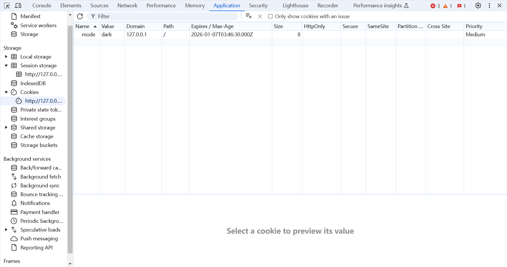
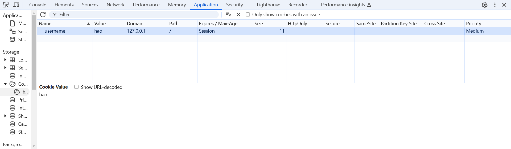
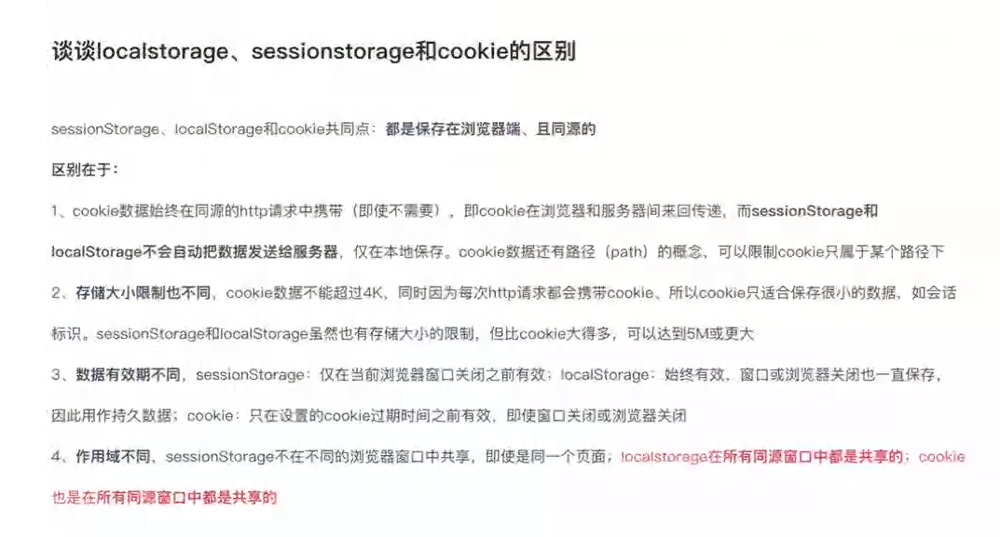

# 浏览器存储

## 1、cookie

> Cookie是一个保存在浏览器中的简单的文本文件，，保存了该浏览器访问这个Web文档时的信息，当浏览器再次访问这个Web文档时这些信息可供该文档使用。（HTTP是无状态的协议，即HTTP协议本身不对请求和响应之间的通信状态进行保存，为了实现期望的保存状态功能，引入了cookie技术）

### 特征

1. 不同的浏览器，不同页面存放的 cookie 位置不⼀样，也是不能通⽤的。
2. cookie 的存储是以域名形式进⾏区分的，不同的域名下存储的 cookie 是独⽴的(比如在百度首页中的cookie，在qq首页中是访问不到的)
3. 我们可以设置 cookie ⽣效的域（当前设置 cookie 所在域的⼦域），也就是说，我们能够操作的cookie 是当前域以及当前域下的所有⼦域。如：登录了https://www.baidu.com页面的百度账号，https://pan.baidu.com/的账号也登录了，即顶级域名访问的页面中的cookie，他的二级、三级...域名都可以访问顶级域名的cookie
4. ⼀个域名下存放的 cookie 的个数是有限制的，不同的浏览器存放的个数不⼀样,⼀般为 20 个。
5. 每个 cookie 存放的内容⼤⼩也是有限制的，不同的浏览器存放⼤⼩不⼀样，⼀般为 4KB。
6. cookie 也可以设置过期的时间，默认是会话结束的时候，当时间到期⾃动销毁

### 属性



#### Name    Value

> 键值对：表示需要存储的数据

#### Domain

> 表示当前键值对可以作用的域名

```js
  /*
    顶级域名.com
    一级域名 q9.com
    二级域名 map.q9.com

    我在访问qq.com的时候服务器给我设置的
    setCookie("a=1;path=/abc;domain=qq.com");
    setCookie("b=2;path=/def;domain*map.qq.com");
    假设我现在访问map.qq.com/abc 可以接受到a和b的值
    wx.qq.com/def 可以接受到a的值
  */
```

#### Path

> 表示当前访问的路径，/表示最顶层

#### Expires/Max-Age

> 生命周期。表示cookie的过期时间。Expires表示具体的时间过期，Max-Age表示设置cookie后过多长时间过期

#### Size

> 表示cookie的大小

#### httpOnly

> 这个选项⽤来设置 cookie 是否能通过 js 去访问。默认情况下，cookie 不会带 httpOnly 选项(即为空)，
> 所以默认情况下，客户端是可以通过 js 代码去访问（包括读取、修改、删除等）这个 cookie 的。当
> cookie 带 httpOnly 选项时，客户端则⽆法通过 js 代码去访问（包括读取、修改、删除等）这个cookie。

#### Secure

> 设置是否仅在HTTPS安全通信时才会发送Cookie

### 操作cookie

##### 创建 cookie：

```js
document.cookie = "username=hao";
```



### 使用js-cookie操作cookie

> js-cookie是一个简单的，轻量级的处理cookies的js API。

#### 设置

```js
// Create a cookie, valid across the entire site:
Cookies.set('name', 'value');

// Create a cookie that expires 7 days from now, valid across the entire site:
Cookies.set('name', 'value', { expires: 7 });

// Create an expiring cookie, valid to the path of the current page:
Cookies.set('name', 'value', { expires: 7, path: '' });

```

#### 获取

```js
// Read cookie:
Cookies.get('name'); // => 'value'
Cookies.get('nothing'); // => undefined

// Read all visible cookies:
Cookies.get(); // => { name: 'value' }

```

#### 删除

```js
// Delete cookie:
Cookies.remove('name');

// Delete a cookie valid to the path of the current page:
Cookies.set('name', 'value', { path: '' });
Cookies.remove('name'); // fail!
Cookies.remove('name', { path: '' }); // removed!


//也可以用 
```

## 2、loacalStorage（本地存储）

#### 特点

- ⽣命周期：持久化的本地存储，除⾮主动删除数据，否则数据是永远不会过期的。
- 存储的信息在同⼀域中是共享的。
- 当本⻚操作（新增、修改、删除）了 localStorage 的时候，本⻚⾯不会触发 storage 事件,但是别的⻚⾯会触发 storage 事件。
- ⼤⼩：据说是 5M（跟浏览器⼚商有关系）
- 在⾮ IE 下的浏览中可以本地打开。IE 浏览器要在服务器中打开。
- localStorage 本质上是对字符串的读取，如果存储内容多的话会消耗内存空间，会导致⻚⾯变卡
- localStorage 受同源策略的限制

#### 同源策略

```js
  // 浏览器的同源策略：限制了数据的访问 限制了限制DOM的获取 限制了HTTP的请求(跨域)
  // 协议 域名 端口 要一模一样
  // http://localhost !== http://127.0.0.1  (虽然访问的都是一个网站，但不是同源)
  // https://localhost !== http://localhost (协议不一样)
```

### 操作localStorage

#### 设置

```js
localStorage.setItem('username','cfangxu');
```

#### 获取

```js
localStorage.getItem('username')
// 也可以获取键名
localStorage.key(0)#获取第一个键名
```

#### 删除

```js
localStorage.removeItem('username')
// 也可以一次性清除所有存储
localStorage.clear()
```

注意：localStorage只能存储字符串 如果存储的数据不是字符串则调用toString方法，所以在传对象时要用JSON.stringify先转为字符串

```js
  localStorage.setItem('k3', JSON.stringify({ 'a': 1, 'b': false }))
```

取的时候也要用JSON.parse转为JSON对象，非常的麻烦 ，推荐使用store

### 使用store操作localStorage

#### 设置

```js
store.set('username', 'hao')
store.set('k2', { 'a': 1, 'b': 2 })
```

### 获取

```js
store.get('username')
```

删除

```js
store.remove('username')
//清除所有key
//store.clear()
```

## 3、sessionStorage 

> sessionStorage 与 localStorage基本一样，它们的区别是：

- sessionStorage 和 localStorage的区别是：生命周期不一样
- localStorage一般做持久化存储 需要主动删除
- sessionStorage一般做会话存储 关闭选项卡即销毁

```js
sessionStorage.setItem('kkk', '我是会话存储')
```


## 总结

**谈谈你对cookie loacalStorage sessionStorage的理解?cookie loacalStorage sessionStorage 区别?**

>   相同：都是客户端存储数据，都准守同源策略
>
>   不同：存的数据量不一样，生命周期不一样(持久化存储、会话存储、设置有限期)，cookie服务端可以设置 自动携带到对应的服务端
>   



实例开发使用：js-cookie store.js localforage