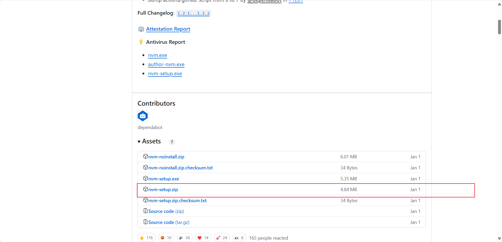
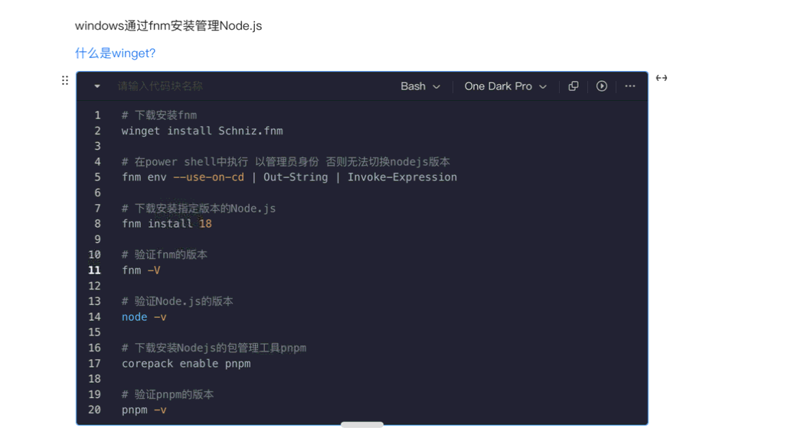

# 安装管理nodejs

## 使用nvm安装管理nodejs

### 为什么使用nvm

> 1、使用简单的命令在本地下载任何远程长期支持（LTS）版本的Node.js。
> 2、直接从命令行在Node.js的多个版本之间轻松切换。
> 3、设置别名以轻松在不同下载版本的Node.js之间切换。

### 卸载node

如果你已经安装了node，那么你需要先卸载node（不然安装nvm可能会失败），如果你没有安装那直接跳过到下一步。

打开控制面板 -> 打开程序和功能 -> 右上角搜索输入node -> 右键卸载

为了确保彻底删除node在看看你的node安装目录中还有没有node文件夹，有的话一起删除。再看看C:\Users\用户名 文件夹下有没有.npmrc以及.yarnrc等等统统删除。再去看看你的环境变量有没有node相关的，有的话也一起删除了。

### 安装nvm

>  [nvm官网](https://github.com/coreybutler/nvm-windows/releases)
>
> 

### nvm命令

**查看nvm版本**

1. nvm -v
2. nvm --version

**查看可安装或已安装的版本**

1. nvm list: 显示已安装的版本（同 nvm list installed）
2. nvm list installed: 显示已安装的版本
3. nvm list available: 显示所有可以下载的版本

**使用指定版本node**

1. nvm use 14.5.0	切换到14.5.0版本的node.js

**卸载指定版本node**

1. nvm uninstall 14.5.0	卸载14.5.0版本的node.js

**显示命令行帮助信息**

1. nvm --help

参考文章：https://blog.csdn.net/HuangsTing/article/details/113857145

## 使用fnm安装管理nodejs

命令基本和nvm一致

