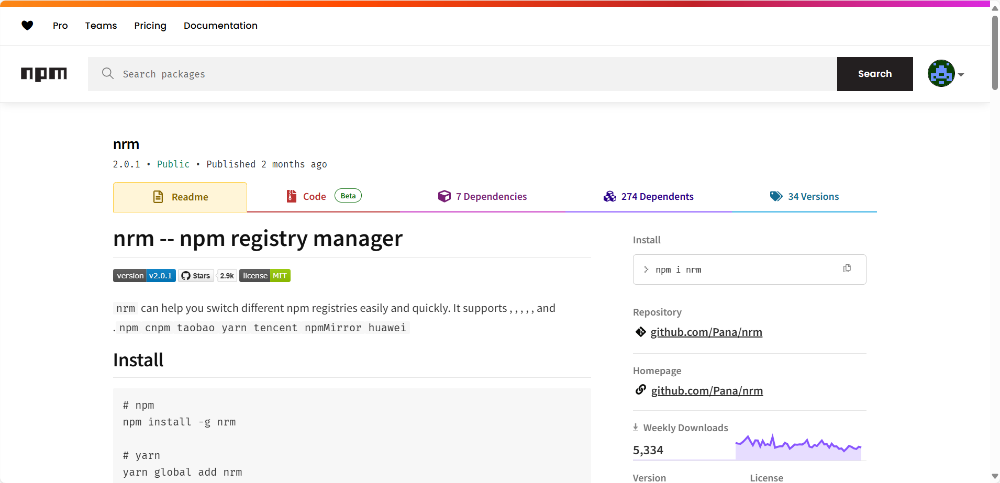
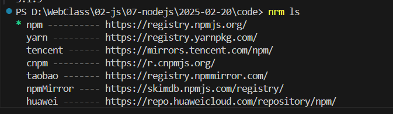
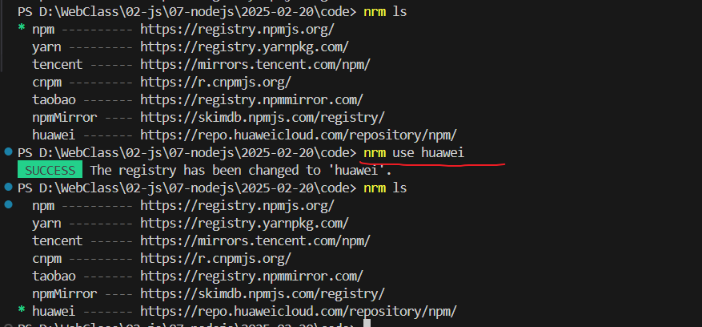
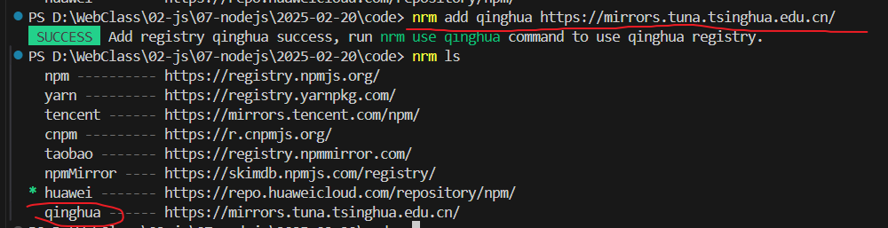
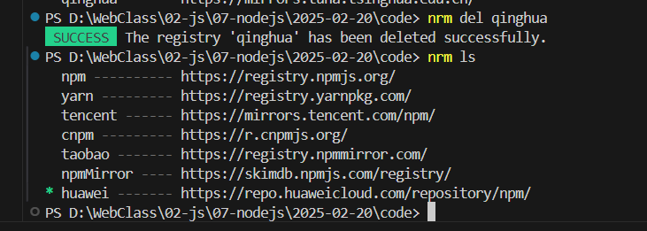
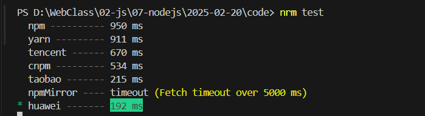

# 使用nrm管理镜像地址

nrm(npm registry manager )是npm的镜像源管理工具，有时候国外资源太慢，使用这个就可以快速地在 npm 源间切换

## nrm安装



输入命令

> pnpm add nrm或npm i nrm来安装nrm

## 命令

### 查看可选的源

```powershell
nrm ls
```



### 切换源

```powershell
nrm use 源名称
```



### 增加源

qinghua为自己取的源名，后面跟源的路径

```powershell
nrm add qinghua https://mirrors.tuna.tsinghua.edu.cn/
```



### 删除源

```powershell
nrm del 源名
```



测试速度

```powershell
nrm test
```

