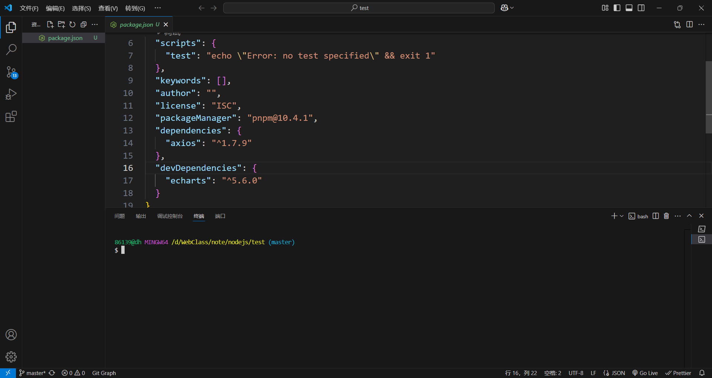
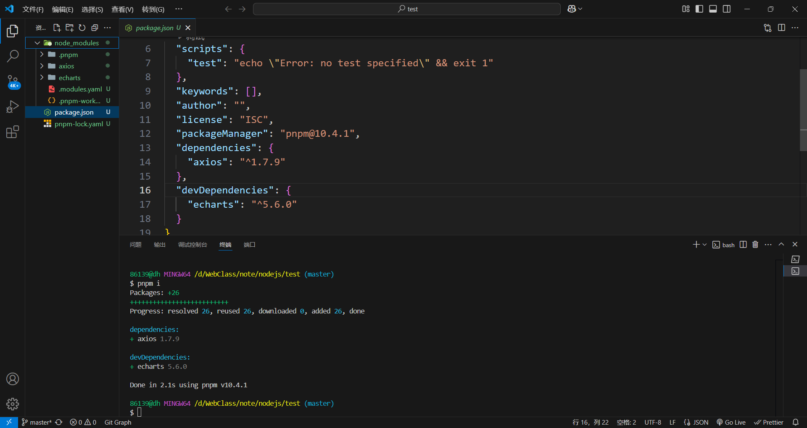
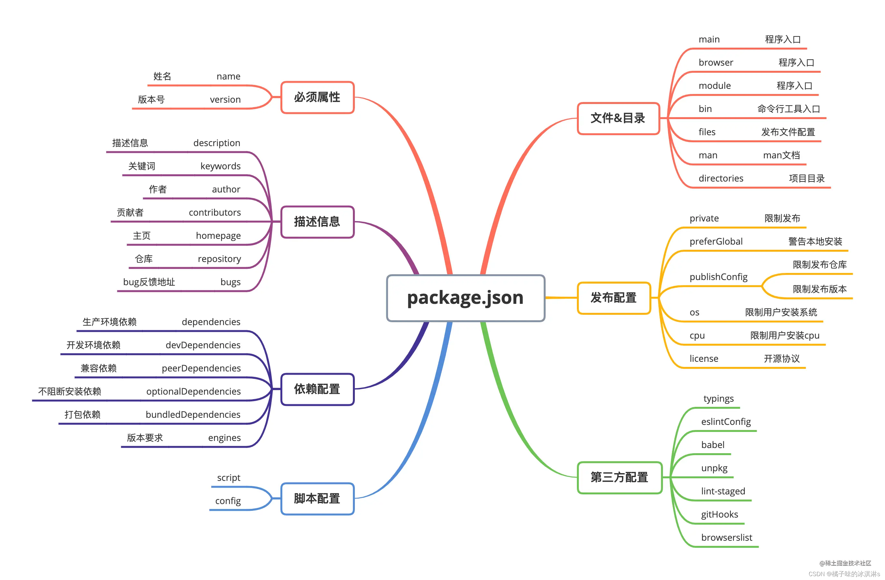

# package.json文件的作用

> `package.json`  文件一般都在每个项目的根目录下面，定义了这个项目所需要的各种模块，以及项目的配置信息，包括名称、版本、许可证、依赖模块等数据。

## 一键下载项目依赖（生产依赖和开发依赖）

当你执行`pnpm i`或`pnpm install`或`npm i`或`npm install`时，node会先从package.json 文件中读取所有的dependencies(生产依赖)和devDependencies(开发依赖)，然后和本地的node_modules 中的模块进行对比，没有的直接下载(pnpm会先看看以前有没有装过)，已有的检查更新。

所以当我们上传或下载代码时，就不需要把庞大的node_modules一起带着了，比如此时我需要下载项目中需要用到的依赖`axios`和`echarts`，那么直接执行`pnpm i`



此时就一键将项目中需要用到的所有依赖全部下载好了



## 各个键值对分别的作用

### ”name“

> 项目的名称

### "version"

> 项目的版本号，每一次在npm发布时要更新版本号，否则报错

### "description"

> 项目描述，description是一个字符串。它可以帮助我们在使用npm search时找到这个包

### "main"

> 项目的主入口文件

### "type"

> 指定模块系统类型。填`"module"`为使用 ECMAScript 模块系统（ESM），文件扩展名为 `.mjs` 的文件始终视为 ESM 模块。
>
> 如果未指定 `"type"`，默认为 `"commonjs"`。

### "scripts"

> 将常用命令封装为脚本，简化操作。这些命令可以通过 `npm run <script-name>` 来执行，主要用于自动化常见的开发任务，如启动服务器、运行测试、构建项目等。

```json
  "scripts": {
    "dev":"npx nodemon -v"
  },
// 使用npm run dev或pnpm dev来执行查看nodemon版本的命令
```

### "keywords"

> 关键字，允许我们使用关键字去描述当前项目

### "author"

> 项目的作者

### "license"

> 项目遵循的协议,默认是ISC也就是开放源代码的协议

### "packageManager"

> 用于指定项目使用的包管理器及其版本。它通常与 Corepack（Node.js 内置工具）结合使用，确保团队成员使用一致的包管理器版本，避免因版本差异导致的问题。

```json
"packageManager": "pnpm@10.4.1",
// 表示项目使用 pnpm 作为包管理器，且版本为 10.4.1。
```

### "dependencies"

> 生产依赖。在项目的开发阶段和线上运营阶段，都需要依赖的第三方包，称为生产依赖
>
> 使用npm install 包名命令下载的文件会默认被添加到 package.json 文件的 dependencies 字段中;

### "devDependencies"

> 开发依赖。在项目的开发阶段需要依赖，线上运营阶段不需要依赖的第三方包，称为开发依赖
>
> 使用npm install 包名 --save-dev命令将包添加到package.json文件的devDependencies字段中。


