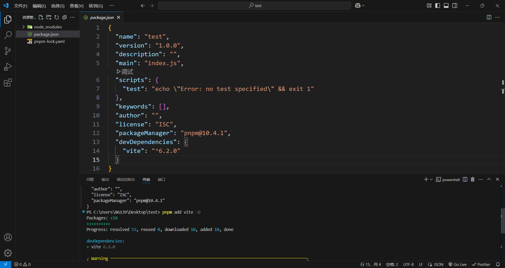
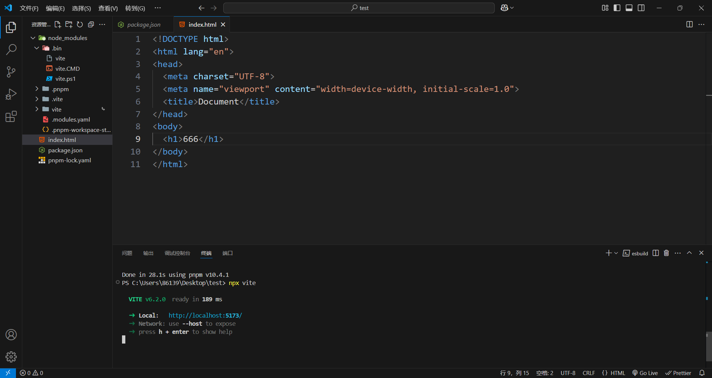

# vite的使用

## 搭建第一个 Vite 项目

### pnpm add vite -D

**使用`pnpm init`快速初始化之后，输入pnpm add vite -D**

**启动vite，首先在最外层生成一个index.html入口文件**

> 在一个 Vite 项目中，`index.html` 在项目最外层而不是在 `public` 文件夹内。这是有意而为之的：在开发期间 Vite 是一个服务器，而 `index.html` 是该 Vite 项目的入口文件。

### npx vite

**使用npx vite执行node_modules/bin/vite.CMD可执行文件来启动**

支持热更新

